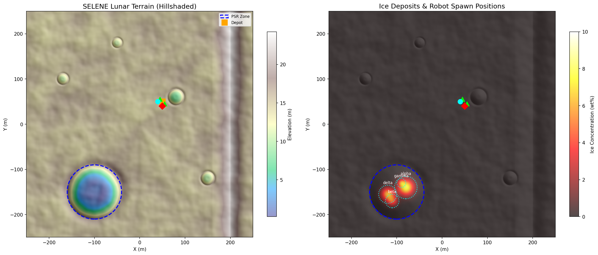

<p align="center">
  
</p>

<h1 align="center">S E L E N E</h1>

<p align="center">
  <strong>Spacecraft & Extraterrestrial Logistics for Extraction, Navigation & Exploitation</strong>
</p>

<p align="center">
  <em>AI-driven fleet management for autonomous lunar ISRU operations</em>
</p>

<p align="center">
  <a href="#architecture">Architecture</a> &bull;
  <a href="#quick-start">Quick Start</a> &bull;
  <a href="#packages">Packages</a> &bull;
  <a href="#simulation">Simulation</a> &bull;
  <a href="#roadmap">Roadmap</a>
</p>

---

## What is SELENE?

SELENE is a software suite that commands, coordinates, and optimizes a **heterogeneous fleet of autonomous lunar surface robots** across the full In-Situ Resource Utilization (ISRU) value chain: prospecting, extraction, processing, and transportation.

The system orchestrates three robot types working in concert:

| Robot | Role | Capabilities |
|---|---|---|
| **Scout** | Prospecting | Neutron spectrometer survey, adaptive waypoint planning, resource map building |
| **Excavator** | Extraction | Drill/heater operation, ice sublimation, hopper management |
| **Hauler** | Transport | Material pickup from excavators, depot delivery, route optimization |

A **market-based task auction** allocates work. An **HTN planner** decomposes high-level objectives ("Collect 100 kg ice from PSR") into robot-level primitives. Each robot runs an **FSM-based autonomy stack** with energy-aware planning and graceful degradation.

## Architecture

```
MISSION CONTROL (Earth)          FLEET ORCHESTRATION (Lunar)         ROBOTS (Per-agent)
 Dashboard, digital twin          Task planning, auction,             FSM, navigation,
 monitoring, overrides             resource map, scheduling            skills, HAL
                                         
      Browser ──── rosbridge ────── Orchestrator ────── Agent ────── Gazebo/Hardware
                                       |                  |
                                  Resource Map        HAL Interface
                                  (Bayesian grid)     (sensor/actuator abstraction)
```

**Design principles:**
- **Delay-tolerant** -- 1.3s Earth-Moon light delay, multi-minute comm blackouts
- **Hardware-agnostic** -- Standard interfaces via HAL and RCDL descriptors
- **Graceful degradation** -- No single point of failure; fleet adapts to robot loss
- **Extensible** -- New robot types, ISRU processes, or celestial bodies without re-architecting

## Quick Start

### Prerequisites

- **Ubuntu 22.04/24.04** (or WSL2 on Windows 11)
- **ROS 2** Humble (22.04) or Jazzy (24.04)
- **Gazebo Harmonic**
- Python 3.10+, Node.js 18+

> **WSL2 users:** The project lives on the Windows filesystem but must be synced to the Linux filesystem for Gazebo compatibility. The scripts below handle this automatically.

### First-Time Setup

```bash
# Clone
git clone https://github.com/JusHoya/selene.git

# Install ROS 2 + Gazebo (WSL2 Ubuntu 24.04)
cd /mnt/c/Users/<you>/WorkSpace/Projects/selene
bash scripts/setup_wsl2.sh
```

### Build & Run

From the project directory on the **WSL2 filesystem**:

```bash
cd /mnt/c/Users/<you>/WorkSpace/Projects/selene

# Sync to Linux filesystem and build (run once, or after code changes)
bash scripts/sync_and_build.sh

# Launch Gazebo GUI + autonomous scout agent
bash scripts/start.sh
```

The Gazebo server starts first, then the GUI connects to it separately. On WSL2, software rendering is used automatically to avoid GPU shader compatibility issues. A scout robot will autonomously prospect 5 ice deposit waypoints, return to recharge, and repeat.

> **Note:** The GUI may take a few seconds to render on WSL2 with software rendering. If the GUI crashes, the simulation server continues running — you can monitor via `ros2 topic echo` in another terminal.

**Headless mode** (no GUI, for CI or remote machines):

```bash
bash scripts/start.sh --headless
```

### Monitoring (second terminal)

```bash
source /opt/ros/jazzy/setup.bash && cd ~/selene && source install/setup.bash

# Watch robot state (FSM, battery, position)
ros2 topic echo /scout_01/state

# Watch ice readings
ros2 topic echo /scout_01/sensors/neutron_spec

# Watch battery level
ros2 topic echo /scout_01/battery_state

# List all active topics
ros2 topic list
```

### Docker (alternative)

```bash
cd docker
docker compose build
docker compose up selene-dev
```

## Packages

```
selene/
├── selene_msgs/           ROS 2 message & service definitions (7 msgs, 2 srvs)
├── selene_orchestrator/   Fleet orchestration engine (task planner, auction, fleet monitor)
├── selene_agent/          Per-robot autonomy stack (FSM, navigator, energy manager, skills)
├── selene_hal/            Hardware Abstraction Layer (RCDL descriptors, sensor/actuator interfaces)
├── selene_sim/            Gazebo Harmonic simulation (lunar world, robot models, sensor nodes)
├── selene_isru/           ISRU process models (thermal mining, logistics, inventory)
├── selene_dashboard/      React web dashboard (fleet map, resource heatmap, task management)
├── docker/                Dockerfile & docker-compose for dev environment
└── scripts/               Setup, verification, and utility scripts
```

### Message Definitions (`selene_msgs`)

| Message | Purpose |
|---|---|
| `RobotState` | Robot ID, pose, velocity, battery, FSM state, task progress |
| `TaskAnnouncement` | Broadcast task for auction (type, location, energy cost, capabilities) |
| `BidResponse` | Robot bid on a task (score, ETA, projected energy) |
| `TaskAssignment` | Confirmed task assignment to a specific robot |
| `ResourceMapUpdate` | Scout sensor reading for Bayesian map fusion |
| `FleetAlert` | Fleet-level alerts with severity |
| `MissionProgress` | Aggregated mission metrics (extracted, in-transit, deposited) |

### Hardware Abstraction Layer (`selene_hal`)

Robot capabilities are declared in **RCDL** (Robot Capability Descriptor Language) YAML files:

```yaml
robot_type: scout
max_speed: 0.5          # m/s
mass: 50                # kg
battery:
  capacity: 500         # Wh
  idle_draw: 5           # W
  locomotion_draw: 20    # W per m/s
sensors:
  - name: neutron_spectrometer
    type: scalar_field
    range: 10.0
    noise_stddev: 0.5
capabilities:
  - prospect
```

Agent code interacts exclusively through the HAL interface -- never with simulator-specific topics:

```python
hal = create_hal("config/scout.yaml", "scout_01", backend="stub")
sensor = hal.get_sensor("neutron_spectrometer")
reading = sensor.read()  # ScalarFieldReading(value=3.2, uncertainty=0.5)
drive = hal.get_actuator("drive")
drive.command_velocity(0.5, 0.0)
```

## Simulation

The Gazebo Harmonic simulation provides a 500m x 500m lunar operational area:

- **Terrain**: Procedurally generated heightmap with regolith surface
- **PSR Crater**: 120m diameter permanently shadowed region with 4 ice deposits
- **Robots**: Scout (4-wheel), Excavator (6-wheel + drill), Hauler (6-wheel + bin)
- **Physics**: Lunar gravity (1.62 m/s^2), terrain friction, slope energy costs
- **Sensors**: Simulated neutron spectrometer, battery model, hopper/bin fill tracking
- **26 rock obstacles** distributed across the terrain for navigation challenges

### Simulation Nodes

| Node | Function |
|---|---|
| `battery_node` | Energy model: idle + locomotion + actuator draw, solar recharging |
| `neutron_spectrometer_node` | Ice concentration from ground truth with Gaussian noise |
| `hopper_node` | Excavator hopper fill tracking during extraction |
| `bin_load_node` | Hauler transport bin load/unload management |
| `extraction_node` | Drill extraction rate based on local ice concentration |

## Tech Stack

| Layer | Technology |
|---|---|
| Robot middleware | ROS 2 (Humble/Jazzy) |
| Simulation | Gazebo Harmonic |
| Task planning | PDDL + HTN planner |
| Communication | DDS (Cyclone/FastDDS) |
| Orchestration | Python 3.10+ |
| Dashboard | React + roslib (WebSocket) |
| Build system | colcon |
| CI | GitHub Actions |
| Containerization | Docker |

## Roadmap

SELENE Sprint 0 is built in 6 phases:

```
Phase 1              Phase 2              Phase 3              Phase 4
Scaffolding    --->   Single Agent   --->  Multi-Agent    --->  Orchestration
& Sim World          Autonomy             Coordination         Intelligence
[COMPLETE]           [NEXT]

                                          Phase 5              Phase 6
                                          Dashboard &    --->  Polish &
                                          Integration          Hardening
```

| Phase | Delivers |
|---|---|
| **1 -- Scaffolding & Sim World** | ROS 2 packages, Gazebo world, robot models, HAL interfaces, CI/Docker |
| **2 -- Single Agent Autonomy** | FSM, A* navigation, energy manager, skill library, Gazebo HAL driver |
| **3 -- Multi-Agent Coordination** | Task auction, fleet state monitor, probabilistic resource map |
| **4 -- Orchestration Intelligence** | HTN planner, dynamic reallocation, adaptive survey, full ISRU cycle |
| **5 -- Dashboard & Integration** | React dashboard, rosbridge, real-time fleet visualization |
| **6 -- Polish & Hardening** | Stability, performance, integration demos, documentation |

## Development

```bash
# Run tests
colcon test
colcon test-result --verbose

# Run HAL unit tests directly
python -m pytest selene_hal/test/ -v

# Lint
flake8 selene_orchestrator/ selene_agent/ selene_hal/ selene_sim/ selene_isru/ --max-line-length=100
```

## License

Apache-2.0

---

<p align="center">
  <sub>Built for the Moon. Designed for everywhere else.</sub>
</p>
