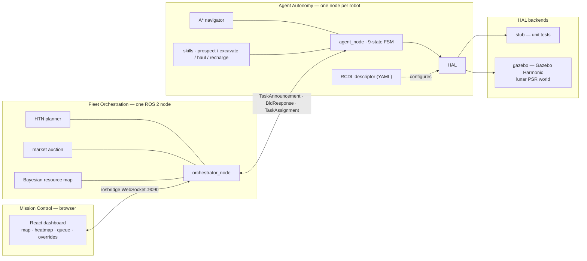

<a id="top"></a>

<div align="center">

<picture>
  <source media="(prefers-color-scheme: dark)" srcset="assets/banner-dark.svg">
  
</picture>

<br>

<!-- Honest static badges only. No CI badge: the pipeline's own history is
     summarised in Status below rather than implied by a shield. -->


[Why](#why) · [Architecture](#architecture) · [Quickstart](#quickstart) · [Status](#status) · [Simulation](#simulation) · [Roadmap](#roadmap) · [Known gaps](#known-gaps)

</div>

---

> A fleet of lunar robots is not a robot problem. It is an allocation problem under an energy budget, a comms delay, and no possibility of rescue.

**SELENE** commands, coordinates, and optimises a heterogeneous fleet of autonomous lunar surface robots across the In-Situ Resource Utilization value chain — prospecting, extraction, and transport. An HTN planner decomposes a mission objective into robot-level primitives, a market-based auction allocates them, and each robot runs its own FSM autonomy stack behind a hardware abstraction layer. The full specification is [`docs/PRD.md`](docs/PRD.md); this README is the front door.

> [!IMPORTANT]
> **Sprint 0 prototype. Phases 1–4 are implemented; Phase 5's code is implemented and mostly demonstrated, and its exit gate has been run twice and does not pass.** On 2026-07-31 `scripts/validate_phase5.sh` returned **8 passed / 1 failed / 2 skipped (exit 1)** and then **9 / 0 / 2 (exit 2)** on ROS 2 Jazzy + Gazebo. Exit 2 is a SKIP, which by the gate's own contract is not a pass; both non-passes are defects in the gate's *measuring apparatus* rather than in the system, and neither was patched, because adjusting an instrument until it stops reporting a problem is precisely the failure this project's deviation register exists to name. In the same period the fleet ran end to end and delivered 94.85 kg of material to the depot, the dashboard was confirmed rendering in a browser, and nineteen new deviations were opened — of which **the cause of a reproducible Gazebo/ODE abort remains unknown**. Everything in [Architecture](#architecture) exists as code; read [Status](#status) and `docs/phase5_deviation_register.md` before relying on any single capability.

## Why

Lunar ISRU is usually prototyped one robot at a time. But the economics only close with a *fleet*: a scout that finds ice it cannot dig, an excavator that fills a hopper it cannot deliver, a hauler that is useless without both. The hard part is not locomotion — it is deciding which robot does what, with a battery that does not care about your schedule and an operator 1.3 light-seconds away.

SELENE is built as that allocation layer first, with the robot autonomy underneath it and the hardware deliberately abstracted away.

| Typical single-robot prototype | SELENE |
| --- | --- |
| One robot, one hardcoded task sequence | Heterogeneous fleet; tasks allocated by sealed-bid auction on cost, energy and capability |
| Waypoints authored by hand | HTN decomposition from a mission objective into typed, dependency-ordered primitives |
| "Where is the ice?" answered by a fixed survey | Bayesian occupancy map with a Gaussian conjugate update; site selection reads the posterior |
| Simulator topics wired straight into behaviour code | All hardware access through a HAL behind a declarative robot descriptor (RCDL) |
| Robot failure stops the run | Heartbeat timeout reassigns the lost robot's tasks back into the auction |
| Operator watches logs | Browser mission control over rosbridge: live map, ice heatmap, task queue, task injection, per-robot override |

## Architecture

Four layers with one rule: **behaviour code never touches a simulator topic.** Everything a robot senses or actuates goes through the HAL, which is configured from that robot's RCDL descriptor and bound to a backend at launch. Swapping Gazebo for hardware is a new backend module plus a new descriptor, with the autonomy stack untouched.


```mermaid
flowchart LR
  subgraph MC ["Mission Control — browser"]
    DASH["React dashboard<br/>map · heatmap · queue · overrides"]
  end

  subgraph FO ["Fleet Orchestration — one ROS 2 node"]
    ORCH["orchestrator_node"]
    HTN["HTN planner"]
    AUC["market auction"]
    RMAP["Bayesian resource map"]
    HTN --- ORCH
    AUC --- ORCH
    RMAP --- ORCH
  end

  subgraph AA ["Agent Autonomy — one node per robot"]
    AG["agent_node · 9-state FSM"]
    NAV["A* navigator"]
    SK["skills · prospect / excavate / haul / recharge"]
    HAL["HAL"]
    RCDL["RCDL descriptor (YAML)"]
    NAV --- AG
    SK --- AG
    AG --> HAL
    RCDL -.->|configures| HAL
  end

  subgraph BE ["HAL backends"]
    ST["stub — unit tests"]
    GZ["gazebo — Gazebo Harmonic<br/>lunar PSR world"]
  end

  DASH <-->|"rosbridge WebSocket :9090"| ORCH
  ORCH <-->|"TaskAnnouncement · BidResponse · TaskAssignment"| AG
  HAL --> ST
  HAL --> GZ
```

## Quickstart

**Prerequisites:** Ubuntu 24.04 (or WSL2 on Windows 11), ROS 2 Jazzy, Gazebo Harmonic, Node.js 18+. On 22.04 use ROS 2 Humble.

```bash
git clone https://github.com/JusHoya/selene.git
cd selene

# Installs ROS 2, Gazebo, colcon, Node.js, and Pydantic v2.
# (Ubuntu 24.04's apt pydantic is v1, which the RCDL parser cannot use.)
bash scripts/setup_wsl2.sh

# WSL2 only: sync to the Linux filesystem and build. Derives its own source
# path, so it works from wherever you cloned.
bash scripts/sync_and_build.sh

# Preflight — reports what is missing before you need it
bash scripts/check_env.sh

# Bring up the whole system
ros2 launch selene_sim unified_sim.launch.py
```

The dashboard is served at **http://localhost:3000**; rosbridge listens on **ws://localhost:9090**.

```bash
ros2 launch selene_sim unified_sim.launch.py headless:=true   # no dashboard; rosbridge still up
ros2 launch selene_sim unified_sim.launch.py prebuilt:=true   # serve a production build, skip the dev-server compile
```

If the dashboard cannot start (no npm, no `node_modules`), the launch now reports it loudly and continues without it — rosbridge, Gazebo, the orchestrator and the agents are unaffected.

<details>
<summary><b>Monitoring from a second terminal</b></summary>

```bash
source /opt/ros/jazzy/setup.bash && cd ~/selene && source install/setup.bash

ros2 topic echo /scout_01/state              # FSM state, pose, battery
ros2 topic echo /orchestrator/mission_progress
ros2 topic echo /orchestrator/task_assignment
ros2 topic list
```

</details>

## Status

| Phase | Delivers | State |
| --- | --- | --- |
| 1 — Scaffolding & sim world | ROS 2 packages, Gazebo world, robot models, HAL, CI/Docker | Implemented |
| 2 — Single-agent autonomy | FSM, A* navigation, energy manager, skills, Gazebo HAL backend | Implemented |
| 3 — Multi-agent coordination | Task auction, fleet monitor, probabilistic resource map | Implemented |
| 4 — Orchestration intelligence | HTN planner, reallocation, full ISRU cycle | Implemented |
| 5 — Dashboard & integration | React dashboard, rosbridge, unified launch | Code implemented; **exit gate not passed** |
| 6 — Polish & hardening | Stability, performance, integration demos | Not started |

**What is independently verified.** The message and service contracts match their definitions field-for-field across 13 topic subscriptions and 2 service calls, with zero mismatches; the dashboard's nine FSM state strings match the agent's `AgentState` enum exactly; the navigator's static obstacle list matches all 26 rocks in the world file; the resource map's update is a real Gaussian conjugate posterior, measured at 0.21 ms per update on the production 500 × 500 grid; and the workspace builds clean under ROS 2 Jazzy (all six packages). The Python suite is **604 passing in a single pytest process** spanning all five Python packages, in either collection order, with one declared skip (`selene_hal`'s Gazebo backend, which needs a real `rclpy`); split into the three per-package lanes it is 603 passing and two skips, the extra skip being a `selene_sim` test that stands down when `selene_hal` is not on that lane's path. Measured on pytest 9.1.1 on 2026-07-31; the combined run was re-measured on the `pytest<8` version CI pins. The ROS-free stubs that let the orchestrator import without a workspace are scoped to their own test directory rather than installed process-wide, which is what makes the combined run possible; it aborted at collection until 2026-07-31. See `docs/phase5_deviation_register.md` D-14.

Also independently verified, and worth naming because the register spent two days calling it the change most likely to be silently wrong: the **`ImageData` row flip** that puts the fused resource map on the dashboard canvas is **correct**. Three independent passes executed the producer's flat index, the consumer's decode and the blit's negative-y transform outside a browser and all reproduced `ResourceMap.grid_to_world()` exactly, one of them over 36,000 cells with zero mismatches; omitting the flip would mirror the map about y = 0, which is the defect this repository has shipped once before. That is arithmetic agreeing with arithmetic — **the raster has still never been rendered**.

**What is not.** Three Phase 5 deviations were measured on a live ROS 2 Jazzy + Gazebo run on 2026-07-30 — launch configurability, the fused resource map on the wire, and the RViz2 overlay. **Everything else in Phase 5 is implemented and unit-tested but has never been executed against ROS 2, Gazebo, rosbridge, RViz2 or a browser**, the rewritten exit gate included, and no `colcon build` has compiled the nine new or amended message definitions. `docs/phase5_deviation_register.md` states this per deviation and is the authority; it draws the "implemented" versus "demonstrated" line that this paragraph summarises. Two of those deviations — the fleet map (D-01) and the resource heatmap (D-02) — were additionally closed on 2026-07-30 with **no adversarial review at all**, because the reviewer assigned to them failed mid-run and nobody recorded the gap; the review was finally run on 2026-07-31 and opened four new deviations, D-15 through D-18, all open. That is the strongest argument in this repository for why a same-day closure by an implementer is not evidence. **CI has been failing since 2026-04-08** — the cause (a missing `numpy` in the fast test job) is fixed and the lint blocker is cleared, but a green pipeline has not yet been observed. Do not treat CI as a signal until it goes green on its own.

## Simulation

A 500 m × 500 m lunar operational area with a 120 m-diameter permanently shadowed region, four Gaussian ice deposits, and 26 rock obstacles that the planner's occupancy grid mirrors exactly.

| Node | Function |
| --- | --- |
| `battery_node` | Energy model: idle + locomotion + actuator draw, solar recharge outside the PSR |
| `neutron_spectrometer_node` | Ice concentration from deposit ground truth with distance-dependent Gaussian noise |
| `hopper_node` | Excavator hopper fill during extraction |
| `bin_load_node` | Hauler transport-bin load/unload |
| `extraction_node` | Drill rate as a function of local ice concentration |

Robot capabilities are declared, not coded:

```yaml
robot_type: scout
max_speed: 0.5            # m/s
battery:
  capacity: 500           # Wh
  locomotion_draw: 20     # W per m/s
sensors:
  - name: neutron_spectrometer
    type: scalar_field
    noise_stddev: 0.5
capabilities: [prospect]
```

## Interfaces

`selene_msgs` defines **7 messages** and **3 services**.

| Message | Purpose |
| --- | --- |
| `RobotState` | Id, type, FSM state, pose, velocity, battery, task, progress, capabilities |
| `TaskAnnouncement` | Task broadcast for auction: type, location, energy cost, required capabilities |
| `BidResponse` | A robot's bid: score, ETA, projected energy after the task |
| `TaskAssignment` | Confirmed allocation of a task to a robot |
| `ResourceMapUpdate` | Scout sensor reading for Bayesian fusion |
| `FleetAlert` | Fleet-level alert with severity |
| `MissionProgress` | Aggregated mission metrics |

| Service | Purpose |
| --- | --- |
| `InjectTask` | Operator injects a task into the auction |
| `OverrideRobot` | Operator override: send-to-location, cancel task, force recharge |
| `SetRobotCommand` | Orchestrator → agent command channel behind `OverrideRobot` |

## Design guarantees

Invariants that hold, and what enforces them.

1. **Behaviour code never imports a hardware symbol** — a case-insensitive search of `selene_agent/` for `gz`, `ignition`, `/world/`, `GazeboHal` and `subprocess` returns nothing. All access is via `hal.get_sensor()` / `get_actuator()` / `get_battery()`.
2. **The planner's world and the simulator's world agree** — all 26 obstacle positions, the PSR centre and radius, the depot, and all four ice-deposit centres/sigmas/peaks are identical between `selene_sim/` config and `selene_agent/config/nav_params.yaml`. There is no second source of truth to drift.
3. **A* never cuts a corner diagonally** — a diagonal step is admitted only when both adjacent cardinals are free, and ties break on a monotonic counter, so paths are deterministic.
4. **Recharge cannot oscillate** — entry at ≤ 15 %, exit at ≥ 90 %, with the FSM transition table omitting `ENERGY_CRITICAL` from the recharging state entirely. Exactly one entry and one exit per cycle.
5. **Losing a robot does not lose its work** — a heartbeat timeout marks it offline and returns its assigned and in-progress tasks to `PENDING` for re-auction. Covered by unit tests.
6. **The test suite is order-independent** — 604 passing in one pytest process spanning all five Python packages, byte-identical totals in both collection orders. This broke once (D-14: `conftest.py` installed process-global ROS stubs that were incomplete relative to what `selene_hal` imports, and a combined run aborted at collection having run zero tests) and the fix is structural rather than a patched stub: the stubs are inserted into `sys.modules` only while pytest is collecting or running something under `selene_orchestrator/test`, and removed on the way out. Enforced by `selene_hal/test/test_ros_stub_isolation.py` — which fails on both the loud form of the defect and the silent one — and by the `cross-package-tests` CI job, which runs both orders on both pytest 7 and pytest 9.

## Roadmap

- [x] **Phase 1 — Scaffolding & sim world.** ROS 2 packages, lunar PSR world, three robot models, HAL, Docker.
- [x] **Phase 2 — Single-agent autonomy.** FSM, A* navigator, energy manager, skill library.
- [x] **Phase 3 — Multi-agent coordination.** Sealed-bid auction, fleet monitor, Bayesian resource map.
- [x] **Phase 4 — Orchestration intelligence.** HTN decomposition, dynamic reallocation, ISRU cycle.
- [ ] **Phase 5 — Dashboard & integration.** Code complete; **exit gate not passed — the rewritten gate has never been run.** See `docs/phase5_deviation_register.md`.
- [ ] **Phase 6 — Polish & hardening.** Integration demos, NFR performance validation, 30-minute stability run. Not started.

## Known gaps

Stated plainly, because a demo that surprises you is worse than one that is scoped.

- **Robots spawn below the terrain surface.** The heightmap generator raises the whole field by 15 m and nothing downstream compensates, so every robot, rock and the depot originates inside the terrain. Being fixed now, with a validator that samples the height map at every placement coordinate.
- **Odometry is spawn-relative but consumed as world coordinates.** There is no world-pose publisher, so every consumer shares the same offset frame. They agree with each other, which is why the dashboard looks correct while the fleet is elsewhere in the physics world. Being fixed now.
- **The ISRU mass ledger is instrumented but the chain has never been run.** `MaterialInventory` is now written from a real measurement chain — sim fill *fraction* → HAL `mass_kg` → skill delta → `MaterialEvent` → orchestrator ledger → `MissionProgress` — and mass is never estimated: a skill that cannot read its fill sensor publishes nothing rather than a zero. Nothing in that chain has been executed against Gazebo or DDS, and three defects were found on it *after* it was first recorded as fixed. See D-06.
- **Robot counts and world files are configurable** (`num_scouts` / `num_excavators` / `num_haulers`, `world`, `ice_config`, `spawn_config`), and `spawn_positions.yaml` describes a ten-robot fleet with every pose surveyed against the terrain. Measured on a live Jazzy run. Asking for more robots than the file describes fails the launch rather than inventing a pose. See D-07.
- **Task failure reaches the orchestrator, but the agent's FSM still does not distinguish it.** The agent fires the same FSM event on a failed skill as on a successful one — deliberately, because firing `FAULT` would route the robot to ERROR on any transient failure — and instead reports the outcome on `selene_msgs/msg/TaskResult`, which the orchestrator treats as authoritative. A timed-out haul is now recorded FAILED rather than credited as complete. See D-03.
- **FR-MAP-4 (RViz2 resource-map view) is implemented and was measured live.** The orchestrator publishes a `visualization_msgs/MarkerArray` CUBE_LIST overlay beside the fused posterior, hue for concentration and alpha for certainty, from the same snapshot on the same timer; the dashboard heatmap renders that same posterior through a ported half of the same colour law. See D-08 and D-02.
- **The Phase 5 exit gate has never been run.** It was rewritten from eight liveness proxies to eleven correlated checks, and the rewrite has not been executed on WSL2. `docs/phase5_validation_report.md` records one run of the *superseded* gate at commit `251e84d` and its footer asserts a waiver that is now false; it is a historical artifact, not current evidence.
- **`use_sim_time` is set nowhere.** All nodes run on wall clock, and `MissionProgress.elapsed_sim_time` is orchestrator uptime, not Gazebo time.
- **Lunar gravity and slope costs.** Gravity is now declared at world scope (1.62 m/s²) but has not been re-validated in a running sim. The A* slope-cost grid is allocated and never populated, so slope has no effect on planning.
- **No `LICENSE` file.** All five `package.xml` files and this README declare Apache-2.0, but the licence text is not in the repository.

## Development

```bash
# Tests — package roots on PYTHONPATH; runs without a ROS installation.
# Everything, one process, either order (separators are ';' on Windows, ':' elsewhere).
PYTHONPATH="selene_orchestrator;selene_isru;selene_hal;selene_agent;selene_sim" \
  python -m pytest selene_orchestrator/test selene_isru/test selene_hal/test \
                   selene_agent/test selene_sim/test -q                    # 598 passed, 1 skipped

# Or per package. Same tests; the extra skip is selene_sim's cross-check against
# the HAL, which stands down when selene_hal is not on this lane's path.
PYTHONPATH="selene_orchestrator;selene_isru" \
  python -m pytest selene_orchestrator/test selene_isru/test -q            # 321 passed

PYTHONPATH="selene_hal;selene_agent;selene_orchestrator;selene_isru" \
  python -m pytest selene_hal/test selene_agent/test -q                    # 215 passed, 1 skipped

python -m pytest selene_sim/test -q                                        # 61 passed, 1 skipped

# In a built workspace (each package gets its own process)
colcon test && colcon test-result --verbose

# Lint (matches CI; settings come from the repo's .flake8, so run from the root)
python -m flake8 selene_orchestrator/ selene_agent/ selene_hal/ selene_isru/ selene_sim/ scripts/

# Dashboard
cd selene_dashboard && npm ci && npm run build && npx eslint src --ext .js,.jsx
```

<details>
<summary><b>Repository layout</b></summary>

```
selene/
├── selene_msgs/           ROS 2 message & service definitions (7 msgs, 3 srvs)
├── selene_orchestrator/   HTN planner, task auction, resource map, fleet monitor
├── selene_agent/          Per-robot FSM, A* navigator, energy manager, skills
├── selene_hal/            Hardware abstraction layer + RCDL descriptors
├── selene_sim/            Gazebo Harmonic world, robot models, sensor nodes, launch
├── selene_isru/           ISRU process models (extraction rate, material ledger)
├── selene_dashboard/      React mission control over rosbridge
├── docs/                  PRD, whitepapers
├── docker/                Dev container
└── scripts/               Setup, sync/build, preflight, exit-gate validation
```

</details>

<details>
<summary><b>Why HTN and not PDDL?</b></summary>

Recorded as decision DD-2 in [`docs/PRD.md`](docs/PRD.md): Sprint 0 uses a hierarchical task network rather than STRIPS/PDDL. ISRU missions decompose naturally into a known hierarchy, so the expressive cost of a general planner buys little, while HTN gives dependency-ordered subtasks that map directly onto auctionable units. PDDL is not implemented and is not currently planned.

</details>

## License

Apache-2.0, as declared in every package manifest. The `LICENSE` file itself has not yet been added to the repository — see [Known gaps](#known-gaps).

---

<div align="center">
<sub>Built for the Moon. Designed for everywhere else. · <a href="#top">back to top ↑</a></sub>
</div>
