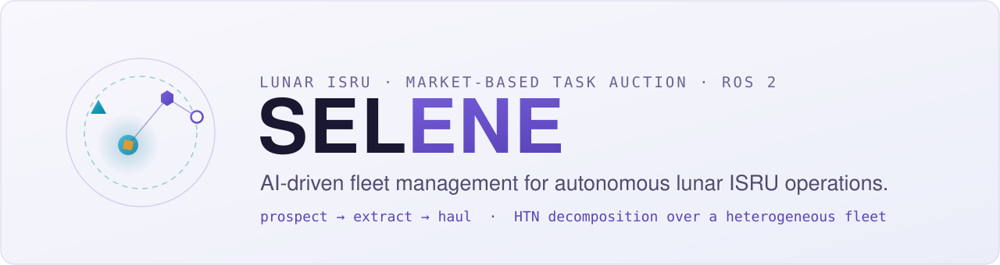
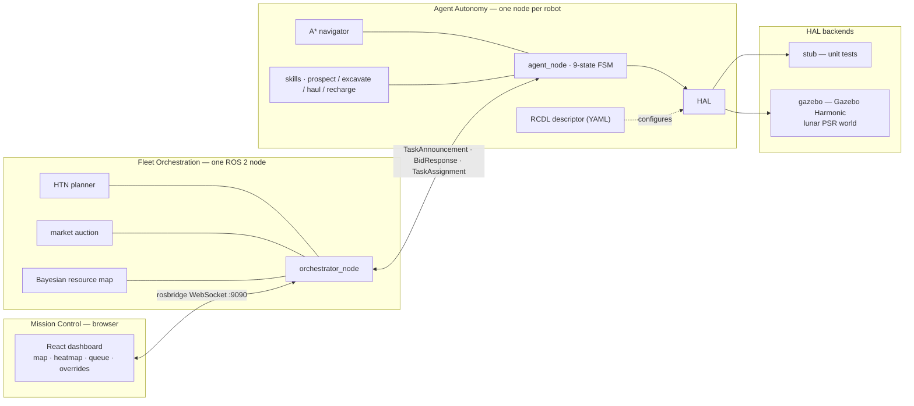

<a id="top"></a>

<div align="center">

<picture>
  <source media="(prefers-color-scheme: dark)" srcset="assets/banner-dark.svg">
  
</picture>

<br>

<!-- Honest static badges only. No CI badge: the pipeline's own history is
     summarised in Status below rather than implied by a shield. -->


[Why](#why) · [Architecture](#architecture) · [Quickstart](#quickstart) · [Status](#status) · [Simulation](#simulation) · [Roadmap](#roadmap) · [Known gaps](#known-gaps)

</div>

---

> A fleet of lunar robots is not a robot problem. It is an allocation problem under an energy budget, a comms delay, and no possibility of rescue.

**SELENE** commands, coordinates, and optimises a heterogeneous fleet of autonomous lunar surface robots across the In-Situ Resource Utilization value chain — prospecting, extraction, and transport. An HTN planner decomposes a mission objective into robot-level primitives, a market-based auction allocates them, and each robot runs its own FSM autonomy stack behind a hardware abstraction layer. The full specification is [`docs/PRD.md`](docs/PRD.md); this README is the front door.

> [!IMPORTANT]
> **Sprint 0 prototype. Phases 1–4 are implemented; Phase 5's code is implemented and mostly demonstrated, and its exit gate has been run three times and does not pass.** `scripts/validate_phase5.sh` returned **8 / 1 / 2 (exit 1)** and then **9 / 0 / 2 (exit 2)** on 2026-07-31, and **10 passed / 1 failed / 0 skipped (exit 1)** on 2026-08-01 on ROS 2 Jazzy + Gazebo. **Zero skips is the news**: two PRD exit-gate rows that no run had ever measured now have verdicts, and both passed. The single remaining failure is not the system — the gate selected a robot reporting 0.0 % battery and never checked that it could obey the command it was about to be given, and **why that robot reported 0 % is unknown**. In the same period the fleet ran end to end and delivered 94.85 kg of material to the depot, the dashboard was confirmed rendering in a browser, the fleet's real slope capability was measured over 54 Gazebo trials, and twenty-four deviations were opened — of which **two remain open and neither has a known cause**: a reproducible Gazebo/ODE abort, and the 0 % battery above. Everything in [Architecture](#architecture) exists as code; read [Status](#status) and `docs/phase5_deviation_register.md` before relying on any single capability.

## Why

Lunar ISRU is usually prototyped one robot at a time. But the economics only close with a *fleet*: a scout that finds ice it cannot dig, an excavator that fills a hopper it cannot deliver, a hauler that is useless without both. The hard part is not locomotion — it is deciding which robot does what, with a battery that does not care about your schedule and an operator 1.3 light-seconds away.

SELENE is built as that allocation layer first, with the robot autonomy underneath it and the hardware deliberately abstracted away.

| Typical single-robot prototype | SELENE |
| --- | --- |
| One robot, one hardcoded task sequence | Heterogeneous fleet; tasks allocated by sealed-bid auction on cost, energy and capability |
| Waypoints authored by hand | HTN decomposition from a mission objective into typed, dependency-ordered primitives |
| "Where is the ice?" answered by a fixed survey | Bayesian occupancy map with a Gaussian conjugate update; site selection reads the posterior |
| Simulator topics wired straight into behaviour code | All hardware access through a HAL behind a declarative robot descriptor (RCDL) |
| Robot failure stops the run | Heartbeat timeout reassigns the lost robot's tasks back into the auction |
| Operator watches logs | Browser mission control over rosbridge: live map, ice heatmap, task queue, task injection, per-robot override |

## Architecture

Four layers with one rule: **behaviour code never touches a simulator topic.** Everything a robot senses or actuates goes through the HAL, which is configured from that robot's RCDL descriptor and bound to a backend at launch. Swapping Gazebo for hardware is a new backend module plus a new descriptor, with the autonomy stack untouched.


```mermaid
flowchart LR
  subgraph MC ["Mission Control — browser"]
    DASH["React dashboard<br/>map · heatmap · queue · overrides"]
  end

  subgraph FO ["Fleet Orchestration — one ROS 2 node"]
    ORCH["orchestrator_node"]
    HTN["HTN planner"]
    AUC["market auction"]
    RMAP["Bayesian resource map"]
    HTN --- ORCH
    AUC --- ORCH
    RMAP --- ORCH
  end

  subgraph AA ["Agent Autonomy — one node per robot"]
    AG["agent_node · 9-state FSM"]
    NAV["A* navigator"]
    SK["skills · prospect / excavate / haul / recharge"]
    HAL["HAL"]
    RCDL["RCDL descriptor (YAML)"]
    NAV --- AG
    SK --- AG
    AG --> HAL
    RCDL -.->|configures| HAL
  end

  subgraph BE ["HAL backends"]
    ST["stub — unit tests"]
    GZ["gazebo — Gazebo Harmonic<br/>lunar PSR world"]
  end

  DASH <-->|"rosbridge WebSocket :9090"| ORCH
  ORCH <-->|"TaskAnnouncement · BidResponse · TaskAssignment"| AG
  HAL --> ST
  HAL --> GZ
```

## Quickstart

**Prerequisites:** Ubuntu 24.04 (or WSL2 on Windows 11), ROS 2 Jazzy, Gazebo Harmonic, Node.js 18+. On 22.04 use ROS 2 Humble.

```bash
git clone https://github.com/JusHoya/selene.git
cd selene

# Installs ROS 2, Gazebo, colcon, Node.js, and Pydantic v2.
# (Ubuntu 24.04's apt pydantic is v1, which the RCDL parser cannot use.)
bash scripts/setup_wsl2.sh

# WSL2 only: sync to the Linux filesystem and build. Derives its own source
# path, so it works from wherever you cloned.
bash scripts/sync_and_build.sh

# Preflight — reports what is missing before you need it
bash scripts/check_env.sh

# Bring up the whole system
ros2 launch selene_sim unified_sim.launch.py
```

The dashboard is served at **http://localhost:3000**; rosbridge listens on **ws://localhost:9090**.

```bash
ros2 launch selene_sim unified_sim.launch.py headless:=true   # no dashboard; rosbridge still up
ros2 launch selene_sim unified_sim.launch.py prebuilt:=true   # serve a production build, skip the dev-server compile
```

If the dashboard cannot start (no npm, no `node_modules`), the launch now reports it loudly and continues without it — rosbridge, Gazebo, the orchestrator and the agents are unaffected.

<details>
<summary><b>Monitoring from a second terminal</b></summary>

```bash
source /opt/ros/jazzy/setup.bash && cd ~/selene && source install/setup.bash

ros2 topic echo /scout_01/state              # FSM state, pose, battery
ros2 topic echo /orchestrator/mission_progress
ros2 topic echo /orchestrator/task_assignment
ros2 topic list
```

</details>

## Status

| Phase | Delivers | State |
| --- | --- | --- |
| 1 — Scaffolding & sim world | ROS 2 packages, Gazebo world, robot models, HAL, CI/Docker | Implemented |
| 2 — Single-agent autonomy | FSM, A* navigation, energy manager, skills, Gazebo HAL backend | Implemented |
| 3 — Multi-agent coordination | Task auction, fleet monitor, probabilistic resource map | Implemented |
| 4 — Orchestration intelligence | HTN planner, reallocation, full ISRU cycle | Implemented |
| 5 — Dashboard & integration | React dashboard, rosbridge, unified launch | Implemented, mostly demonstrated live; **exit gate run three times, not passed** |
| 6 — Polish & hardening | Stability, performance, integration demos | Not started as a phase; substantial hardening landed on `phase5-hardening` |

**What is independently verified.** The message and service contracts match their definitions field-for-field across 13 topic subscriptions and 2 service calls, with zero mismatches; the dashboard's nine FSM state strings match the agent's `AgentState` enum exactly; the navigator's static obstacle list matches all 26 rocks in the world file; the resource map's update is a real Gaussian conjugate posterior, measured at 0.21 ms per update on the production 500 × 500 grid; and the workspace builds clean under ROS 2 Jazzy (all six packages, zero errors). The Python suite is **1150 passing in a single pytest process** spanning all five Python packages, in either collection order, with one declared skip (`selene_hal`'s Gazebo backend, which needs a real `rclpy`). The gate lane — `selene_orchestrator` + `selene_isru` alone — is **623 passing, 3 skipped**, and CI now runs it whole. The dashboard's JavaScript suite is **101 Jest tests** over 7 suites, exercising the real state reducer, the real canvas mark planner and the resource view's canvas lifecycle. All re-measured on Python 3.11.6 / pytest 9.1.1 on 2026-08-01 against commit `9c1a4d7`. **No documented lane is red**: D-36 is fixed and now has a CI job (`gate-lane-tests`) that was mutation-tested before it landed. **SELENE CI is green on this branch — 9/9 jobs** at the three most recent commits, including the ROS 2 Humble `colcon build`/`colcon test` lane; the separate real-Gazebo **Simulation gates** workflow is green too.

Also independently verified: the **`ImageData` row flip** that puts the fused resource map on the dashboard canvas is **correct**. Three independent passes executed the producer's flat index, the consumer's decode and the blit's negative-y transform outside a browser and all reproduced `ResourceMap.grid_to_world()` exactly, one of them over 36,000 cells with zero mismatches; omitting the flip would mirror the map about y = 0, which is the defect this repository has shipped once before. The raster **has now been rendered in Chrome** against a live rosbridge.

**What is not.** Most of Phase 5 has now been observed on a running system, and `docs/phase5_deviation_register.md` states per deviation which claims rest on a live run and which on a unit test — it remains the authority, and it draws the "implemented" versus "demonstrated" line that this paragraph summarises. What is still missing: **RViz2 has never been started**, so the side-by-side comparison of the overlay against the dashboard heatmap that `docs/PRD.md:1504` asks for has never been performed — three gate runs, a 54-trial Gazebo campaign and two browser sessions have now gone past it, and nothing blocks it. PRD row 7 (dashboard frame timing) is not coverable headlessly. The two PRD rows that no run had ever measured — the gate could not observe an FSM state lasting 0.25 s through a 0.5 s sampler — **were measured on 2026-08-01 and both passed**. **The cause of a reproducible Gazebo/ODE `collide()` abort — three crashes on 2026-07-30/31 — is unknown**; it has not recurred in 24,327 abort-free robot-seconds, and four things changed at once, so that is not a fix. **The cause of a scout reporting 0.0 % battery six seconds after startup is also unknown**, and it is what the exit gate currently fails on. Two further limits are worth knowing before a demo: **no vehicle has driven a switchback** (the routes that make the crater reachable are executed plans, not journeys), and **side-slope rollover — usually the binding limit on a real rover — is unmeasured and unbounded**. Browser observations made on 2026-08-01 were against a **rosbridge test double, not the real stack**.

## Simulation

A 500 m × 500 m lunar operational area with a 120 m-diameter permanently shadowed region, four Gaussian ice deposits, and 26 rock obstacles that the planner's occupancy grid mirrors exactly.

| Node | Function |
| --- | --- |
| `battery_node` | Energy model: idle + locomotion + actuator draw, solar recharge outside the PSR |
| `neutron_spectrometer_node` | Ice concentration from deposit ground truth with distance-dependent Gaussian noise |
| `hopper_node` | Excavator hopper fill during extraction |
| `bin_load_node` | Hauler transport-bin load/unload |
| `extraction_node` | Drill rate as a function of local ice concentration |
| `world_odometry_node` | The single frame conversion point: `/<robot>/odom` → `/<robot>/odom_world` in frame `map`, plus a localisation-divergence and wheel-slip monitor |

Robot capabilities are declared, not coded:

```yaml
robot_type: scout
max_speed: 0.5            # m/s
battery:
  capacity: 500           # Wh
  locomotion_draw: 20     # W per m/s
sensors:
  - name: neutron_spectrometer
    type: scalar_field
    noise_stddev: 0.5
capabilities: [prospect]
```

## Interfaces

`selene_msgs` defines **13 messages** and **3 services**. (This line said "7 messages" until 2026-07-31; six were added during Phase 5 and the count was never updated with them.)

| Message | Purpose |
| --- | --- |
| `RobotState` | Id, type, FSM state, pose, velocity, battery, task, progress, capabilities |
| `TaskAnnouncement` | Task broadcast for auction: type, location, energy cost, required capabilities |
| `BidResponse` | A robot's bid: score, ETA, projected energy after the task |
| `TaskAssignment` | Confirmed allocation of a task to a robot |
| `ResourceMapUpdate` | Scout sensor reading for Bayesian fusion |
| `ResourceMap` | The fused posterior, sparse-encoded as a complete snapshot |
| `FleetAlert` | Fleet-level alert with severity |
| `MissionProgress` | Aggregated mission metrics, including the ISRU mass ledger |
| `MaterialEvent` | One measured mass delta from one skill on one robot, deduplicated by `event_id` |
| `TaskResult` | A task's authoritative outcome, reported by the agent |
| `TaskStatus` | One task's row in the queue snapshot |
| `TaskEvent` | An entry in the bounded operator-event ring |
| `TaskQueueState` | 2 Hz snapshot of the whole task table plus the event ring |

| Service | Purpose |
| --- | --- |
| `InjectTask` | Operator injects a task into the auction |
| `OverrideRobot` | Operator override: send-to-location, cancel task, force recharge |
| `SetRobotCommand` | Orchestrator → agent command channel behind `OverrideRobot` |

## Design guarantees

Invariants that hold, and what enforces them.

1. **Behaviour code never imports a hardware symbol** — a case-insensitive search of `selene_agent/` for `gz`, `ignition`, `/world/`, `GazeboHal` and `subprocess` returns nothing. All access is via `hal.get_sensor()` / `get_actuator()` / `get_battery()`.
2. **The planner's obstacle world and the simulator's agree** — all 26 obstacle positions are identical between `selene_sim/`'s world file and `selene_agent/config/nav_params.yaml`, and `selene_sim/test/test_world_extent_agrees.py` fails the build if the terrain extent stops agreeing across the four files that declare it. The recharge position used to be declared three times with three different values; **the two unread copies are now deleted rather than corrected**, because promoting an unread key to authority is the same defect from the other end — it would have moved every robot's charger 45 m. The single source of truth is the physical pad at (-30, -100). See D-32.
3. **A* never cuts a corner diagonally** — a diagonal step is admitted only when both adjacent cardinals are free, and ties break on a monotonic counter, so paths are deterministic.
4. **Recharge cannot oscillate** — exit at ≥ 90 %, with the FSM transition table omitting `ENERGY_CRITICAL` from the recharging state entirely, so there is exactly one entry and one exit per cycle. Entry is a policy with three inputs (`selene_agent/recharge_policy.py`): the critical threshold at ≤ 15 %, the configured `recharge_threshold` floor at 30 %, and whether there is energy margin to get home. **Until 2026-07-31 there was no entry condition at all** — every task ended with an unconditional recharge, so robots charged after every waypoint at ~90 % and the ISRU cycle never reached its first excavation. See deviation D-19.
5. **Losing a robot does not lose its work** — a heartbeat timeout marks it offline and returns its assigned and in-progress tasks to `PENDING` for re-auction. Covered by unit tests.
6. **The combined test suite is order-independent** — 1150 passing in one pytest process spanning all five Python packages, identical totals in both collection orders. This broke once (D-14: `conftest.py` installed process-global ROS stubs that were incomplete relative to what `selene_hal` imports, and a combined run aborted at collection having run zero tests) and the fix is structural rather than a patched stub: the stubs are inserted into `sys.modules` only while pytest is collecting or running something under `selene_orchestrator/test`, and removed on the way out. Enforced by `selene_hal/test/test_ros_stub_isolation.py` and the `cross-package-tests` CI job. **The converse now holds too**: `selene_orchestrator/test` run on the two-package path is green (623 passed, 3 skipped), every skip is `importorskip`-guarded, the cross-package lane still runs all of those assertions with zero skips, and a `gate-lane-tests` CI job runs the lane whole. That was deviation D-36, closed.

## Roadmap

- [x] **Phase 1 — Scaffolding & sim world.** ROS 2 packages, lunar PSR world, three robot models, HAL, Docker.
- [x] **Phase 2 — Single-agent autonomy.** FSM, A* navigator, energy manager, skill library.
- [x] **Phase 3 — Multi-agent coordination.** Sealed-bid auction, fleet monitor, Bayesian resource map.
- [x] **Phase 4 — Orchestration intelligence.** HTN decomposition, dynamic reallocation, ISRU cycle.
- [ ] **Phase 5 — Dashboard & integration.** Code complete and mostly demonstrated on a live system; **exit gate run three times and not passed** — exit 1, exit 2, then **10 passed / 1 failed / 0 skipped** on 2026-08-01. See `docs/phase5_deviation_register.md`.
- [ ] **Phase 6 — Polish & hardening.** Integration demos, NFR performance validation, 30-minute stability run. Not started as a phase — though a 30-minute ten-robot run did complete at real-time factor 1.000 on 2026-07-31, and of the twenty-four deviations opened by running the system (D-19..D-42), **twenty-two are closed**; the two that remain, D-37 and D-42, have no known cause.

## Known gaps

Stated plainly, because a demo that surprises you is worse than one that is scoped.

- **Robots no longer spawn below the terrain surface, but the gate has a known hole.** Every one of the ten poses in `spawn_positions.yaml` is a measured collision surface plus 0.30 m, surveyed by `scripts/check_terrain.sh`, and asking for more robots than the file describes fails the launch rather than inventing a pose. The depot marker is placed at a surveyed z too. **Rocks are not asserted**: `check_terrain.sh` compares a placed z against the surface and knows nothing about per-entity geometry, so a rock whose collision hangs up to 0.61 m below its origin could be buried by less than its own drop and still pass. The limitation is stated in the world file at the point of use.
- **Odometry was spawn-relative and consumed as world coordinates — fixed 2026-07-31.** The offset is a full SE(2), a ~133° rotation, and it is now applied once in `world_odometry_node`, which publishes `/<robot>/odom_world` in frame `map`; every sensor node and all three RCDLs read that topic. A `pose_source` parameter chooses whether it carries the simulator's true world pose (default) or the old dead reckoning. **Any position measured in this repository before 2026-07-31 is in the old frame and is not comparable.** See D-33 and D-24.
- **The ISRU mass ledger has now run end to end.** On a 30-minute ten-robot run it recorded five deliveries, `deposited_quantity` **94.85 kg** — non-zero for the first time in the project's history — and `unaccounted_quantity` exactly 0.0, with the hauler's Gazebo ground truth 1.539 m from the depot marker. Note the conservation identity is *not* the interesting check: it is an algebraic invariant of `MaterialInventory` and can only fail on float drift. An earlier run produced an identically clean ledger for a "delivery" that happened 241 m from the depot. See D-06.
- **The PSR crater was a one-way trip, and it made every haul impossible.** Its rim is 34–39° over a 3 m baseline on every azimuth; every ice deposit sits inside it and both previous depot positions sat outside it. Fixed by relocating the depot to the crater floor at (-100, -150), pinned by `selene_sim/test/test_mission_traversability.py`. **The wall is still there and it is no longer a barrier** — a vehicle climbs along its own heading, not the fall line, so a route ≥ 57.4° off the fall line of 34° ground climbs at 20° for a 1.85× length penalty. Under that rule the map is one connected component and every agent logs the depot and the recharge pad as REACHABLE at startup. See D-23, D-28 and D-32.
- **The fleet's slope capability is measured, and one of its failure modes is not.** `scripts/measure_slope_capability.sh` ran **54 Gazebo trials** — 3 robot types × 9 grades × 2 directions, judged on world displacement against the command, never against odometry — giving scout 35°/25°, excavator 20°/25° and hauler 20°/25° (ascent/descent), so **round trips are governed by 20°**. That limit is enforced **per step** against the grade along each planned edge, *not* per cell: enforced per cell it would refuse the entire mission at every value the campaign supports. Artefacts are committed under `docs/`, including a provenance note recording that the artefact's own commit id is wrong and why the measurement stands anyway. **Not measured: side-slope rollover**, usually the binding limit on a real rover and exactly the attitude a switchback route holds — nothing in SELENE bounds it. One trial per condition, no repeats, and **no vehicle has driven a switchback**.
- **A reproducible Gazebo/ODE abort has no known cause.** Three SIGABRTs on 2026-07-30/31 in `dxHashSpace::collide`. The terrain-edge theory this repository asserted as fact in two config files is **refuted** and those files now say so. It has not recurred since, and that is not evidence of a fix. `ros2 launch` now dies with the simulator rather than degrading silently. See D-37.
- **Robot counts and world files are configurable** (`num_scouts` / `num_excavators` / `num_haulers`, `world`, `ice_config`, `spawn_config`), and `spawn_positions.yaml` describes a ten-robot fleet with every pose surveyed against the terrain. Measured on a live Jazzy run. Asking for more robots than the file describes fails the launch rather than inventing a pose. See D-07.
- **Task failure reaches the orchestrator, but the agent's FSM still does not distinguish it.** The agent fires the same FSM event on a failed skill as on a successful one — deliberately, because firing `FAULT` would route the robot to ERROR on any transient failure — and instead reports the outcome on `selene_msgs/msg/TaskResult`, which the orchestrator treats as authoritative. A timed-out haul is now recorded FAILED rather than credited as complete. See D-03.
- **FR-MAP-4 (RViz2 resource-map view) is implemented and was measured live.** The orchestrator publishes a `visualization_msgs/MarkerArray` CUBE_LIST overlay beside the fused posterior, hue for concentration and alpha for certainty, from the same snapshot on the same timer; the dashboard heatmap renders that same posterior through a ported half of the same colour law. See D-08 and D-02.
- **The Phase 5 exit gate has been run three times and does not pass.** 8 / 1 / 2 (exit 1), then 9 / 0 / 2 (exit 2), then **10 passed / 1 failed / 0 skipped (exit 1)** on 2026-08-01. The two checks that used to SKIP on a *correct* system now produce verdicts and both pass (D-34, fixed on both the agent and the gate side), and the check that used to flip between FAIL and PASS now aims at a bearing derived from the robot's own heading with a window derived from its descriptor (D-35, fixed — the 12 s literal was deleted, not raised). **The remaining failure is a missing precondition plus an unexplained input**: the gate issued an override to a robot reporting 0.0 % battery, and the energy-critical rule overrode the operator six milliseconds later. `docs/phase5_validation_report.md` still records one run of the *superseded* eight-check gate at commit `251e84d`; it must be regenerated by a green run, never hand-edited.
- **A scout reported 0.0 % battery six seconds after startup, three times, and nobody knows why.** Its battery node starts full at 50 Wh and cannot shed more than about 2 % in that time; the HAL's cache is constructed full, so this is not a default leaking through; the topic has exactly one publisher and one subscriber; and only one of four robots was affected. No cause is proposed. It needs a live probe of `/scout_02/battery_state`. See D-42.
- **`use_sim_time` is set nowhere.** All nodes run on wall clock, and `MissionProgress.elapsed_sim_time` is orchestrator uptime, not Gazebo time.
- **Lunar gravity.** Declared at world scope (1.62 m/s²) and confirmed present by `scripts/check_env.sh`, which until 2026-08-01 printed that check as OK **against an empty value** whenever the world file failed to parse — two world files were briefly invalid XML and the check certified gravity while measuring nothing. It now reports 19 ok / 0 failed and `world-scope <gravity> = 0 0 -1.62`. Whether Gazebo honours it in a running sim is still not checked here. See D-39.
- **No `LICENSE` file.** All five `package.xml` files and this README declare Apache-2.0, but the licence text is not in the repository.

## Development

```bash
# Tests — package roots on PYTHONPATH; runs without a ROS installation.
# Counts measured 2026-08-01 at commit 9c1a4d7 on Python 3.11.6 / pytest 9.1.1.
# Everything, one process, either order (separators are ';' on Windows, ':' elsewhere).
PYTHONPATH="selene_orchestrator;selene_isru;selene_hal;selene_agent;selene_sim" \
  python -m pytest selene_orchestrator/test selene_isru/test selene_hal/test \
                   selene_agent/test selene_sim/test -q                    # 1150 passed, 1 skipped

# The gate lane — the two-package path. CI runs this one whole (job `gate-lane-tests`);
# its three skips are all importorskip-guarded, and the cross-package lane above still
# runs every one of those assertions with no skip.
PYTHONPATH="selene_orchestrator;selene_isru" \
  python -m pytest selene_orchestrator/test selene_isru/test -q            # 623 passed, 3 skipped

# In a built workspace (each package gets its own process)
colcon test && colcon test-result --verbose

# Lint (matches CI; settings come from the repo's .flake8, so run from the root)
python -m flake8 selene_orchestrator/ selene_agent/ selene_hal/ selene_isru/ selene_sim/ scripts/

# Dashboard — lint, unit tests, production build
cd selene_dashboard && npm ci && npx eslint src \
  && CI=true npx react-scripts test --watchAll=false                       # 101 passed, 7 suites
npm run build
```

<details>
<summary><b>Repository layout</b></summary>

```
selene/
├── selene_msgs/           ROS 2 message & service definitions (13 msgs, 3 srvs)
├── selene_orchestrator/   HTN planner, task auction, resource map, fleet monitor
├── selene_agent/          Per-robot FSM, A* navigator, energy manager, skills
├── selene_hal/            Hardware abstraction layer + RCDL descriptors
├── selene_sim/            Gazebo Harmonic world, robot models, sensor nodes, launch
├── selene_isru/           ISRU process models (extraction rate, material ledger)
├── selene_dashboard/      React mission control over rosbridge
├── docs/                  PRD, whitepapers
├── docker/                Dev container
└── scripts/               Setup, sync/build, preflight, exit-gate validation
```

</details>

<details>
<summary><b>Why HTN and not PDDL?</b></summary>

Recorded as decision DD-2 in [`docs/PRD.md`](docs/PRD.md): Sprint 0 uses a hierarchical task network rather than STRIPS/PDDL. ISRU missions decompose naturally into a known hierarchy, so the expressive cost of a general planner buys little, while HTN gives dependency-ordered subtasks that map directly onto auctionable units. PDDL is not implemented and is not currently planned.

</details>

## License

Apache-2.0, as declared in every package manifest. The `LICENSE` file itself has not yet been added to the repository — see [Known gaps](#known-gaps).

---

<div align="center">
<sub>Built for the Moon. Designed for everywhere else. · <a href="#top">back to top ↑</a></sub>
</div>
