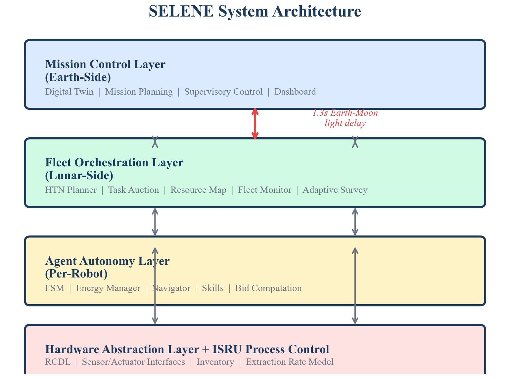
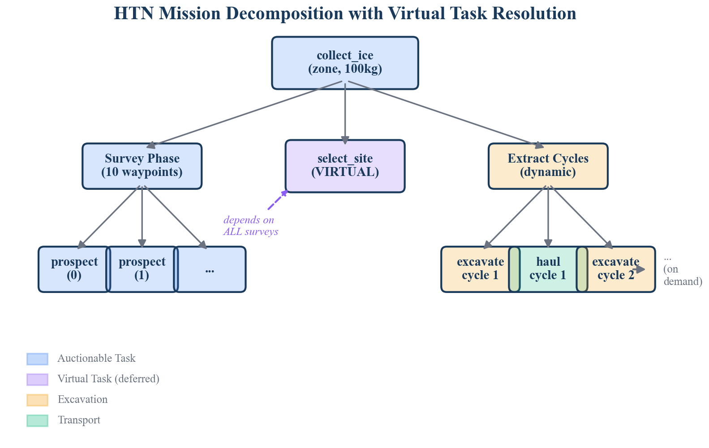
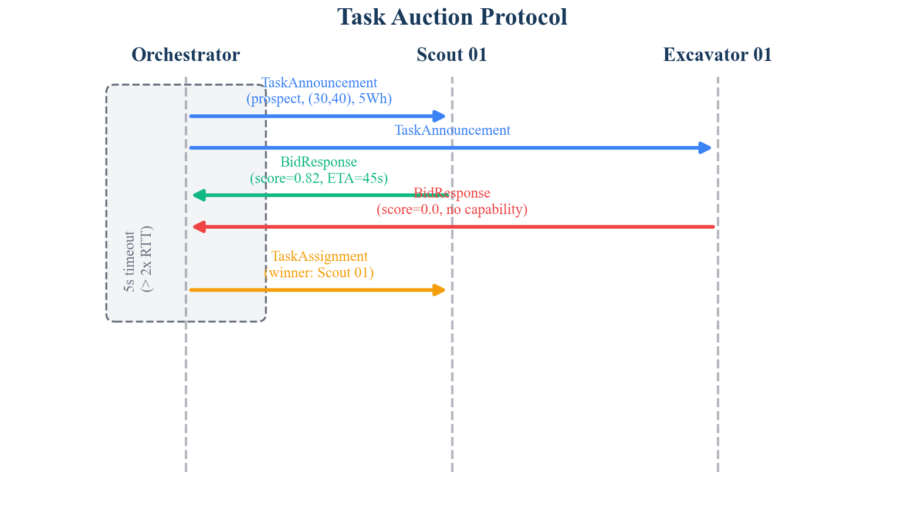
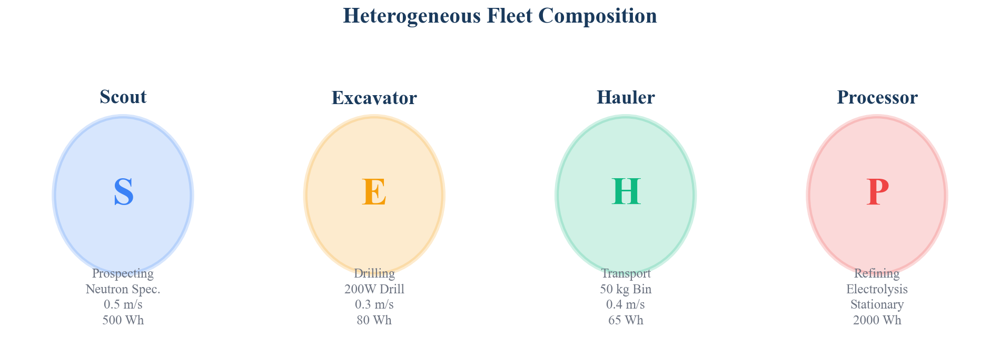
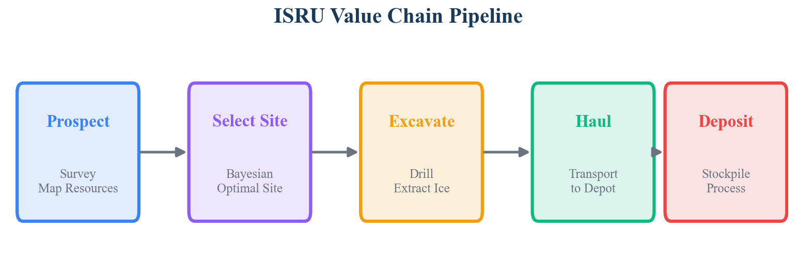
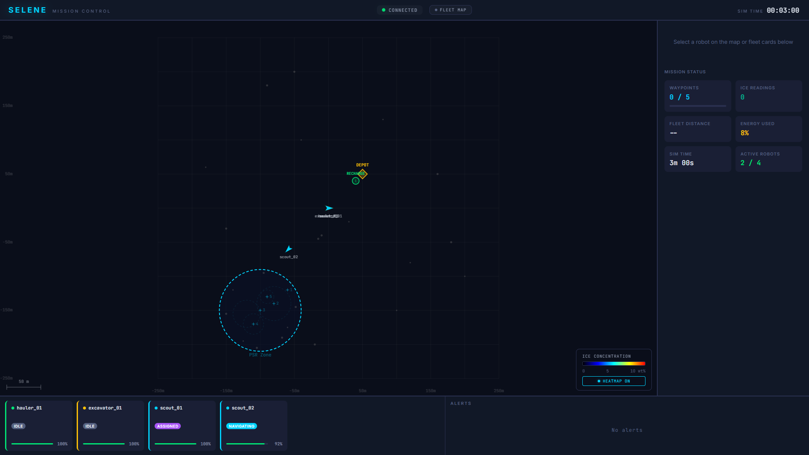

# Introduction

The Artemis program and international lunar exploration initiatives have established a clear trajectory toward sustained human presence on the Moon within the next decade. A critical enabler for this vision is In-Situ Resource Utilization (ISRU) — the extraction and processing of lunar resources, particularly water ice in permanently shadowed regions (PSRs), to produce propellant, life support consumables, and construction materials. Without ISRU, every kilogram of consumable must be launched from Earth at costs exceeding \$1 million per kilogram to the lunar surface, rendering long-term habitation economically infeasible.

The ISRU value chain comprises four sequential phases: *prospecting* (locating and characterizing resource deposits), *extraction* (drilling or excavating raw material), *transport* (hauling material to processing facilities), and *processing* (refining raw material into usable products). Each phase demands specialized robotic capabilities, and the full pipeline requires tight coordination among heterogeneous agents operating under severe constraints: 1.3-second Earth-Moon communication latency, multi-minute communication blackouts, extreme thermal environments, limited onboard power, and the absence of GPS or pre-built infrastructure.

Despite significant progress in individual ISRU technologies — NASA's RASSOR excavator, ESA's PROSPECT drill, and various autonomous navigation systems — no existing system provides an integrated software framework for coordinating a heterogeneous robotic fleet across the complete ISRU value chain. This gap motivates SELENE.

## Contributions

SELENE makes the following contributions, each detailed in a companion white paper in this series:

1. **Hierarchical Task Network (HTN) Planning with Virtual Task Resolution** (WP-01): A mission decomposition algorithm that generates dependency-ordered tasks, including deferred "virtual" tasks that resolve by querying a probabilistic resource map.

2. **Market-Based Auction with Energy-Aware Bid Scoring** (WP-02): A decentralized task allocation protocol where robots bid on tasks using a scoring function that integrates spatial proximity, round-trip energy affordability, and capability matching.

3. **Bayesian Spatial Grid Fusion for Resource Mapping** (WP-03): A probabilistic resource map that fuses noisy sensor observations via conjugate Gaussian updates with distance-decayed spatial footprint weighting.

4. **Adaptive Survey Planning via Information Gain** (WP-04): A waypoint selection algorithm that balances exploration (high posterior variance), exploitation (neighboring resource signal), and travel cost.

5. **Robot Capability Descriptor Language (RCDL)** (WP-05): A YAML-based schema with model validation for declaratively describing heterogeneous robot capabilities, enabling hardware-agnostic agent software.

6. **Material Conservation Ledger** (WP-06): A material tracking system enforcing the invariant that total extracted material equals material in transit plus material deposited.

## Paper Organization

Section 2 presents the system architecture. Section 3 describes the fleet orchestration layer. Section 4 covers the agent autonomy layer. Section 5 details the hardware abstraction and ISRU process control layers. Section 6 presents the integrated mission execution workflow. Section 7 positions SELENE against the state of the art. Section 8 discusses current limitations and future work.

# System Architecture

## Design Principles

SELENE's architecture is governed by five principles derived from the operational constraints of lunar surface operations:

**Delay Tolerance.** The 1.3-second one-way light delay between Earth and Moon renders synchronous teleoperation infeasible for real-time robot control. SELENE's fleet must operate autonomously for extended periods, with Earth-side operators providing supervisory oversight rather than direct commands. All coordination protocols are designed with timeouts exceeding twice the round-trip communication delay.

**Graceful Degradation.** No single robot failure should halt the mission. When a robot becomes unresponsive, its assigned tasks must be automatically recovered and re-allocated to remaining fleet members. The system must degrade proportionally — losing one of four robots should reduce throughput by approximately 25%, not 100%.

**Resource Awareness.** Lunar robots operate under severe energy constraints. Battery capacity ranges from 65 Wh (hauler) to 500 Wh (scout), and solar recharging is unavailable in permanently shadowed regions. Every task allocation decision must account for whether a robot can reach the task, execute it, *and return to a recharging station* before its battery reaches critical levels.

**Hardware Agnosticism.** The same orchestration software must coordinate robots with fundamentally different capabilities — from neutron spectrometers on scouts to 200W drills on excavators to 50 kg transport bins on haulers. The software architecture must abstract hardware differences behind uniform interfaces.

**Extensibility.** New robot types, sensor modalities, ISRU processes, and even celestial bodies must be accommodable without re-architecting the system.

## Layered Architecture

SELENE employs a four-layer architecture, illustrated in Figure 1.

{width=100%}

**Mission Control Layer (Earth-Side).** Provides a web-based dashboard (React + Three.js) for supervisory control, mission planning, and digital twin visualization. Operators can monitor fleet state, inject tasks, override robot behavior, and analyze resource maps. This layer operates asynchronously — commands are queued and executed when communication windows permit.

**Fleet Orchestration Layer (Lunar-Side).** The central coordination engine running on a lunar surface compute node. Comprises the HTN planner, task auction mechanism, resource map, fleet monitor, and adaptive survey planner. Operates at 2 Hz for auction ticks and 1 Hz for heartbeat monitoring and mission progress reporting.

**Agent Autonomy Layer (Per-Robot).** Each robot runs an independent autonomy stack including a finite state machine, energy manager, path planner (A* with cost grids), pure-pursuit path follower, and skill-based task execution modules. Agents operate independently during communication blackouts.

**Hardware Abstraction Layer (HAL) + ISRU Process Control.** Provides uniform sensor and actuator interfaces across heterogeneous robots. Robot capabilities are declared in YAML descriptors (RCDL) and validated at startup via Pydantic schemas. The ISRU process control layer tracks material flow with conservation invariant enforcement.

## Technology Stack

SELENE is implemented in Python atop ROS 2 (Humble+), using DDS (Cyclone/FastDDS) for inter-node communication. The simulation environment uses Gazebo Harmonic with custom lunar terrain and sensor plugins. The dashboard is a React application communicating via rosbridge WebSocket. Safety-critical components are designated for Rust implementation in future phases.

| Component | Technology | Lines of Code |
|---|---|---|
| Orchestrator | Python / ROS 2 | ~1,200 |
| Agent | Python / ROS 2 | ~1,100 |
| HAL | Python / Pydantic | ~800 |
| ISRU Process | Python | ~200 |
| Messages | ROS 2 IDL | ~100 |
| Dashboard | React / JSX | ~2,500 |

Table: SELENE implementation breakdown by component.

# Fleet Orchestration Layer

The orchestration layer coordinates the fleet through five tightly integrated modules.

## HTN Planner

The HTN planner decomposes high-level mission objectives into primitive, auction-able tasks. A `collect_ice(zone, radius, quantity)` mission decomposes into:

1. **Survey phase**: Hexagonal grid waypoints within the target zone, sorted by distance from center (spiral-outward pattern), generating `prospect`-type tasks.

2. **Virtual site selection**: A non-auctioned placeholder task dependent on all survey tasks. When all surveys complete, the planner queries the Bayesian resource map, scoring each cell as $\text{score} = \mu / (1 + \sigma^2)$ to favor high concentration with low uncertainty.

3. **Extract-haul cycles**: Sequential `excavate` → `haul` task pairs generated based on the target quantity and hopper capacity (20 kg/load). Additional cycles are generated dynamically as the material ledger reports deposited quantities below the target.

{width=80%}

The virtual task mechanism is, to our knowledge, a novel contribution to the HTN planning literature in the context of multi-robot ISRU systems. See WP-01 for the complete algorithmic treatment.

## Task Auction Mechanism

Task allocation uses a market-based auction protocol designed for delay-tolerant operation:

1. The orchestrator detects idle robots and pending tasks with satisfied dependencies.
2. A `TaskAnnouncement` is broadcast containing the task location, energy cost estimate, required capabilities, priority, and deadline.
3. Agents compute a bid score: $b = w_d \cdot e^{-d^2/2\sigma^2} + w_e \cdot E_{\text{afford}} + w_c \cdot C_{\text{match}}$
4. After a 5-second timeout (exceeding $2 \times$ the Earth-Moon round-trip time), the orchestrator selects the highest-scoring bidder.
5. If no bids are received, the task is re-queued for future auction.

The bid score integrates three factors: spatial proximity (Gaussian decay with distance), energy affordability (whether the robot can execute the task and return to base with a 10% safety margin), and capability match (binary: does the robot's RCDL descriptor include the required capability?). See WP-02 for the energy model and scoring analysis.

{width=80%}

## Probabilistic Resource Map

The resource map maintains a 500 $\times$ 500 grid (1 m resolution) where each cell stores a posterior mean $\mu$, posterior variance $\sigma^2$, and observation count. When a scout reports a neutron spectrometer reading at position $(x, y)$, the map updates all cells within a 5-meter footprint radius using Bayesian Gaussian-Gaussian conjugate formulae:

$$\tau_{\text{post}} = \tau_{\text{prior}} + w \cdot \tau_{\text{obs}}$$
$$\sigma^2_{\text{post}} = 1 / \tau_{\text{post}}$$
$$\mu_{\text{post}} = \sigma^2_{\text{post}} \cdot (\tau_{\text{prior}} \cdot \mu_{\text{prior}} + w \cdot \tau_{\text{obs}} \cdot z)$$

where $\tau = 1/\sigma^2$ denotes precision, $z$ is the observation value, and $w = \exp(-r^2 / 2\sigma_f^2)$ is the distance-decayed footprint weight at distance $r$ from the sensor. This yields O(1) updates per observation — critical for resource-constrained processors. See WP-03 for the complete derivation and convergence analysis.

## Adaptive Survey Planner

Rather than surveying on a static grid, SELENE's adaptive survey planner selects waypoints to maximize information gain. Each candidate waypoint is scored:

$$S = w_v \cdot \hat{\sigma}^2 + w_s \cdot \hat{N} - w_d \cdot \hat{d}$$

where $\hat{\sigma}^2$ is the normalized posterior variance (exploration), $\hat{N}$ is the normalized average neighbor ice concentration (exploitation), and $\hat{d}$ is the normalized distance from the robot (cost). Hats denote cross-candidate normalization. This three-term formulation explicitly balances exploration of unknown regions, exploitation near detected deposits, and energy-efficient routing. See WP-04 for the complete formulation and comparison with pure information-gain approaches.

## Fleet Monitor

The fleet monitor tracks robot state via heartbeat messages at 2 Hz. If a robot's heartbeat exceeds a 10-second timeout, it is marked offline and its assigned tasks are reverted to PENDING status for re-auction. This provides automatic, human-free task recovery — essential when Earth-side operators may be minutes away from awareness of a failure.

# Agent Autonomy Layer

## Finite State Machine

Each robot's lifecycle is governed by an event-driven FSM with 11 states and explicit transition rules. The FSM supports *wildcard transitions* for cross-cutting concerns: an `ENERGY_CRITICAL` event from any active state immediately transitions to `RETURNING`, and a `FAULT` event transitions to `ERROR`. This ensures safety-critical behaviors override task execution regardless of the agent's current activity.

The FSM is implemented as a pure Python module with zero ROS dependencies, enabling isolated unit testing of the complete state space.

## Energy Manager

The energy manager models task affordability as a multi-leg budget:

$$E_{\text{total}} = E_{\text{go}} + E_{\text{task}} + E_{\text{return}}$$

where each leg accounts for locomotion power, idle draw, and speed-dependent consumption. A 10% safety margin is applied:

$$E_{\text{budget}} = 1.1 \times E_{\text{total}}$$

A robot will not bid on a task unless $E_{\text{remaining}} \geq E_{\text{budget}}$. If battery level falls below 15% during any activity, the `ENERGY_CRITICAL` wildcard fires, aborting the current task and initiating return to the recharging station.

## Skill-Based Task Execution

Complex multi-phase behaviors are encapsulated as *skills* — composable state machines orthogonal to the agent FSM. Four skills are implemented:

- **ProspectSkill**: Navigate → Settle (1s) → Sense (2s, 20 readings) → Record
- **ExcavateSkill**: Navigate → Position → Drill (until hopper full or timeout) → Stop
- **HaulSkill**: Navigate to pickup → Load → Navigate to depot → Unload
- **RechargeSkill**: Navigate to station → Charge to 90%

Each skill reports progress (0.0–1.0) to the orchestrator, enabling fleet-level situational awareness. Skills are HAL-agnostic — they access sensors and actuators exclusively through abstract interfaces.

# Hardware Abstraction and ISRU Process Control

## Robot Capability Descriptor Language (RCDL)

SELENE introduces RCDL, a YAML-based schema for declaratively describing robot capabilities. Each descriptor specifies the robot's kinematic model, maximum speed, mass, battery profile (capacity, idle draw, locomotion draw), sensor suite (type, range, noise characteristics, power draw), actuator suite (type, capacity, power), and capability tags.

Descriptors are validated at startup using Pydantic v2 model validators, catching misconfigurations before they cause runtime failures. The HAL factory constructs the appropriate sensor and actuator interface implementations based on the parsed descriptor. See WP-05 for the schema specification and validation rules.

{width=100%}

## Material Conservation Ledger

The ISRU process control layer maintains a material conservation ledger tracking three quantities: extracted (at sites), in-transit (on robots), and deposited (at depot). The system enforces the invariant:

$$m_{\text{extracted}} = m_{\text{in\_transit}} + m_{\text{deposited}} \pm \epsilon$$

where $\epsilon = 0.01$ kg is the numerical tolerance. Violations trigger alerts, enabling early detection of accounting errors or sensor drift. The extraction rate model incorporates ice concentration, drill power fraction, and depth penalty. See WP-06 for the conservation proof and rate model analysis.

# Integrated Mission Execution

{width=100%}

A complete SELENE mission proceeds as follows:

1. **Mission initialization.** The HTN planner decomposes `collect_ice(zone_center, zone_radius, target_kg)` into survey waypoints + virtual site selection + initial extract-haul cycles.

2. **Survey phase.** Survey tasks are auctioned to scouts. Each scout navigates to its assigned waypoint, activates the neutron spectrometer, records ice concentration readings, and publishes `ResourceMapUpdate` messages. The Bayesian resource map fuses these readings, progressively reducing uncertainty.

3. **Adaptive replanning.** Between auctions, the adaptive survey planner evaluates whether additional waypoints should be generated based on the current knowledge map state.

4. **Site selection.** When all survey dependencies are satisfied, the virtual `select_site` task resolves by querying the resource map. The cell with the highest $\mu/(1+\sigma^2)$ score is selected as the extraction site.

5. **Extraction-transport cycles.** Excavate tasks are auctioned to excavators; haul tasks to haulers. Each excavate-haul cycle is dependency-linked, enforcing temporal ordering. The material ledger tracks mass flow.

6. **Dynamic cycle expansion.** After each haul completion, the HTN planner checks whether deposited mass meets the target. If not, additional excavate-haul cycles are generated on demand.

7. **Mission completion.** When $m_{\text{deposited}} \geq m_{\text{target}}$, the mission is marked complete. All robots return to idle.

Throughout execution, the fleet monitor detects unresponsive robots and recovers their tasks. Energy-critical robots abort tasks and recharge autonomously. The dashboard provides real-time visualization of fleet state, resource map evolution, and mission progress.

{width=100%}

# State of the Art

## Comparison with Existing Systems

Table 2 compares SELENE against the most relevant existing systems across five architectural dimensions.

| System | Het. Fleet | Auction/HTN | ISRU Chain | Delay-Tolerant | ROS 2 |
|---|---|---|---|---|---|
| **SELENE** | Yes | Yes | Yes | Yes | Yes |
| NASA CADRE | No | No (leader) | No | Yes | No |
| NASA SRCP2 | Yes | No (central) | Yes | No | Yes |
| OffWorld | Yes | No (MARL) | Yes | Unknown | Unknown |
| ESA PRO-ACT | Yes | No (central) | Partial | No | No |
| DARPA SubT | Yes | Partial | No | Yes | Yes |
| Cat/Rio Tinto | Yes | No (MILP) | Yes (terr.) | No (GPS) | No |

Table: Comparison of SELENE with existing multi-robot coordination systems. No existing system occupies SELENE's complete design space.

**NASA CADRE** (launching 2026) demonstrates multi-robot autonomy with leader election and shared state, but operates a homogeneous fleet for mapping — not ISRU. **NASA SRCP2** (2019–2021) is the closest problem-domain match, using Scout/Excavator/Hauler roles in Gazebo, but employed centralized task assignment without HTN planning, Bayesian mapping, or auction-based allocation. **OffWorld Inc.** pursues heterogeneous swarm mining but uses multi-agent reinforcement learning rather than symbolic planning — a fundamentally different architectural approach. **DARPA SubT Challenge** teams independently validated SELENE's core component choices: CERBERUS used distributed auction, CoSTAR used Bayesian belief-space planning, and all teams designed for communication-degraded operation. However, no SubT team combined all three approaches, and none addressed the ISRU value chain.

## Novel Contributions

SELENE's primary novelty is the *system-level integration* of components that individually have precedent but have never been combined. Additionally, three specific algorithmic contributions appear novel:

1. **Virtual task resolution in HTN**: Non-auctioned placeholder tasks that resolve by querying a probabilistic resource map, enabling conditional task generation based on sensor-derived state. Not found in prior HTN, MRTA, or ISRU literature.

2. **Dynamic cycle expansion**: Closed-loop integration of HTN planning with material conservation tracking, generating extraction cycles on demand based on real-time deposited mass.

3. **Three-term adaptive survey scoring**: The combination of posterior variance, neighbor signal exploitation, and distance cost in a single weighted scoring function with cross-candidate normalization.

# Limitations and Future Work

**Current limitations.** SELENE has been validated only in simulation (Gazebo Harmonic). The flat-terrain model does not capture the full complexity of PSR terrain (boulders, steep crater walls, permanent shadow). The communication model assumes reliable DDS messaging without modeling RF propagation, signal attenuation, or multi-path effects. The fleet size (4 robots) is small; scalability to dozens of agents remains untested.

**Planned extensions.** Phase 4 will introduce multi-mission planning (concurrent ice and regolith oxygen extraction). Phase 5 will add predictive maintenance and learned terrain cost models via onboard ML inference. Phase 6 will port safety-critical components to Rust and begin integration with Space ROS for flight qualification pathways.

**Toward flight readiness.** The path from simulation prototype to flight software requires: (1) integration with Space ROS and F-Prime for DO-178C alignment, (2) hardware-in-the-loop testing with physical rover platforms, (3) terrain model validation using orbital data (LOLA, Diviner, Mini-RF), and (4) communication protocol alignment with NASA LunaNet DTN specifications.

# Conclusion

SELENE demonstrates that the complete ISRU value chain — from prospecting through deposition — can be autonomously orchestrated by a heterogeneous robotic fleet using a combination of HTN planning, market-based task allocation, Bayesian resource mapping, and information-gain adaptive surveying. The architecture's delay-tolerant, fault-resilient design addresses the fundamental operational constraints of lunar surface operations. While currently validated in simulation, the modular, hardware-agnostic design provides a clear pathway toward flight-qualified deployment. The six companion white papers in this series provide detailed algorithmic treatments of each core technical contribution.

# References

1. G. Sanders et al., "Progress Review: NASA In-Situ Resource Utilization (ISRU) Development & Incorporation — 2019 to 2025," NASA TM, 2025.
2. D. Nau et al., "SHOP2: An HTN Planning System," JAIR, vol. 20, pp. 379–404, 2003.
3. R. Zlot and A. Stentz, "Market-Based Multirobot Coordination for Complex Tasks," Int. J. Robotics Research, vol. 25, no. 1, pp. 73–101, 2006.
4. M. B. Dias and A. Stentz, "TraderBots: A New Paradigm for Robust and Efficient Multirobot Coordination in Dynamic Environments," CMU-RI-TR-03-19, 2003.
5. H. Choi, L. Brunet, and J. How, "Consensus-Based Decentralized Auctions for Robust Task Allocation," IEEE Trans. Robotics, vol. 25, no. 4, pp. 912–926, 2009.
6. S. Chien et al., "Using Autonomy Flight Software to Improve Science Return on Earth Observing One," J. Aerospace Computing, 2005.
7. "Multi-robot cooperation for lunar In-Situ resource utilization," Frontiers in Robotics and AI, vol. 10, 2023.
8. "CADRE: Planning, Scheduling, and Execution for Multi-Robot Lunar Exploration," arXiv:2502.14803, 2025.
9. "Space ROS: An Open-Source Framework for Space Robotics," AIAA SciTech 2023-2709, 2023.
10. S. Thrun, W. Burgard, and D. Fox, "Probabilistic Robotics," MIT Press, 2005.
11. "LunarMiner: A Nature-Inspired Swarm Robotics Framework for Lunar Water Ice Extraction," Biomimetics, vol. 9, no. 11, 2024.
12. "Informative Path Planning to Explore and Map Unknown Planetary Surfaces," arXiv:2503.16613, 2025.
