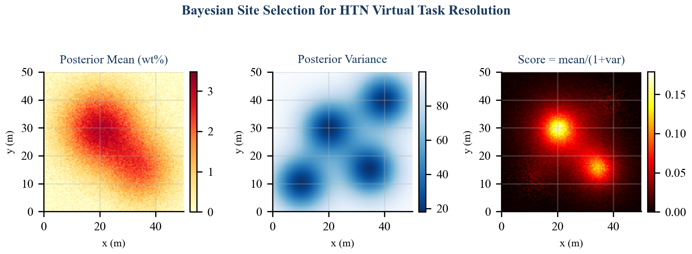

# 1. Introduction

Lunar In-Situ Resource Utilization (ISRU) represents one of the most operationally complex challenges in space robotics. A complete ice-harvesting campaign requires prospecting permanently shadowed regions (PSRs) to locate water ice deposits, selecting optimal extraction sites under uncertainty, excavating regolith, and hauling material to processing facilities---all coordinated across a heterogeneous fleet of autonomous robots operating under severe communication latency (1.3-second one-way Earth-Moon delay), limited computational resources, and the possibility of multi-minute communication blackouts.

Classical planning approaches based on the Planning Domain Definition Language (PDDL) model the world as a state space and search for action sequences that transform an initial state into a goal state. While PDDL planners excel at combinatorial reasoning over discrete state variables, they struggle with the hierarchical, temporally extended structure of ISRU missions. An ice-collection campaign is not naturally expressed as a goal predicate over world state; it is a *process* with phases, information dependencies, and iterative refinement. The survey phase must complete before site selection can occur, but the number of extraction cycles depends on information available only after selection---and may need dynamic expansion at runtime if partial loads are lost.

Hierarchical Task Network (HTN) planning provides a more natural formalism for this class of problems. Rather than searching through state space, HTN planners decompose compound tasks into subtask networks using domain-specific *methods*, preserving the operational structure that human mission planners reason about. This paper presents the HTN planning subsystem of the SELENE fleet management architecture, with three primary contributions:

1. **Virtual task resolution**: A mechanism for non-auctioned synchronization nodes that bridge information-gathering phases and commitment-bearing phases, resolving programmatically when all preconditions are satisfied.
2. **Bayesian site selection integration**: Tight coupling between the HTN planner and a probabilistic resource map, enabling site selection that balances exploitation (high estimated concentration) against epistemic uncertainty (measurement variance).
3. **Dynamic cycle expansion**: A runtime mechanism that monitors mission progress and generates additional excavate-haul cycles on-demand when deposited material falls short of the target quantity.

# 2. Background

## 2.1 HTN Planning

Hierarchical Task Network planning [1] represents planning knowledge as a hierarchy of *tasks* and *methods*. A task is either *primitive* (directly executable) or *compound* (requiring decomposition). A method $m = (c, \text{tn})$ specifies that compound task $c$ can be decomposed into task network $\text{tn}$, which is a partially ordered set of subtasks with ordering constraints.

Formally, an HTN planning problem is a tuple $P = (s_0, D, d)$ where $s_0$ is the initial state, $D$ is the planning domain (a set of operators and methods), and $d$ is the initial task network. A solution is a sequence of primitive task instantiations that can be obtained by recursively decomposing all compound tasks in $d$ using methods in $D$.

The SHOP2 algorithm [2] processes tasks in a total order, performing forward state-space search at each decomposition step. This provides completeness for totally ordered HTN problems while enabling domain-specific heuristics through method preconditions. Our approach shares SHOP2's forward-chaining philosophy but operates on a dependency graph rather than a total order, permitting concurrent execution of independent subtasks across the fleet.

## 2.2 Task Decomposition in Multi-Robot Systems

Multi-robot task allocation (MRTA) has been extensively studied under taxonomies such as ST-MR-TA (single-task robots, multi-robot tasks, time-extended allocation) [3]. HTN planning intersects with MRTA at the decomposition boundary: the planner produces primitive tasks that are then allocated to robots via auction-based or optimization-based mechanisms.

A key challenge is *information-dependent decomposition*, where later decomposition steps depend on information gathered during earlier task execution. Classical HTN planners assume full observability at planning time; in ISRU, the planner must defer site-selection decisions until survey data populates the resource map. Our virtual task mechanism addresses this by encoding deferred decisions as nodes in the task dependency graph.

## 2.3 Lunar ISRU Mission Structure

A canonical water-ice harvesting mission proceeds through four phases:

1. **Prospecting**: Deploying neutron spectrometers or ground-penetrating radar across a PSR to estimate subsurface ice concentration.
2. **Site selection**: Analyzing prospecting data to identify the most promising extraction site.
3. **Extraction**: Excavating ice-bearing regolith at the selected site.
4. **Transportation**: Hauling excavated material to a processing depot.

Phases 3 and 4 repeat cyclically until a target quantity is achieved, and the number of cycles cannot be determined until the extraction rate at the selected site is characterized. This iterative, information-dependent structure motivates the dynamic cycle expansion mechanism described in Section 4.4.

# 3. Problem Formulation

We formalize the ISRU mission decomposition as an HTN planning problem over a partially observable domain.

**Definition 1 (ISRU HTN Domain).** The domain $D_{\text{ISRU}}$ consists of:

- Primitive task types $T_p = \{\texttt{prospect}, \texttt{excavate}, \texttt{haul}\}$, each with required capabilities, target coordinates, and energy/duration estimates.
- Compound task types $T_c = \{\texttt{collect\_ice}\}$ parameterized by zone center $(c_x, c_y)$, zone radius $r$, and target quantity $q$ (kg).
- Virtual task types $T_v = \{\texttt{select\_site}\}$, which are non-auctioned decision points resolved by the planner rather than executed by robots.

**Definition 2 (Task Dependency Graph).** A task dependency graph $G = (V, E)$ is a directed acyclic graph where vertices $V$ represent task instances and edges $E$ represent temporal dependencies. An edge $(u, v) \in E$ indicates that task $u$ must reach status $\texttt{COMPLETED}$ before task $v$ becomes eligible for execution.

**Definition 3 (Task Lifecycle).** Each task $t \in V$ progresses through a status lifecycle:

$$\texttt{PENDING} \rightarrow \texttt{AUCTIONING} \rightarrow \texttt{ASSIGNED} \rightarrow \texttt{IN\_PROGRESS} \rightarrow \texttt{COMPLETED}$$

with exceptional transitions to $\texttt{INTERRUPTED}$ or $\texttt{FAILED}$. A task enters $\texttt{AUCTIONING}$ only when all predecessors in $G$ have reached $\texttt{COMPLETED}$.

**Definition 4 (Readiness Predicate).** Task $t$ is *ready* if and only if:

$$\text{ready}(t) \iff \text{status}(t) = \texttt{PENDING} \;\wedge\; \forall\, d \in \text{depends\_on}(t) : \text{status}(d) = \texttt{COMPLETED}$$

This predicate is evaluated by the `get_next_ready()` method of the task queue, which returns the highest-priority ready task for auction.

# 4. Algorithm Design

The HTN planner decomposes the compound task $\texttt{collect\_ice}(c_x, c_y, r, q)$ into a three-phase task network. Figure 1 illustrates the complete decomposition structure.


*Figure 1: HTN decomposition of a CollectIce mission. Survey tasks (green) feed into the virtual SelectSite node (orange), which gates excavate-haul cycles (blue/red). Dashed lines denote dependency edges; the bold boundary marks the dynamic expansion region.*

## 4.1 Survey Phase: Hexagonal Waypoint Generation

The survey phase generates a set of prospecting waypoints arranged in a hexagonal grid pattern within the target zone. Hexagonal tessellation provides optimal coverage with minimal overlap for circular sensor footprints [4], achieving approximately 13% better area coverage efficiency than square grids at equivalent spacing.

**Algorithm 1: Survey Waypoint Generation**

```
function GenerateSurveyWaypoints(center, radius, spacing, max_points):
    effective_radius <- radius - margin
    waypoints <- empty list
    row_spacing <- spacing * sin(60 deg)
    rows <- floor(2 * effective_radius / row_spacing) + 1

    for row in 0..rows:
        y_offset <- -effective_radius + row * row_spacing
        x_shift <- spacing / 2  if row is odd,  else 0
        cols <- floor(2 * effective_radius / spacing) + 1

        for col in 0..cols:
            x_offset <- -effective_radius + col * spacing + x_shift
            (wx, wy) <- (center_x + x_offset, center_y + y_offset)
            if dist((wx, wy), center) <= effective_radius:
                waypoints.append((wx, wy))

    sort waypoints by distance to center (ascending)
    return waypoints[0 : max_points]
```

The algorithm generates candidate waypoints on a hexagonal lattice with row spacing $\Delta_y = s \cdot \sin(60°) \approx 0.866s$ where $s$ is the configured spacing (default $s = 20.0\;\text{m}$). A 5-meter safety margin is subtracted from the zone radius to prevent waypoints near the boundary. Waypoints are sorted by Euclidean distance from the zone center, producing a center-outward spiral ordering that ensures the most geologically relevant area is surveyed first. The output is capped at $N_{\max} = 10$ waypoints.

For each waypoint $(w_x, w_y)$, the planner creates a primitive task:

$$t_i^{\text{survey}} = \texttt{prospect}(w_x, w_y), \quad \text{capabilities} = \{\texttt{prospect}\}, \quad \text{priority} = 5.0$$

Survey tasks have no inter-dependencies and may be executed concurrently by any robot possessing the `prospect` capability, enabling the auction mechanism to distribute survey work across multiple prospecting rovers.

## 4.2 Virtual Task Resolution: Select Site

The transition from the survey phase to the extraction phase requires an information-dependent decision: choosing the optimal extraction site based on survey data. This decision cannot be made at initial planning time because the resource map is unpopulated, and it should not be auctioned to a robot because it is a *planning decision*, not a *physical action*.

We introduce the concept of a **virtual task**---a node in the task dependency graph that is resolved by the planner itself rather than dispatched to a robot. The `select_site` virtual task is defined as:

$$t^{\text{site}} = \texttt{select\_site}(c_x, c_y), \quad \text{depends\_on} = \{t_1^{\text{survey}}, t_2^{\text{survey}}, \ldots, t_N^{\text{survey}}\}$$

Virtual tasks are never entered into the auction. Instead, the planner's `check_and_advance()` method, invoked at 1 Hz, evaluates the readiness predicate for virtual tasks and resolves them programmatically.

**Algorithm 2: Virtual Task Resolution**

```
function CheckAndAdvance():
    site_task <- queue.get(select_site_id)
    if site_task.status = PENDING:
        if all d in site_task.depends_on have status COMPLETED:
            (site_x, site_y) <- PickBestSite()
            site_task.metadata["site_x"] <- site_x
            site_task.metadata["site_y"] <- site_y
            queue.set_status(select_site_id, COMPLETED)
            GenerateCycles(site_x, site_y)

    UpdateDeposited()

    if deposited_kg < target_kg:
        remaining <- target_kg - deposited_kg
        needed <- ceil(remaining / HOPPER_CAPACITY_KG)
        if needed > cycles_generated:
            GenerateCycles(site_x, site_y, count=needed - cycles_generated)
```

The virtual task mechanism provides several advantages over alternative approaches. Compared to callback-based event systems, virtual tasks are first-class nodes in the dependency graph, making the mission structure inspectable and serializable. Compared to replanning (discarding the current plan and generating a new one), virtual tasks preserve the existing task network and extend it incrementally, avoiding the disruption of in-progress tasks.

## 4.3 Excavate-Haul Cycle Generation

Once the extraction site is determined, the planner generates a chain of excavate-haul cycles. Each cycle consists of two primitive tasks in strict temporal order:

$$\texttt{excavate}(s_x, s_y) \rightarrow \texttt{haul}(d_x, d_y)$$

where $(s_x, s_y)$ are the extraction site coordinates and $(d_x, d_y)$ are the depot coordinates. The number of initial cycles is determined by:

$$N_{\text{cycles}} = \left\lceil \frac{q}{C_{\text{hopper}}} \right\rceil$$

where $q$ is the target quantity in kilograms and $C_{\text{hopper}} = 20.0\;\text{kg}$ is the hopper capacity constant.

The dependency chain enforces strict sequential ordering across cycles:

$$t^{\text{site}} \rightarrow t_1^{\text{exc}} \rightarrow t_1^{\text{haul}} \rightarrow t_2^{\text{exc}} \rightarrow t_2^{\text{haul}} \rightarrow \cdots \rightarrow t_N^{\text{exc}} \rightarrow t_N^{\text{haul}}$$

This serialization is deliberate: it ensures that at most one excavation is in progress at a given extraction site, preventing mechanical interference between robots operating in close proximity. Each excavate task depends on the preceding haul task's completion, and the first excavate depends on the `select_site` virtual task. The implementation achieves this by tracking `prev_dep`, which is initialized to `select_site_id` and updated to the most recently generated haul task ID after each cycle.

## 4.4 Dynamic Cycle Expansion

A static plan with a fixed number of cycles is insufficient for real ISRU operations, where material may be lost during hauling (spillage, mechanical failure) or where the actual extraction yield per cycle may differ from the nominal hopper capacity. The dynamic cycle expansion mechanism addresses this by monitoring actual mission progress and generating additional cycles on-demand.

**Algorithm 3: Dynamic Cycle Expansion**

```
function UpdateDeposited():
    completed_hauls <- count tasks where
        type = "haul" AND parent = mission_id AND status = COMPLETED
    deposited_kg <- completed_hauls * HOPPER_CAPACITY_KG

function IsMissionComplete():
    return deposited_kg >= target_kg
```

The `check_and_advance()` method (Algorithm 2) is invoked at 1 Hz. After updating the deposited quantity, it computes the number of additional cycles required:

$$N_{\text{additional}} = \left\lceil \frac{q - d}{C_{\text{hopper}}} \right\rceil - N_{\text{generated}}$$

where $d$ is the current deposited quantity and $N_{\text{generated}}$ is the cumulative number of cycles already generated. If $N_{\text{additional}} > 0$, new cycle pairs are appended to the end of the dependency chain. This mechanism guarantees eventual mission completion under the assumption that individual tasks eventually succeed (possibly after recovery via re-queuing).

The expansion is conservative: it only adds cycles when the shortfall is confirmed by completed haul counts, never speculatively. New cycles are appended to the tail of the existing dependency chain by locating the last haul task in the current mission's task set, ensuring the sequential ordering invariant is maintained.

# 5. Task Queue with Dependency Tracking

The task queue serves as the interface between the HTN planner and the auction-based task allocation mechanism. It maintains a dictionary of `TaskEntry` records indexed by task ID, with each entry encoding the full task specification including dependency information.

## 5.1 Data Model

Each task entry is a dataclass with the following fields:

| Field | Type | Description |
|-------|------|-------------|
| `task_id` | `str` | Unique identifier (prefixed by task type) |
| `task_type` | `str` | One of `prospect`, `select_site`, `excavate`, `haul` |
| `target_x`, `target_y` | `float` | World coordinates of the task target |
| `priority` | `float` | Scheduling priority (higher = more urgent) |
| `status` | `TaskStatus` | Current lifecycle state |
| `assigned_robot` | `str` | Robot ID when assigned, empty otherwise |
| `required_capabilities` | `list[str]` | Capabilities needed to execute |
| `depends_on` | `list[str]` | Task IDs that must complete first |
| `parent_task_id` | `str` | Mission-level grouping identifier |
| `progress_metadata` | `dict` | Extensible key-value store for runtime data |

## 5.2 Dependency-Aware Scheduling

The `get_next_ready()` method implements the readiness predicate from Definition 4:

```
function GetNextReady():
    ready <- empty list
    for each task t in queue:
        if t.status != PENDING: continue
        deps_met <- true
        for each dep_id in t.depends_on:
            if queue[dep_id].status != COMPLETED:
                deps_met <- false; break
        if deps_met:
            ready.append(t)
    return argmax(ready, key=priority)  or None
```

This linear scan over the task set is acceptable for the expected task counts in ISRU missions ($O(10^1)$ to $O(10^2)$ tasks). For larger-scale deployments, the readiness check could be accelerated using a dependency counter that is decremented as predecessors complete, reducing the per-invocation cost from $O(|V| \cdot |E|)$ to $O(|V|)$.

## 5.3 Fault Recovery

The `recover_tasks_for_robot()` method handles robot timeouts by reverting all `ASSIGNED` and `IN_PROGRESS` tasks for the faulted robot back to `PENDING` status, clearing the robot assignment:

$$\forall\, t \in V : (\text{assigned}(t) = r_{\text{faulted}}) \wedge (\text{status}(t) \in \{\texttt{ASSIGNED}, \texttt{IN\_PROGRESS}\}) \implies \text{status}(t) \leftarrow \texttt{PENDING}$$

This enables transparent re-auction of interrupted work. The `INTERRUPTED` status is available for tasks where partial progress metadata must be preserved, such as partially completed excavation operations.

# 6. Integration with Bayesian Resource Map

The site selection decision bridges the HTN planner and the Bayesian resource map, a 500 x 500 probabilistic grid that maintains posterior estimates of ice concentration at each cell.

## 6.1 Bayesian Sensor Fusion

The resource map employs Gaussian-Gaussian conjugate updates. For each sensor reading $z$ at location $(x, y)$ with sensor noise variance $\sigma_s^2$, cells within a footprint radius receive updates weighted by a Gaussian distance kernel:

$$w(d) = \exp\!\left(-\frac{d^2}{2\sigma_f^2}\right)$$

where $d$ is the distance from the measurement center and $\sigma_f$ is the footprint sigma. The posterior update for each affected cell follows the conjugate form:

$$\tau_{\text{post}} = \tau_{\text{prior}} + \frac{w}{\sigma_s^2}, \qquad \mu_{\text{post}} = \frac{\tau_{\text{prior}} \cdot \mu_{\text{prior}} + \frac{w}{\sigma_s^2} \cdot z}{\tau_{\text{post}}}$$

where $\tau = 1/\sigma^2$ denotes precision. This provides principled uncertainty reduction as multiple survey passes accumulate evidence.

## 6.2 Site Selection Scoring

The `_pick_best_site()` method computes a score for each cell within the survey zone that balances exploitation against uncertainty:

$$\text{score}(i, j) = \frac{\mu_{i,j}}{1 + \sigma^2_{i,j}}$$

This scoring function has an intuitive interpretation: it is the posterior mean discounted by uncertainty. A cell with high estimated ice concentration but also high variance (few observations, conflicting readings) will score lower than a cell with moderate concentration but low variance. This behavior is desirable for ISRU operations where the cost of excavating a dry site is substantial---multi-hour robot time and significant energy expenditure.


*Figure 2: Bayesian site selection. Left: posterior mean (ice concentration wt%). Center: posterior variance (uncertainty). Right: composite score $\mu / (1 + \sigma^2)$ used for site selection. The selected site (star) maximizes the score within the survey zone boundary (dashed circle).*

The scoring function searches over grid cells within the zone boundary:

$$(\hat{x}, \hat{y}) = \arg\max_{(i,j) \in \mathcal{Z}} \; \frac{\mu_{i,j}}{1 + \sigma^2_{i,j}}$$

where $\mathcal{Z} = \{(i, j) : \|(g_x(i,j), g_y(i,j)) - (c_x, c_y)\| \leq r\}$ is the set of grid cells within the zone radius $r$ of the zone center.

The selected coordinates are stored in the virtual task's `progress_metadata` dictionary, making them available to subsequent task generation without side channels. This design keeps the dependency graph self-contained: all information flows through task metadata and the resource map, both of which are inspectable and serializable.

# 7. Analysis

## 7.1 Dependency Graph Acyclicity

**Theorem 1.** *The task dependency graph $G$ produced by `decompose_collect_ice` is a directed acyclic graph (DAG).*

*Proof.* We show that every dependency edge $(u, v)$ satisfies $\text{creation\_time}(u) < \text{creation\_time}(v)$, establishing a topological order coincident with creation order.

Survey tasks $\{t_i^{\text{survey}}\}$ are created first and have no dependencies. The virtual task $t^{\text{site}}$ is created after all survey tasks, with dependencies pointing backward to already-created survey tasks. Excavate-haul cycles are created after $t^{\text{site}}$, with the first excavate depending on $t^{\text{site}}$ and subsequent tasks depending on the immediately preceding task in the chain. Dynamically generated cycles (Section 4.4) are appended after the last existing haul task, maintaining the creation-time ordering invariant.

Since all dependency edges point from earlier-created to later-created tasks, and creation times are strictly increasing (guaranteed by UUID-based task IDs generated sequentially), no cycle can exist. $\square$

## 7.2 Complexity Analysis

**Waypoint generation.** The hexagonal grid generation produces $O(r^2 / s^2)$ candidate points for zone radius $r$ and spacing $s$. Sorting is $O(k \log k)$ where $k$ is the candidate count, but the output is capped at $N_{\max} = 10$, making the effective cost constant for fixed zone geometries.

**Task graph size.** For a mission with target $q$ kg and hopper capacity $C$, the total number of tasks is:

$$|V| = N_{\text{survey}} + 1 + 2\left\lceil \frac{q}{C} \right\rceil = O\!\left(N_{\max} + \frac{q}{C}\right)$$

With $N_{\max} = 10$ and $C = 20.0$, a 100 kg mission produces $10 + 1 + 10 = 21$ tasks.

**`check_and_advance()` cost.** Each invocation performs: (a) a dependency check over $N_{\text{survey}}$ tasks ($O(N_{\max})$), (b) a deposited-quantity scan over all haul tasks ($O(q/C)$), and (c) potentially generates new cycles ($O(1)$ amortized). The total per-tick cost is $O(N_{\max} + q/C)$, which is negligible at the 1 Hz invocation rate for missions in the $10^2$--$10^3$ kg range.

**`get_next_ready()` cost.** Each invocation scans all tasks and checks dependencies: $O(|V| \cdot \bar{d})$ where $\bar{d}$ is the average dependency list length. Since survey tasks have $\bar{d} = 0$, the virtual task has $\bar{d} = N_{\max}$, and cycle tasks have $\bar{d} = 1$, the amortized cost is $O(|V|)$.

## 7.3 Mission Completion Guarantee

**Theorem 2.** *Under the assumptions that (i) every primitive task eventually reaches* COMPLETED *status (possibly after recovery and re-auction), and (ii)* `check_and_advance()` *is invoked infinitely often, the mission will complete in finite time.*

*Proof sketch.* Survey tasks have no dependencies and will eventually be auctioned and completed by assumption (i). Once all surveys complete, the virtual task resolves on the next `check_and_advance()` invocation, generating initial cycles. Each completed haul increases $d$ by $C_{\text{hopper}}$. If $d < q$ after all generated cycles complete, `check_and_advance()` generates additional cycles. Since each cycle increases $d$ by a fixed positive amount, $d \geq q$ is reached in at most $\lceil q / C_{\text{hopper}} \rceil$ successful haul completions. $\square$

# 8. Related Work

**SHOP2** [2] is the most widely used HTN planner in the literature, supporting both totally ordered and partially ordered task networks with conditional method selection. Our approach shares SHOP2's forward decomposition philosophy but differs in two key respects: we embed virtual tasks as first-class synchronization primitives rather than using method preconditions for conditional decomposition, and we support runtime task graph extension via dynamic cycle expansion.

**HTN-Timeline** [5] integrates HTN planning with timeline-based scheduling for multi-robot coordination. While HTN-Timeline addresses temporal flexibility through temporal constraint networks, our approach uses a simpler dependency graph model that is sufficient for the sequential nature of ISRU extraction cycles and more amenable to implementation on resource-constrained lunar computing hardware.

**SRCP2** [6], NASA's Space Robotics Challenge Phase 2, required autonomous teams to prospect, excavate, and process lunar volatiles. Published solutions primarily used finite state machines or behavior trees for task sequencing. Our HTN approach provides a more principled decomposition that separates mission-level planning from robot-level execution, enabling the same planner to coordinate fleets of varying composition.

**CADRE PS&E** [7], the Cooperative Autonomous Distributed Robotic Exploration mission, employs a priority-based scheduling and execution framework for multi-rover lunar exploration. Like CADRE, our system uses priority-based task selection. Unlike CADRE, which operates with homogeneous rovers performing identical science tasks, SELENE must coordinate heterogeneous agents across the full ISRU value chain, motivating the capability-based filtering in our task queue.

**Auction-based MRTA** [8] is complementary to our approach. The HTN planner generates primitive tasks; the auction mechanism allocates them. This separation of concerns---decomposition via HTN, allocation via auction---follows the architecture advocated by Korsah et al. [3] for complex multi-robot domains where task dependencies constrain the allocation space.

**Bayesian optimization for site selection** [9] has been applied to robotic exploration, typically using Gaussian process models with acquisition functions such as Expected Improvement or Upper Confidence Bound. Our scoring function $\mu / (1 + \sigma^2)$ can be interpreted as a simplified acquisition function that trades off exploitation against uncertainty without the computational overhead of full GP inference, which is appropriate for the resource-constrained lunar computing environment.

# 9. Conclusion

We have presented an HTN planning architecture for autonomous lunar ISRU mission decomposition that introduces three mechanisms tailored to the unique demands of multi-robot resource extraction: virtual tasks for information-dependent phase transitions, Bayesian-informed site selection for uncertainty-aware decision making, and dynamic cycle expansion for runtime plan adaptation. The system decomposes high-level `CollectIce` objectives into dependency-ordered primitive tasks that are compatible with auction-based multi-robot allocation, maintaining a clean separation between mission planning and task execution.

The virtual task mechanism is the central contribution. By embedding non-executable synchronization nodes directly in the task dependency graph, we avoid the brittleness of callback-based event systems and the disruption of full replanning, while keeping the mission structure inspectable and serializable. The 1 Hz `check_and_advance()` loop provides a simple yet effective mechanism for runtime plan management that is well-suited to the computational constraints of lunar surface operations.

The complete implementation comprises 488 lines of pure Python (344 lines for the HTN planner, 144 lines for the task queue) with no ROS dependencies, enabling unit testing, formal analysis, and deployment flexibility. Current work focuses on evaluation in the SELENE simulation environment with heterogeneous rover fleets, integration with the adaptive survey planner for multi-resolution prospecting, and extension of the virtual task mechanism to support branching decompositions where alternative extraction strategies are selected based on resource map characteristics.

# References

[1] K. Erol, J. Hendler, and D. S. Nau, "HTN planning: Complexity and expressivity," in *Proceedings of the 12th National Conference on Artificial Intelligence (AAAI-94)*, Seattle, WA, 1994, pp. 1123--1128.

[2] D. S. Nau, T.-C. Au, O. Ilghami, U. Kuter, J. W. Murdock, D. Wu, and F. Yaman, "SHOP2: An HTN planning system," *Journal of Artificial Intelligence Research*, vol. 20, pp. 379--404, 2003.

[3] G. A. Korsah, A. Stentz, and M. B. Dias, "A comprehensive taxonomy for multi-robot task allocation," *International Journal of Robotics Research*, vol. 32, no. 12, pp. 1495--1512, 2013.

[4] J. C. Latombe, *Robot Motion Planning*. Boston, MA: Springer, 1991, ch. 6.

[5] A. Umbrico, A. Cesta, M. Cialdea Mayer, and R. Nardi, "Integrating resource management in timeline-based planning," in *Proceedings of the 28th International Conference on Automated Planning and Scheduling (ICAPS-18)*, 2018, pp. 264--272.

[6] NASA, "Space Robotics Challenge Phase 2: Final results and analysis," NASA Technical Report, 2021.

[7] J.-P. de la Croix, A. Rahmani, et al., "Cooperative Autonomous Distributed Robotic Exploration: Priority-based scheduling and execution for multi-robot lunar science," in *IEEE Aerospace Conference*, 2023.

[8] M. B. Dias, R. Zlot, N. Kalra, and A. Stentz, "Market-based multirobot coordination: A survey and analysis," *Proceedings of the IEEE*, vol. 94, no. 7, pp. 1257--1270, 2006.

[9] R. Marchant and F. Ramos, "Bayesian optimisation for informative continuous path planning," in *IEEE International Conference on Robotics and Automation (ICRA)*, 2014, pp. 6136--6143.
