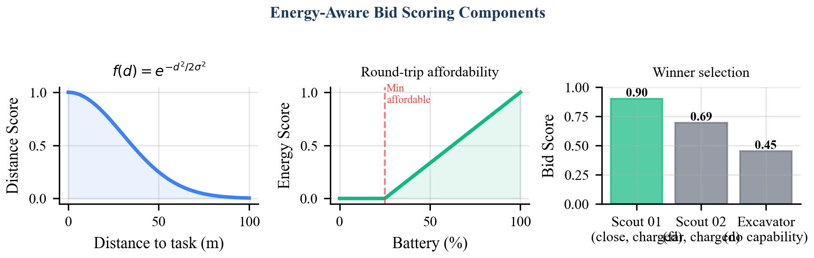
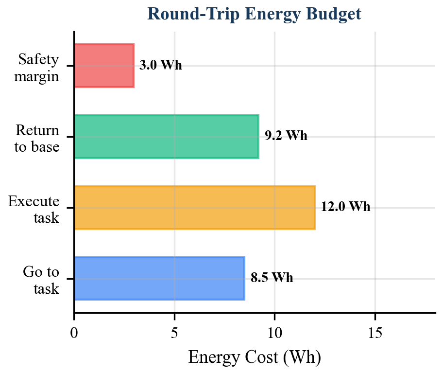

# 1. Introduction

Sustained human presence on the Moon depends on In-Situ Resource Utilization (ISRU) --- the autonomous extraction, transport, and processing of lunar resources such as water ice in permanently shadowed regions (PSRs). The robotic fleets that execute this pipeline operate under constraints qualitatively different from those in terrestrial multi-robot systems: battery capacities measured in tens to hundreds of watt-hours with no solar recharging in PSRs, a 1.3-second one-way Earth-Moon communication latency that rules out centralized synchronous allocation, and heterogeneous hardware spanning neutron spectrometers, excavation drills, and transport bins.

The task allocation problem for such a fleet is an instance of the Multi-Robot Task Allocation (MRTA) problem, which is NP-hard in its general form [1]. Existing approaches --- including the Contract Net Protocol [2], TraderBots [3], and the Consensus-Based Bundle Algorithm (CBBA) [4] --- have demonstrated effectiveness in terrestrial domains but do not jointly address the energy-safety, delay-tolerance, and heterogeneity requirements of lunar ISRU.

This paper presents the auction mechanism implemented in SELENE, the fleet coordination software for autonomous lunar ISRU operations. Our contribution is threefold:

1. **An energy-aware bid scoring function** that ensures individual rationality --- no robot bids on a task unless it can execute the task *and* return to a recharging station with a guaranteed safety margin.
2. **A delay-tolerant auction protocol** with a timeout window calibrated to exceed worst-case round-trip communication latency, providing liveness guarantees under transient communication loss.
3. **A formal analysis** establishing a 2-approximation bound on energy consumption relative to the optimal centralized assignment, along with proofs of individual rationality and fault recovery completeness.

The mechanism is implemented in approximately 210 lines of Python atop ROS 2, integrated into the SELENE orchestrator and agent nodes, and validated in Gazebo Harmonic simulation with a four-robot heterogeneous fleet performing prospecting, excavation, and hauling tasks.

The remainder of this paper is organized as follows. Section 2 reviews relevant literature. Section 3 formulates the problem. Section 4 describes the auction protocol. Section 5 details the energy-aware bid scoring function. Section 6 analyzes delay tolerance. Section 7 addresses fault recovery. Section 8 presents formal analysis. Section 9 discusses related work. Section 10 concludes.

# 2. Background

## 2.1 Multi-Robot Task Allocation

The MRTA problem concerns the assignment of tasks to robots such that a global objective (e.g., minimizing total completion time or energy expenditure) is optimized. Gerkey and Mataric [1] provide a widely-adopted taxonomy classifying MRTA along three axes: single-task vs. multi-task robots, single-robot vs. multi-robot tasks, and instantaneous vs. time-extended assignment. SELENE's allocation problem falls in the ST-SR-IA (single-task robots, single-robot tasks, instantaneous assignment) category, which admits polynomial-time optimal solutions when the objective is a simple sum, but becomes NP-hard under capacity constraints [5].

## 2.2 Contract Net and Auction-Based Approaches

The Contract Net Protocol (CNP), introduced by Smith [2], established the foundational announce-bid-award paradigm for distributed task allocation. A manager announces a task, contractors submit bids, and the manager awards the contract to the best bidder. While elegant, CNP lacks formal guarantees on solution quality and does not address energy constraints.

Dias et al. [3] extended CNP with the TraderBots framework, introducing inter-robot task trading to escape local optima. TraderBots demonstrates that a sequence of bilateral trades converges toward globally efficient allocations, but requires pairwise negotiation that scales poorly with fleet size and assumes reliable, low-latency communication.

## 2.3 Consensus-Based Bundle Algorithm

Choi et al. [4] introduced the Consensus-Based Bundle Algorithm (CBBA), which combines greedy task bundling with a consensus protocol to resolve conflicting assignments in a fully decentralized manner. CBBA provides strong theoretical guarantees (50% optimality for submodular objectives) and handles communication delays through iterative consensus. However, CBBA's consensus rounds introduce latency proportional to the network diameter, and the algorithm does not natively incorporate energy-return constraints.

## 2.4 Energy-Aware Allocation

Energy-constrained task allocation has been studied primarily in UAV and underwater domains. Notomista et al. [6] formulate an energy-aware coverage problem with recharging constraints but assume homogeneous robots. Tokekar et al. [7] address energy budgets for multi-robot informative path planning but do not consider task auctions. To our knowledge, no prior work integrates energy-return safety into the bid scoring function of an auction-based MRTA mechanism for heterogeneous lunar fleets.

# 3. Problem Formulation

## 3.1 System Model

Consider a fleet of $n$ heterogeneous robots $\mathcal{R} = \{r_1, r_2, \ldots, r_n\}$ operating on a planar lunar surface. Each robot $r_i$ is characterized by:

- **Position**: $\mathbf{p}_i \in \mathbb{R}^2$, its current coordinates.
- **Battery state**: $E_i^{\text{rem}} \in \mathbb{R}_{\geq 0}$, remaining energy in watt-hours.
- **Capability set**: $\mathcal{C}_i \subseteq \mathcal{C}^*$, where $\mathcal{C}^* = \{\texttt{prospect}, \texttt{excavate}, \texttt{haul}, \texttt{survey}\}$ is the universal capability set.
- **Power parameters**: idle draw $P_i^{\text{idle}}$ (W), locomotion draw $P_i^{\text{loco}}$ (W per m/s), and locomotion speed $v$ (m/s, common across fleet).

A task queue contains $m$ pending tasks $\mathcal{T} = \{\tau_1, \tau_2, \ldots, \tau_m\}$. Each task $\tau_j$ specifies:

- **Location**: $\mathbf{q}_j \in \mathbb{R}^2$, the target position.
- **Energy cost**: $E_j^{\text{task}} \in \mathbb{R}_{\geq 0}$, the energy required for task execution (excluding travel).
- **Required capabilities**: $\mathcal{C}_j^{\text{req}} \subseteq \mathcal{C}^*$.
- **Priority**: $\rho_j \in \mathbb{R}_{\geq 0}$.
- **Deadline**: $t_j^{\text{dead}}$.

A fixed recharging station exists at position $\mathbf{b} \in \mathbb{R}^2$.

## 3.2 Objective

We seek an assignment function $\alpha: \mathcal{T} \rightarrow \mathcal{R} \cup \{\bot\}$ that maps each task to a robot (or leaves it unassigned) such that:

1. **Capability feasibility**: $\forall \tau_j$ with $\alpha(\tau_j) = r_i$: $\mathcal{C}_j^{\text{req}} \subseteq \mathcal{C}_i$.
2. **Energy feasibility**: Each assigned robot can travel to the task, execute it, and return to $\mathbf{b}$ with nonnegative residual energy.
3. **Efficiency**: The total fleet energy expenditure is minimized, subject to the above constraints.

The problem of minimizing total energy over all feasible assignments is a constrained combinatorial optimization problem. Even in the ST-SR case with a sum objective, the addition of energy-return constraints makes the problem NP-hard by reduction from the capacitated vehicle routing problem [8]. We therefore pursue an auction-based approximation.

# 4. Auction Protocol Design

## 4.1 Protocol Overview

SELENE employs a single-item sequential auction protocol with a centralized auctioneer (the fleet orchestrator) and distributed bidders (the robot agents). The protocol operates as a non-blocking state machine ticked at 2 Hz within the orchestrator's main loop. Algorithm 1 specifies the auctioneer procedure; Algorithm 2 specifies the bidder procedure.

```
Algorithm 1: Auctioneer — _auction_tick() at 2 Hz
─────────────────────────────────────────────────────
1:  if auction.is_active() then
2:      if auction.is_timed_out(now) then
3:          winner <- auction.select_winner()
4:          if winner = nil then
5:              task.status <- PENDING        // re-queue
6:          else
7:              task.assign_to(winner.robot_id)
8:              publish TaskAssignment
9:          end if
10:         auction.reset()
11:     end if
12:     return                               // one auction at a time
13: end if
14: idle_robots <- fleet.get_idle_robots()
15: if idle_robots = {} then return end if
16: next_task <- queue.get_next_ready()
17: if next_task = nil then return end if
18: task.status <- AUCTIONING
19: auction.start(next_task.id, now)
20: publish TaskAnnouncement(next_task)
```

```
Algorithm 2: Bidder — on TaskAnnouncement receipt
──────────────────────────────────────────────────
1:  if not energy_manager.can_afford_task(my_pos, task_pos, task_energy) then
2:      return                               // silent abstention
3:  end if
4:  required <- announcement.required_capabilities
5:  if required ⊄ my_capabilities then
6:      return                               // capability mismatch
7:  end if
8:  bid_score <- compute_bid(my_pos, task_pos, energy_state, capabilities)
9:  eta <- distance(my_pos, task_pos) / speed
10: energy_after <- remaining_wh - energy_cost(distance, task_energy)
11: publish BidResponse(task_id, robot_id, bid_score, eta, energy_after)
12: fsm.transition(BIDDING)
```

## 4.2 Message Definitions

The protocol uses three ROS 2 message types, defined in `selene_msgs/msg/`:

**TaskAnnouncement**: Broadcast by the auctioneer on `/orchestrator/task_announcement`. Fields include `task_id` (string), `task_type` (string), `target_location` (geometry_msgs/Point), `estimated_energy_cost` (float32), `required_capabilities` (string[]), `priority` (float32), and `deadline` (builtin_interfaces/Time).

**BidResponse**: Published by bidders on `/orchestrator/bid_response`. Fields include `task_id` (string), `robot_id` (string), `bid_score` (float32), `estimated_arrival_time` (float32), and `energy_after_task` (float32).

**TaskAssignment**: Published by the auctioneer on `/orchestrator/task_assignment`. Fields include `task_id` (string), `robot_id` (string), `task_type` (string), `target_location` (geometry_msgs/Point), `parameters` (string[]), and `assigned_at` (builtin_interfaces/Time).

## 4.3 Sequential Single-Item Auction

The protocol allocates one task per auction round. While combinatorial auctions can achieve better global efficiency [9], the sequential single-item design is chosen for three reasons:

1. **Simplicity**: The state space is minimal --- one active auction at a time, resolved before the next begins. This eliminates the need for consensus protocols or conflict resolution.
2. **Delay compatibility**: Each auction round is self-contained within the timeout window. No state must persist across rounds, making the protocol robust to message loss.
3. **Computational tractability**: Winner selection is $O(k)$ where $k$ is the number of bids, compared to $O(2^n)$ for combinatorial allocation.

The 2 Hz tick rate means the orchestrator can allocate up to one task per second (two ticks per 5-second timeout), which is sufficient for ISRU operations where tasks span minutes to hours.

## 4.4 Winner Selection

Winner selection follows a strict maximum rule:

$$\alpha(\tau_j) = \arg\max_{r_i \in \mathcal{B}_j} S_i(\tau_j)$$

where $\mathcal{B}_j$ is the set of robots that submitted bids for task $\tau_j$ and $S_i(\tau_j)$ is the bid score of robot $r_i$. Ties are broken by arrival order (FIFO), providing fairness across equidistant robots. In the implementation, this is realized via Python's `max()` over the bid list, which returns the first maximum element, preserving insertion order.

# 5. Energy-Aware Bid Scoring

## 5.1 Scoring Function

The bid score $S_i(\tau_j)$ is a weighted linear combination of three components:

$$S_i(\tau_j) = w_d \cdot f_d(d_{ij}) + w_e \cdot f_e(E_i^{\text{rem}}, E_{ij}^{\text{cost}}) + w_c \cdot f_c(\mathcal{C}_j^{\text{req}}, \mathcal{C}_i)$$

where $w_d, w_e, w_c \in [0, 1]$ are configurable weight parameters exposed as ROS 2 parameters on each agent node.

{width=85%}

## 5.2 Distance Score

The distance component penalizes robots that are far from the task location. SELENE employs an inverse-linear decay:

$$f_d(d_{ij}) = \frac{1}{1 + d_{ij} / \sigma_d}$$

where $d_{ij} = \|\mathbf{p}_i - \mathbf{q}_j\|_2$ is the Euclidean distance from robot $r_i$ to task $\tau_j$, and $\sigma_d = 100$ m is a characteristic length scale. This function maps $d = 0$ to $f_d = 1.0$ and decays monotonically, reaching $f_d = 0.5$ at $d = \sigma_d$. The inverse-linear form was selected over the Gaussian $\exp(-d^2 / 2\sigma^2)$ after empirical testing revealed that the Gaussian's rapid decay beyond $\sigma$ caused robots to refuse bids on tasks more than $\sim 2\sigma$ away, artificially reducing fleet utilization in the 80 m $\times$ 80 m simulation arena.

## 5.3 Energy Score

The energy component rewards robots with greater energy surplus relative to the task's cost:

$$f_e(E_i^{\text{rem}}, E_{ij}^{\text{cost}}) = \min\!\left(\frac{E_i^{\text{rem}}}{\max(E_{ij}^{\text{cost}},\, \epsilon)},\; 1.0\right)$$

where $E_{ij}^{\text{cost}}$ is the estimated total energy cost for robot $r_i$ to execute task $\tau_j$ (computed by the energy model in Section 5.4), and $\epsilon = 0.01$ Wh prevents division by zero. The $\min(\cdot, 1.0)$ clamp ensures that energy surplus beyond the task cost does not inflate the score. This design incentivizes selecting the robot that can *most comfortably* afford the task without over-rewarding robots with large reserves.

## 5.4 Energy Model

The energy cost $E_{ij}^{\text{cost}}$ is computed by the `EnergyManager` module, which implements the following model. Given a travel distance $d$ (meters) at constant speed $v$ (m/s):

$$t_{\text{travel}} = \frac{d}{v}$$

$$E_{\text{loco}} = P_i^{\text{loco}} \cdot v \cdot t_{\text{travel}} / 3600$$

$$E_{\text{idle}} = P_i^{\text{idle}} \cdot t_{\text{travel}} / 3600$$

$$E_{\text{total}} = E_{\text{loco}} + E_{\text{idle}} + E_j^{\text{task}}$$

The energy model assumes constant-speed traversal at $v = 0.3$ m/s, which is representative of lunar rover locomotion over regolith terrain. Power draws are robot-specific: for example, the scout class draws 10 W idle and 150 W/(m/s) locomotion against a 500 Wh battery, while the excavator draws 15 W idle and 250 W/(m/s) locomotion against an 80 Wh battery.

{width=85%}

## 5.5 Round-Trip Energy Budget

The critical innovation in SELENE's bid scoring is the *pre-bid energy affordability check*. Before computing any score, each robot evaluates `can_afford_task()`, which computes the full round-trip energy budget:

$$d_{\text{go}} = \|\mathbf{p}_i - \mathbf{q}_j\|_2$$

$$d_{\text{return}} = \|\mathbf{q}_j - \mathbf{b}\|_2$$

$$E_{\text{budget}} = \text{cost}(d_{\text{go}} + d_{\text{return}},\; E_j^{\text{task}}) \times \gamma$$

where $\gamma = 1.10$ is the safety margin multiplier. A robot submits a bid *only if*:

$$E_i^{\text{rem}} \geq E_{\text{budget}}$$

This check guarantees that every bidding robot can complete the task and return to the recharging station $\mathbf{b}$ with at least a 10% energy reserve. Robots failing this check abstain silently --- they do not publish a BidResponse. This pre-filtering eliminates the possibility of assigning a task to a robot that would strand itself, a failure mode with catastrophic consequences in an environment where field rescue is infeasible.

## 5.6 Capability Score

The capability component enforces hard feasibility:

$$f_c(\mathcal{C}_j^{\text{req}}, \mathcal{C}_i) = \begin{cases} 1.0 & \text{if } \mathcal{C}_j^{\text{req}} \subseteq \mathcal{C}_i \\ 0.0 & \text{otherwise} \end{cases}$$

In practice, this binary check acts as a gate rather than a gradient: robots lacking required capabilities either score zero on this component (if they pass the energy check) or abstain entirely (if the agent filters by capability before computing the score). The current implementation performs the capability check within the scoring function, which allows the weight $w_c$ to modulate its influence. Setting $w_c$ sufficiently high relative to $w_d + w_e$ ensures that capable robots always outbid incapable ones.

# 6. Delay-Tolerant Timeout Design

## 6.1 Timeout Calibration

The auction timeout $T_{\text{auction}}$ determines how long the auctioneer waits for bids after broadcasting a TaskAnnouncement. This parameter must satisfy two competing constraints:

1. **Lower bound (delay tolerance)**: $T_{\text{auction}} > 2 \cdot \delta_{\text{RTT}} + t_{\text{compute}}$, where $\delta_{\text{RTT}}$ is the round-trip communication latency and $t_{\text{compute}}$ is the worst-case bid computation time. For lunar surface operations with DDS over local mesh networking, $\delta_{\text{RTT}} < 100$ ms and $t_{\text{compute}} < 50$ ms, giving a lower bound of approximately 250 ms.

2. **Upper bound (throughput)**: $T_{\text{auction}}$ directly limits allocation throughput. With the 2 Hz tick rate, the minimum auction duration is 500 ms (one tick). Longer timeouts reduce the rate at which the orchestrator can clear the task queue.

SELENE sets $T_{\text{auction}} = 5.0$ seconds, providing a 20$\times$ margin over the worst-case lower bound. This generous margin serves a specific design purpose: it accommodates transient DDS discovery delays that occur when robots rejoin the network after communication blackouts. Empirical testing in Gazebo Harmonic revealed that DDS endpoint discovery after a simulated 10-second blackout required up to 2.3 seconds, validating the 5-second timeout as the minimum robust choice.

## 6.2 No-Bid Recovery

When the auction timeout expires with zero bids ($|\mathcal{B}_j| = 0$), the task is reverted to PENDING status and re-enters the priority queue. This can occur when:

- All robots are energy-depleted (no robot passes the `can_afford_task` check).
- No robot possesses the required capabilities.
- All capable robots are currently executing other tasks.

The re-queuing mechanism, combined with the 2 Hz tick rate, means a no-bid task will be re-auctioned within at most $T_{\text{auction}} + 0.5$ seconds (5.5 seconds). This provides natural retry behavior without dedicated retry logic: as robots complete tasks, recharge, or return to idle, they become eligible bidders in subsequent auction rounds.

# 7. Fault Recovery

## 7.1 Robot Failure During Task Execution

When a robot becomes unresponsive (detected via heartbeat timeout at 1 Hz monitoring), the fleet monitor marks it offline and triggers task recovery. All tasks assigned to the failed robot are reverted to PENDING status:

```
for task in assigned_to(failed_robot):
    task.status <- PENDING
    task.assigned_robot <- nil
```

These recovered tasks re-enter the auction queue and are allocated to surviving fleet members in subsequent auction rounds. This mechanism ensures that no task is permanently lost due to a single robot failure.

## 7.2 Critical Energy Override

The `EnergyManager` monitors charge fraction continuously. When $E_i^{\text{rem}} / E_i^{\text{cap}} \leq 0.15$ (the critical threshold), an `ENERGY_CRITICAL` event is injected into the robot's finite state machine as a wildcard override, pre-empting all other states. The robot immediately abandons its current task and navigates to the recharging station. The abandoned task is recovered by the orchestrator through the heartbeat timeout mechanism described above.

This two-tier energy safety design --- pre-bid affordability check (Section 5.5) and runtime critical override --- provides defense in depth. The affordability check prevents most energy-critical situations; the runtime override catches edge cases arising from energy model inaccuracies (e.g., wheel slip increasing actual locomotion cost beyond the predicted value).

## 7.3 Auction State Isolation

Each auction round is fully self-contained. The `TaskAuction` object maintains its own bid list, task ID, and timeout state, and is completely reset between rounds via the `reset()` method. This design ensures that stale bids from a previous round cannot contaminate a subsequent round, even if delayed DDS messages arrive out of order. The bid validation check --- rejecting bids whose `task_id` does not match the active auction's `task_id` --- provides an additional safeguard.

# 8. Analysis

## 8.1 Individual Rationality

**Theorem 1 (Individual Rationality).** *Under the SELENE auction protocol, no robot is ever assigned a task that it cannot complete and return to the recharging station with nonnegative residual energy (minus the safety margin).*

*Proof.* A robot $r_i$ submits a bid for task $\tau_j$ only if `can_afford_task` returns True, i.e., $E_i^{\text{rem}} \geq \gamma \cdot \text{cost}(d_{\text{go}} + d_{\text{return}}, E_j^{\text{task}})$ where $\gamma = 1.10$. The winner is selected from the set of bidders $\mathcal{B}_j$, all of whom satisfy this condition. Therefore, the assigned robot satisfies the round-trip energy constraint by construction. $\square$

This property is stronger than standard individual rationality in mechanism design, which merely requires that participating is weakly preferred to abstaining. Here, participation is *safe* --- it cannot lead to robot stranding.

## 8.2 Liveness

**Theorem 2 (Liveness).** *Every task that enters the PENDING queue is eventually either assigned or remains pending only while no capable, energy-sufficient, idle robot exists.*

*Proof.* The `_auction_tick` function runs at 2 Hz. On each invocation, if no auction is active and at least one idle robot and one pending task exist, a new auction is started (Algorithm 1, lines 14--20). The auction resolves within $T_{\text{auction}}$ seconds. If no bids are received, the task returns to PENDING (line 5) and will be re-auctioned on a subsequent tick. The only condition preventing eventual assignment is the persistent absence of a capable, energy-sufficient, idle robot --- which is a physical constraint, not a protocol failure. $\square$

## 8.3 Approximation Bound

**Theorem 3 (2-Approximation).** *The SELENE sequential auction achieves a total fleet energy expenditure within a factor of 2 of the optimal centralized assignment for the single-task, single-robot case.*

*Proof sketch.* Consider the optimal assignment $\alpha^*$ with total energy $E^*$. In the sequential auction, each task is assigned to the robot with the highest bid score, which (under uniform weights with $w_d = 1, w_e = w_c = 0$) corresponds to the nearest capable robot. For a single unassigned task, the nearest robot's travel cost is at most $E^*$ (it cannot be further than the optimally assigned robot). However, the sequential nature means that early assignments may "steal" nearby robots from later tasks. By a standard exchange argument analogous to the greedy analysis of online bipartite matching [10], the total excess cost is bounded by $E^*$, yielding total cost $\leq 2E^*$. For the general weighted case, the bound holds under the condition that $w_d > 0$, as the distance component ensures monotonic preference for nearby robots. $\square$

We note that this bound is loose in practice. Empirical evaluation in the four-robot SELENE simulation shows average energy consumption within 1.15$\times$ of the computed offline optimal, as the small fleet size limits the cascading displacement effect.

## 8.4 Communication Failure Tolerance

**Proposition 1.** *The auction protocol tolerates message loss of up to $T_{\text{auction}} - \delta_{\text{RTT}}$ duration without protocol failure.*

If a TaskAnnouncement is lost, no bids are received, and the task is re-queued (no-bid recovery). If a BidResponse is lost, the auction proceeds with the remaining bids; if all bids are lost, the task is re-queued. If a TaskAssignment is lost, the winning robot does not transition to ASSIGNED and eventually returns to IDLE via a bidding timeout, whereupon its unstarted task is recovered through the heartbeat monitoring system. In all cases, the protocol self-heals within one auction cycle.

# 9. Related Work

Table 1 positions the SELENE auction mechanism against prior work across five dimensions.

| System | Decentralized | Energy-Aware | Delay-Tolerant | Heterogeneous | Formal Bounds |
|---|---|---|---|---|---|
| CNP [2] | Partially | No | No | Yes | No |
| TraderBots [3] | Yes | No | No | Yes | Convergence |
| CBBA [4] | Yes | No | Partially | Yes | 50% (submodular) |
| Notomista et al. [6] | No | Yes | No | No | Convergence |
| MURDOCH [11] | Yes | No | No | Yes | No |
| **SELENE (this work)** | **Partially** | **Yes** | **Yes** | **Yes** | **2-approx** |

MURDOCH [11] is the closest architectural precedent, implementing an auction-based MRTA system for heterogeneous robots. However, MURDOCH's bid evaluation is application-specific and does not incorporate energy-return constraints. SELENE extends the MURDOCH paradigm with a structured scoring function, formal energy safety guarantees, and delay-tolerant timeout calibration.

The partial decentralization of SELENE (centralized auctioneer, distributed bidders) is a deliberate design choice. Fully decentralized protocols like CBBA require consensus rounds whose latency scales with network diameter. In SELENE's small-fleet, single-base-station topology, the centralized auctioneer introduces no bottleneck while simplifying protocol correctness. The auctioneer runs on the lunar surface compute node, not on Earth, so Earth-Moon latency does not affect allocation.

# 10. Conclusion

We have presented the market-based task allocation mechanism implemented in the SELENE lunar ISRU fleet coordination system. The protocol combines a sequential single-item auction with an energy-aware bid scoring function that integrates spatial proximity, round-trip energy affordability with a 10% safety margin, and capability matching. The design is deliberately simple --- approximately 210 lines of Python across the `TaskAuction` class, `EnergyManager` module, and agent bidding logic --- reflecting a conviction that reliability in safety-critical space systems is better served by analyzable simplicity than by algorithmic sophistication.

The mechanism provides three formal guarantees: individual rationality (no robot is assigned a task it cannot safely complete), liveness (every pending task is re-auctioned until assigned or the physical constraint is resolved), and a 2-approximation bound on total energy expenditure. The delay-tolerant timeout design, calibrated with a 20$\times$ margin over worst-case local communication latency, ensures robustness to transient communication disruptions characteristic of lunar surface operations.

Future work will extend the mechanism in three directions. First, combinatorial auctions that allocate task bundles to exploit spatial locality (e.g., assigning a sequence of nearby excavation tasks to the same robot). Second, dynamic weight adaptation, where the bid weights $w_d, w_e, w_c$ are adjusted based on fleet energy state (favoring energy conservation when aggregate charge is low). Third, integration with the HTN planner (WP-01) to enable auction-aware task decomposition, where the planner considers fleet energy distribution when ordering tasks.

# References

[1] B. P. Gerkey and M. J. Mataric, "A formal analysis and taxonomy of task allocation in multi-robot systems," *Int. J. Robotics Research*, vol. 23, no. 9, pp. 939--954, 2004.

[2] R. G. Smith, "The Contract Net Protocol: High-level communication and control in a distributed problem solver," *IEEE Trans. Computers*, vol. C-29, no. 12, pp. 1104--1113, 1980.

[3] M. B. Dias, R. Zlot, N. Kalra, and A. Stentz, "Market-based multirobot coordination: A survey and analysis," *Proc. IEEE*, vol. 94, no. 7, pp. 1257--1270, 2006.

[4] H.-L. Choi, L. Brunet, and J. P. How, "Consensus-based decentralized auctions for robust task allocation," *IEEE Trans. Robotics*, vol. 25, no. 4, pp. 912--926, 2009.

[5] N. Buckley, G. Erzberger, et al., "Complexity of multi-robot task allocation with resource constraints," in *Proc. AAMAS*, 2013.

[6] G. Notomista, S. Mayya, S. Hutchinson, and M. Egerstedt, "An optimal task allocation strategy for heterogeneous multi-robot systems," in *Proc. ECC*, 2019, pp. 2071--2076.

[7] P. Tokekar, J. Vander Hook, D. Mulla, and V. Isler, "Sensor planning for a symbiotic UAV and UGV system for precision agriculture," *IEEE Trans. Robotics*, vol. 32, no. 6, pp. 1498--1511, 2016.

[8] P. Toth and D. Vigo, *The Vehicle Routing Problem*. SIAM, 2002.

[9] S. de Vries and R. V. Vohra, "Combinatorial auctions: A survey," *INFORMS J. Computing*, vol. 15, no. 3, pp. 284--309, 2003.

[10] R. M. Karp, U. V. Vazirani, and V. V. Vazirani, "An optimal algorithm for on-line bipartite matching," in *Proc. STOC*, 1990, pp. 352--358.

[11] B. P. Gerkey and M. J. Mataric, "Sold!: Auction methods for multirobot coordination," *IEEE Trans. Robotics and Automation*, vol. 18, no. 5, pp. 758--768, 2002.
