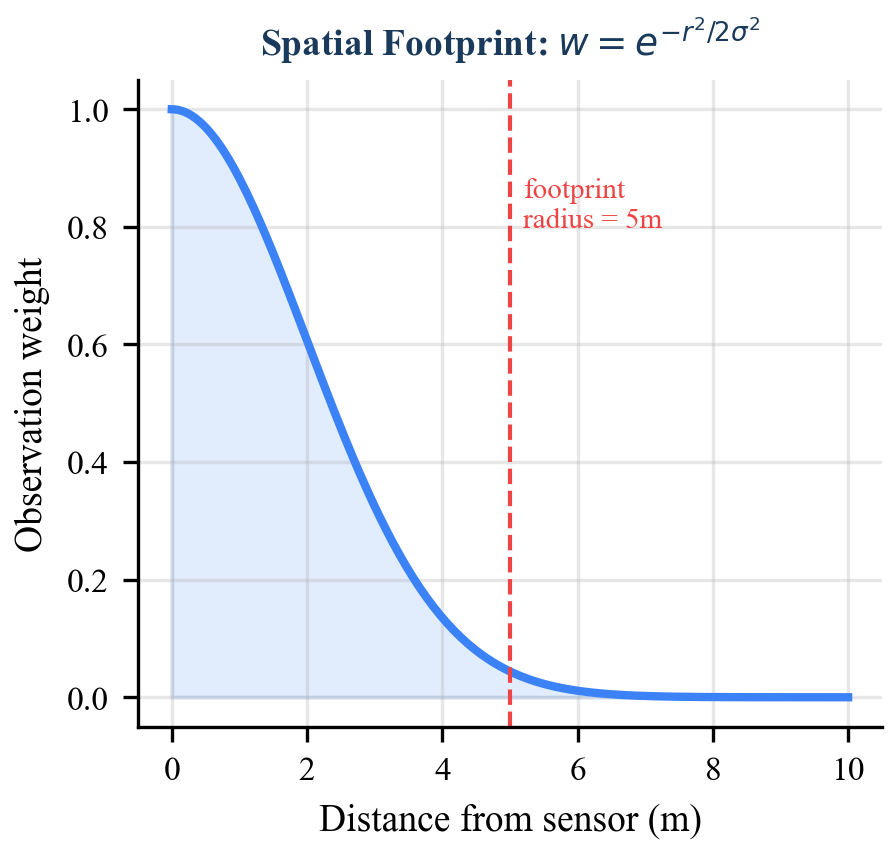

# Introduction

Sustained human presence on the Moon depends on the ability to locate and extract water ice trapped in permanently shadowed regions (PSRs) of lunar polar craters. Orbital instruments such as the Lunar Prospector Neutron Spectrometer (LPNS), the Lunar Crater Observation and Sensing Satellite (LCROSS), and the Lunar Reconnaissance Orbiter's LEND detector have confirmed the existence of hydrogen-bearing volatiles at the lunar poles, but their spatial resolution -- on the order of tens of kilometers -- is insufficient for directing surface mining operations. Ground-truth characterization must be performed by surface robots equipped with in-situ sensors, each of which provides a noisy, spatially localized estimate of subsurface ice concentration.

The fundamental challenge is to fuse a stream of such readings into a coherent spatial map that (1) provides a best estimate of ice concentration at every location in the survey zone, (2) quantifies the uncertainty associated with each estimate, and (3) can be updated in real time on processors rated for the space environment -- typically orders of magnitude less capable than terrestrial hardware.

Gaussian process (GP) regression is the canonical solution for spatial prediction under uncertainty. However, its $O(N^3)$ time and $O(N^2)$ memory complexity in the number of observations renders it impractical for onboard use when hundreds or thousands of readings accumulate during a survey campaign. Sparse GP approximations reduce this cost but introduce approximation error and implementation complexity ill-suited to safety-critical flight software.

This paper presents the Bayesian spatial grid fusion algorithm implemented in SELENE's `ResourceMap` module. The approach discretizes the survey zone into a fixed-resolution grid and maintains an independent conjugate Gaussian posterior at each cell. Sensor readings are propagated to all cells within a spatial footprint radius, with observation weight decaying as a Gaussian function of distance from the sensor. This yields $O(1)$ updates per reading (constant with respect to the number of prior observations), monotonically decreasing posterior variance, and a principled integration of spatial correlation without the computational burden of full GP inference.

The remainder of this paper is organized as follows. Section 2 provides background on Bayesian inference, occupancy grids, and Gaussian processes. Section 3 formalizes the problem. Sections 4 and 5 derive the conjugate update equations and the spatial footprint model, respectively. Section 6 describes the grid coordinate system. Section 7 details integration with SELENE's adaptive survey planner and HTN mission planner. Section 8 analyzes computational complexity. Section 9 compares the approach with alternative methods. Section 10 surveys related work, and Section 11 concludes.

# Background

## Bayesian Inference for Sequential Estimation

Bayesian inference provides a principled framework for updating beliefs as new evidence arrives. Given a prior distribution $p(\theta)$ over a parameter $\theta$ and a likelihood function $p(z \mid \theta)$ for an observation $z$, the posterior is obtained via Bayes' theorem:

$$p(\theta \mid z) = \frac{p(z \mid \theta) \, p(\theta)}{p(z)}$$

When the prior and likelihood belong to the same exponential family -- a *conjugate pair* -- the posterior has the same functional form as the prior, enabling closed-form sequential updates without numerical integration. The Gaussian-Gaussian conjugate pair, where both prior and likelihood are normal distributions, is the foundation of this work.

## Occupancy Grid Mapping

Occupancy grid mapping, introduced by Moravec and Elfes (1985), discretizes the environment into a grid of cells, each maintaining an independent probability of occupancy. The independence assumption -- that observations update cells independently -- sacrifices inter-cell spatial correlation in exchange for computational tractability. Each cell can be updated in $O(1)$ time, and the grid as a whole requires $O(W \times H)$ storage. This paradigm has been applied extensively in mobile robotics for obstacle mapping.

Our approach extends the occupancy grid paradigm in two ways: (1) cells store continuous-valued Gaussian posteriors rather than binary occupancy probabilities, and (2) each observation updates multiple cells through a distance-decayed kernel, partially recovering the spatial correlation that the cell-independence assumption discards.

## Gaussian Process Regression

A Gaussian process (GP) defines a distribution over functions such that any finite collection of function values follows a multivariate Gaussian distribution. Given a set of $N$ observations $\{(\mathbf{x}_i, z_i)\}_{i=1}^{N}$, the GP posterior mean and variance at an unobserved location $\mathbf{x}_*$ are:

$$\mu(\mathbf{x}_*) = \mathbf{k}_*^T (\mathbf{K} + \sigma_n^2 \mathbf{I})^{-1} \mathbf{z}$$

$$\sigma^2(\mathbf{x}_*) = k(\mathbf{x}_*, \mathbf{x}_*) - \mathbf{k}_*^T (\mathbf{K} + \sigma_n^2 \mathbf{I})^{-1} \mathbf{k}_*$$

where $\mathbf{K}$ is the $N \times N$ kernel matrix, $\mathbf{k}_*$ is the $N \times 1$ vector of kernel evaluations between the test point and training points, and $\sigma_n^2$ is the observation noise variance. The inversion of the $N \times N$ matrix incurs $O(N^3)$ time and $O(N^2)$ storage -- costs that grow without bound as observations accumulate.

Sparse GP methods (inducing points, FITC, variational approaches) reduce complexity to $O(NM^2)$ for $M$ inducing points, but introduce hyperparameters, approximation error, and implementation complexity. For resource-constrained space processors where deterministic worst-case execution time is required, these methods remain impractical.

# Problem Formulation

Consider a survey zone $\Omega \subset \mathbb{R}^2$ on the lunar surface, discretized into a grid $\mathcal{G}$ of $W \times H$ cells at resolution $\delta$ meters per cell. Each cell $(g_x, g_y) \in \mathcal{G}$ has an associated true ice concentration $\theta_{g_x, g_y} \in \mathbb{R}_{\geq 0}$ (in weight percent). The objective is to estimate $\theta_{g_x, g_y}$ for all cells from a sequence of noisy sensor readings.

A neutron spectrometer mounted on a prospecting robot at world position $\mathbf{p} = (x, y)$ produces a reading $z$ modeled as:

$$z = \theta(\mathbf{p}) + \epsilon, \quad \epsilon \sim \mathcal{N}(0, \sigma_s^2)$$

where $\sigma_s^2$ is the sensor noise variance. The spectrometer integrates hydrogen flux over a spatial footprint surrounding the measurement position. The instrument does not measure a single point; rather, its sensitivity decreases with distance from the boresight axis, producing a spatially blurred observation.

We seek a mapping $\mathcal{M}: \mathcal{G} \rightarrow (\mu, \sigma^2)$ that assigns to each cell a posterior mean $\mu_{g_x, g_y}$ (best estimate of ice concentration) and posterior variance $\sigma^2_{g_x, g_y}$ (uncertainty in that estimate), such that:

1. The posterior is updated in closed form upon each sensor reading.
2. The posterior variance monotonically decreases with observations.
3. The update cost per reading is $O(1)$ with respect to the total number of prior readings.
4. Spatial correlation is approximately captured through the sensor footprint model.

SELENE's `ResourceMap` instantiates this formulation with $W = H = 500$ cells, $\delta = 1.0$ m, and an origin at $(-250, -250)$ m, covering a $500 \times 500$ m survey zone.

# Conjugate Gaussian Update Derivation

## Prior Specification

For each cell $(g_x, g_y)$, we initialize an uninformative Gaussian prior:

$$\theta_{g_x, g_y} \sim \mathcal{N}(\mu_0, \sigma_0^2)$$

with $\mu_0 = 0$ (no ice assumed) and $\sigma_0^2 = 100$ (high uncertainty, reflecting the 0--10 wt% plausible range for lunar polar ice deposits). The prior variance of 100 ensures that even a single moderately precise observation will dominate the prior, as intended for an uninformative initialization.

## Precision Formulation

We work in the *precision* (inverse variance) parameterization, which simplifies the conjugate update to addition. Define:

$$\tau = \frac{1}{\sigma^2}$$

where $\tau$ is the precision. The prior precision for each cell is $\tau_0 = 1/\sigma_0^2 = 0.01$.

## Single-Cell Update

Consider a sensor reading $z$ at world position $\mathbf{p} = (x, y)$ with sensor noise variance $\sigma_s^2$, and let $(g_x, g_y)$ be a grid cell at world position $\mathbf{c} = (c_x, c_y)$ with current posterior $\mathcal{N}(\mu_{\text{prior}}, \sigma^2_{\text{prior}})$. The observation precision at this cell is modulated by a distance-dependent weight $w$ (derived in Section 5):

$$\tau_{\text{obs}} = \frac{w}{\sigma_s^2}$$

The Gaussian-Gaussian conjugate update proceeds as follows.

**Step 1: Compute posterior precision.** The precision of the product of two Gaussians is the sum of their precisions:

$$\tau_{\text{post}} = \tau_{\text{prior}} + \tau_{\text{obs}} = \frac{1}{\sigma^2_{\text{prior}}} + \frac{w}{\sigma_s^2}$$

**Step 2: Compute posterior variance.**

$$\sigma^2_{\text{post}} = \frac{1}{\tau_{\text{post}}}$$

**Step 3: Compute posterior mean.** The posterior mean is the precision-weighted average of the prior mean and the observation:

$$\mu_{\text{post}} = \sigma^2_{\text{post}} \left( \frac{\mu_{\text{prior}}}{\sigma^2_{\text{prior}}} + \frac{w \cdot z}{\sigma_s^2} \right) = \frac{\tau_{\text{prior}} \cdot \mu_{\text{prior}} + \tau_{\text{obs}} \cdot z}{\tau_{\text{post}}}$$

This is a standard result from conjugate analysis. We now verify its correctness by deriving it from first principles.

## Derivation from Bayes' Theorem

The prior at cell $(g_x, g_y)$ is:

$$p(\theta) = \mathcal{N}(\theta \mid \mu_{\text{prior}}, \sigma^2_{\text{prior}}) \propto \exp\!\left( -\frac{(\theta - \mu_{\text{prior}})^2}{2\sigma^2_{\text{prior}}} \right)$$

The weighted likelihood for observation $z$ with effective variance $\sigma_s^2 / w$ is:

$$p(z \mid \theta) \propto \exp\!\left( -\frac{w \, (z - \theta)^2}{2\sigma_s^2} \right)$$

The posterior is proportional to the product:

$$p(\theta \mid z) \propto \exp\!\left( -\frac{(\theta - \mu_{\text{prior}})^2}{2\sigma^2_{\text{prior}}} - \frac{w(z - \theta)^2}{2\sigma_s^2} \right)$$

Expanding the exponent:

$$-\frac{1}{2}\left[ \frac{\theta^2 - 2\theta\mu_{\text{prior}} + \mu_{\text{prior}}^2}{\sigma^2_{\text{prior}}} + \frac{w(\theta^2 - 2\theta z + z^2)}{\sigma_s^2} \right]$$

Collecting terms in $\theta$:

$$= -\frac{1}{2}\left[ \theta^2 \underbrace{\left(\frac{1}{\sigma^2_{\text{prior}}} + \frac{w}{\sigma_s^2}\right)}_{\tau_{\text{post}}} - 2\theta \underbrace{\left(\frac{\mu_{\text{prior}}}{\sigma^2_{\text{prior}}} + \frac{wz}{\sigma_s^2}\right)}_{\tau_{\text{post}} \cdot \mu_{\text{post}}} + \text{const} \right]$$

Completing the square in $\theta$ yields:

$$p(\theta \mid z) \propto \exp\!\left( -\frac{(\theta - \mu_{\text{post}})^2}{2\sigma^2_{\text{post}}} \right)$$

confirming that the posterior is Gaussian with:

$$\boxed{\sigma^2_{\text{post}} = \frac{1}{\tau_{\text{prior}} + \tau_{\text{obs}}}, \qquad \mu_{\text{post}} = \sigma^2_{\text{post}} \left( \tau_{\text{prior}} \cdot \mu_{\text{prior}} + \tau_{\text{obs}} \cdot z \right)}$$

## Monotonic Variance Reduction

Since $\tau_{\text{obs}} = w / \sigma_s^2 > 0$ for all cells within the footprint radius (where $w > 0$), we have:

$$\tau_{\text{post}} = \tau_{\text{prior}} + \tau_{\text{obs}} > \tau_{\text{prior}}$$

and therefore:

$$\sigma^2_{\text{post}} = \frac{1}{\tau_{\text{post}}} < \frac{1}{\tau_{\text{prior}}} = \sigma^2_{\text{prior}}$$

Each observation strictly reduces the posterior variance of every cell within the footprint. This is a desirable property: the map can never "unlearn" information, and the downstream planner can treat decreasing variance as a reliable indicator of convergence.

## Sequential Updates

Because the posterior after observation $k$ serves as the prior for observation $k+1$, the conjugate structure enables sequential processing. After $K$ observations with respective weights $w_1, \ldots, w_K$, the posterior precision is:

$$\tau_K = \tau_0 + \sum_{k=1}^{K} \frac{w_k}{\sigma_{s,k}^2}$$

This additive accumulation of precision is the key property that makes the method suitable for streaming sensor data.

{width=100%}

# Spatial Footprint Model

## Motivation

A neutron spectrometer does not measure ice concentration at a mathematical point. The instrument integrates epithermal neutron flux over a spatial region whose extent depends on the detector geometry, measurement altitude, and regolith properties. To model this spatial sensitivity, SELENE employs a Gaussian footprint kernel that weights each cell's update according to its distance from the sensor position.

## Weight Function

Let $\mathbf{p} = (x, y)$ be the sensor position and $\mathbf{c} = (c_x, c_y)$ be the center of a grid cell. The distance between them is:

$$r = \|\mathbf{p} - \mathbf{c}\| = \sqrt{(x - c_x)^2 + (y - c_y)^2}$$

The observation weight is a Gaussian function of distance:

$$w(r) = \exp\!\left( -\frac{r^2}{2\sigma_f^2} \right)$$

where $\sigma_f$ is the footprint width parameter ($\sigma_f = 3.0$ m in the default configuration). The weight is applied only to cells within a hard cutoff radius $R_f = 5.0$ m:

$$w(r) = \begin{cases} \exp\!\left( -\frac{r^2}{2\sigma_f^2} \right) & \text{if } r \leq R_f \\ 0 & \text{otherwise} \end{cases}$$

At the cutoff distance, $w(R_f) = \exp(-25/18) \approx 0.25$, so cells at the boundary still receive a nontrivial information update.

## Interpretation as Effective Observation Variance

The weight $w$ modulates the observation precision:

$$\tau_{\text{obs}} = \frac{w}{\sigma_s^2} = \frac{1}{\sigma_s^2 / w}$$

This is equivalent to treating the observation at cell $(g_x, g_y)$ as having an *effective* noise variance of $\sigma_s^2 / w$. At the sensor position ($r = 0$, $w = 1$), the observation has its nominal precision. At the footprint boundary ($r = R_f$, $w \approx 0.25$), the effective noise variance is $4\sigma_s^2$ -- four times noisier. This graduated degradation of information with distance is a physically reasonable model of spatial sensor uncertainty.

{width=60%}

## Footprint Cell Count

For a square grid at resolution $\delta$ and footprint radius $R_f$, the maximum number of cells within the footprint is bounded by the area of the enclosing square divided by the cell area:

$$N_f \leq \left\lceil \frac{2R_f}{\delta} + 1 \right\rceil^2$$

With $R_f = 5.0$ m and $\delta = 1.0$ m, this yields $N_f \leq 11^2 = 121$ cells. After filtering to the circular footprint ($r \leq R_f$), approximately $\pi R_f^2 / \delta^2 \approx 79$ cells are updated per reading. This count is independent of the total observation history.

# Grid Coordinate System

The `ResourceMap` maintains a two-dimensional grid with an explicit coordinate transformation between world (metric) and grid (index) spaces.

## Parameters

| Parameter | Symbol | Default Value |
|---|---|---|
| Grid width | $W$ | 500 cells |
| Grid height | $H$ | 500 cells |
| Resolution | $\delta$ | 1.0 m/cell |
| Origin X | $o_x$ | $-250.0$ m |
| Origin Y | $o_y$ | $-250.0$ m |

## World-to-Grid Transformation

Given world coordinates $(x, y)$, the grid indices are:

$$g_x = \left\lfloor \frac{x - o_x}{\delta} \right\rfloor, \qquad g_y = \left\lfloor \frac{y - o_y}{\delta} \right\rfloor$$

## Grid-to-World Transformation

Given grid indices $(g_x, g_y)$, the world coordinates of the cell center are:

$$x_w = g_x \cdot \delta + o_x + \frac{\delta}{2}, \qquad y_w = g_y \cdot \delta + o_y + \frac{\delta}{2}$$

The $\delta/2$ offset ensures that the returned position is the geometric center of the cell rather than its corner. This convention is critical for accurate distance computation in the footprint model: using cell corners would introduce a systematic $\delta\sqrt{2}/2 \approx 0.71$ m bias in the worst case.

## Coverage

With the default parameters, the grid covers the spatial domain $[-250, 250) \times [-250, 250)$ meters -- a $500 \times 500$ m area centered on the world origin. This is sufficient to encompass the PSR survey zones modeled in SELENE's Sprint 0 prototype.

# Integration with Adaptive Survey and HTN Planning

The resource map is not an isolated data structure; it is the central shared state that drives two upstream planning algorithms.

## Adaptive Survey Planner

The `AdaptiveSurveyPlanner` (WP-04) selects the next prospecting waypoint by scoring candidate cells on three criteria:

$$S = w_v \cdot \hat{\sigma}^2 + w_s \cdot \hat{N} - w_d \cdot \hat{d}$$

where $\hat{\sigma}^2$ is the normalized posterior variance from the resource map (exploration incentive), $\hat{N}$ is the normalized mean ice concentration of the eight neighboring cells (exploitation incentive), and $\hat{d}$ is the normalized Euclidean distance to the robot (travel cost penalty). The variance term directly queries the resource map's posterior, creating a feedback loop: as cells are surveyed and their variance decreases, the planner redirects scouts toward unexplored regions.

## HTN Planner Site Selection

When all survey tasks in a `CollectIce` mission are complete, the HTN planner's virtual `SelectSite` task resolves by querying the resource map for the optimal extraction location. The scoring function balances estimated concentration against residual uncertainty:

$$\text{score}(g_x, g_y) = \frac{\mu_{g_x, g_y}}{1 + \sigma^2_{g_x, g_y}}$$

This formulation has an intuitive interpretation. The numerator favors cells with high estimated ice concentration. The denominator penalizes cells where that estimate is uncertain -- a cell reporting $\mu = 5$ wt% with $\sigma^2 = 50$ (barely surveyed) scores lower than a cell reporting $\mu = 4$ wt% with $\sigma^2 = 0.5$ (well characterized). This prevents the planner from committing excavation resources to a site based on a single noisy reading.

The score function can also be interpreted as an approximation to the *probability of the concentration exceeding a threshold*, which under Gaussian assumptions relates to the $z$-score $\mu / \sigma$. The $(1 + \sigma^2)$ form in the denominator provides additional penalization of high variance compared to the $z$-score, reflecting the operational risk aversion appropriate for committing heavy excavation machinery to a specific site.

# Computational Complexity Analysis

## Per-Reading Update Cost

Each sensor reading triggers updates to at most $N_f$ cells within the footprint. For each cell, the update comprises:

1. One world-to-grid coordinate conversion: $O(1)$.
2. One grid-to-world conversion (for distance computation): $O(1)$.
3. One Euclidean distance computation: $O(1)$.
4. One exponential evaluation (weight): $O(1)$.
5. The conjugate update (three divisions, two multiplications, two additions): $O(1)$.

Total per-reading cost: $O(N_f)$. Since $N_f$ depends only on $R_f$ and $\delta$ (both constants), the per-reading cost is $O(1)$ with respect to the number of prior observations $K$. This stands in contrast to:

| Method | Per-reading update | Query cost | Storage |
|---|---|---|---|
| **SELENE grid** | $O(N_f)$ (const) | $O(1)$ | $O(WH)$ |
| Full GP | $O(K^2)$ amortized | $O(K)$ | $O(K^2)$ |
| GP (from scratch) | $O(K^3)$ | $O(K^2)$ | $O(K^2)$ |
| Sparse GP ($M$ pts) | $O(M^2)$ | $O(M)$ | $O(NM)$ |
| Kriging (exact) | $O(K^3)$ | $O(K^2)$ | $O(K^2)$ |

Table: Computational complexity comparison. $K$ = total observations, $N_f$ = footprint cell count (constant), $M$ = inducing points.

## Storage Cost

The grid stores three arrays of size $W \times H$: mean ($\mu$), variance ($\sigma^2$), and count ($n$). With 64-bit floats for mean and variance and 32-bit integers for count, total storage is:

$$\text{Storage} = W \times H \times (8 + 8 + 4) = 500 \times 500 \times 20 = 5{,}000{,}000 \text{ bytes} \approx 4.8 \text{ MB}$$

This is a fixed allocation, independent of the number of observations -- a desirable property for embedded systems with deterministic memory budgets.

## Query Cost

Querying the posterior mean or variance at any cell is a single array access: $O(1)$. The `get_best_extraction_sites` method scans the full grid: $O(WH)$, but this is invoked only at site selection time (once per mission), not at sensor update frequency.

# Comparison with Alternative Approaches

## Full Gaussian Process Regression

GP regression provides the gold standard for spatial prediction under uncertainty. Its advantages include principled uncertainty quantification, automatic hyperparameter learning via marginal likelihood optimization, and exact recovery of spatial correlation structure through the kernel function. However, the $O(K^3)$ update cost after $K$ observations is prohibitive on space-rated processors. A survey campaign generating 1,000 readings would require $10^9$ floating-point operations per update -- seconds of wall time on a radiation-hardened processor clocked at 200 MHz. The SELENE grid trades global spatial coherence for constant-time updates, an acceptable compromise given that the footprint model partially recovers local spatial correlation.

## Kriging (Geostatistical Interpolation)

Ordinary Kriging is mathematically equivalent to GP regression with a specific class of kernels (variograms) and shares the same computational complexity. Universal Kriging extends the model with trend functions but does not reduce cost. The SELENE grid avoids Kriging's variogram fitting step, which requires a sufficient density of observations to estimate the spatial correlation structure -- a bootstrapping problem when the map is initially empty.

## Simple Averaging

A straightforward alternative is to assign each cell the arithmetic mean of all readings taken within some radius:

$$\hat{\theta}_{g_x, g_y} = \frac{1}{K_{g_x, g_y}} \sum_{k=1}^{K_{g_x, g_y}} z_k$$

While this yields a consistent estimator (by the law of large numbers), it has three deficiencies: (1) no uncertainty quantification -- the planner cannot distinguish well-surveyed from poorly-surveyed regions; (2) equal weighting of all observations regardless of distance, ignoring the spatial sensitivity profile of the sensor; and (3) the prior plays no role, so cells with zero observations provide no information. The Bayesian approach addresses all three deficiencies while adding negligible computational overhead.

## Binary Occupancy Grids

The classical occupancy grid uses a Bernoulli model: each cell is "occupied" (ice present) or "free" (no ice), updated via log-odds. While computationally efficient ($O(1)$ per cell), binary occupancy grids cannot represent *concentration levels* -- only presence or absence. For ISRU operations, knowing that a cell contains 5 wt% versus 0.5 wt% ice is critical for deciding whether extraction is economically viable. The Bayesian Gaussian grid extends the occupancy grid paradigm to continuous-valued estimation while preserving its computational efficiency.

## Summary of Trade-offs

| Method | Uncertainty | Continuous | Spatial corr. | $O(1)$ update | No hyperparams |
|---|---|---|---|---|---|
| **SELENE grid** | Yes | Yes | Local | Yes | Yes |
| Full GP | Yes | Yes | Global | No | No |
| Kriging | Yes | Yes | Global | No | No |
| Simple average | No | Yes | No | Yes | Yes |
| Occupancy grid | Yes | No | Local | Yes | Yes |

Table: Qualitative comparison of resource mapping approaches. The SELENE grid occupies a favorable position in the trade-off space for the constraints of onboard lunar robotics.

# Related Work

Probabilistic mapping for planetary robotics has roots in the Mars exploration program. Arvidson et al. (2006) used geostatistical methods to interpolate Opportunity rover spectral data, but relied on ground-based processing rather than onboard computation. Candela et al. (2022) applied GP regression for terrain-aware path planning in planetary environments, demonstrating the value of uncertainty quantification but assuming terrestrial compute resources for training.

The occupancy grid framework of Moravec and Elfes (1985) and its probabilistic extensions by Thrun et al. (2005) underpin most modern SLAM systems. SELENE's resource map adapts this paradigm from binary occupancy to continuous resource concentration.

In the multi-robot mapping literature, Jadidi et al. (2014) proposed mutual information-based exploration for efficient map building, while Hollinger and Sukhatme (2014) formalized informative path planning under GP models. These approaches assume centralized GP inference, whereas SELENE's grid fusion enables decentralized updates from multiple robots without model synchronization.

Specifically for lunar ISRU, NASA's CADRE mission (Toupet et al., 2025) employs shared mapping for multi-robot coordination but focuses on geometric terrain mapping rather than subsurface resource estimation. The NASA SRCP2 competition (2019--2021) required teams to locate volatile deposits in simulation but did not mandate probabilistic mapping or uncertainty-driven survey planning.

Recent work on informative path planning for planetary surfaces (Mukherjee et al., 2025) proposes GP-based mapping with sparse approximations. While more principled in its treatment of spatial correlation, the approach has not been demonstrated under the computational constraints of space-rated hardware. SELENE's grid fusion can be viewed as a maximally sparse approximation that trades global coherence for guaranteed constant-time updates.

Sensorium (Candela et al., 2023) developed Bayesian approaches for terrain understanding in the context of the Mars 2020 mission, demonstrating that probabilistic spatial models improve both scientific return and operational safety. Our approach shares the Bayesian philosophy but is tailored to the specific requirements of resource concentration mapping rather than terrain classification.

# Conclusion

We have presented a Bayesian spatial grid fusion algorithm for probabilistic resource mapping in lunar ISRU operations. The method maintains a conjugate Gaussian posterior at each cell of a discrete spatial grid, updating all cells within a distance-decayed footprint upon each sensor reading. The conjugate structure yields closed-form updates with three key properties: (1) constant-time cost per observation, independent of the number of prior readings; (2) monotonically decreasing posterior variance, ensuring that additional observations always improve the estimate; and (3) direct integration with downstream planning through the uncertainty-penalized site selection score.

The spatial footprint model with Gaussian weight decay provides a physically motivated approximation to the sensor's spatial sensitivity, partially recovering inter-cell correlation without the computational cost of full Gaussian process inference. The fixed $4.8$ MB memory footprint and deterministic execution time make the algorithm suitable for deployment on radiation-hardened processors.

Within the SELENE system, the resource map serves as the central shared state driving both the adaptive survey planner (which directs scouts toward high-uncertainty regions) and the HTN planner (which selects extraction sites based on the uncertainty-penalized concentration score). This tight integration between probabilistic mapping and task planning enables a closed-loop ISRU pipeline from prospecting through extraction.

Future work will extend the grid to three dimensions (incorporating depth-dependent ice concentration profiles from multi-frequency neutron spectrometry), investigate online kernel hyperparameter adaptation to relax the fixed footprint assumption, and evaluate the algorithm against orbital data products from the Lunar Prospector and LRO missions to establish baseline priors informed by real selenological observations.

# References

1. H. Moravec and A. Elfes, "High resolution maps from wide angle sonar," in *Proc. IEEE Int. Conf. Robotics and Automation*, pp. 116--121, 1985.

2. S. Thrun, W. Burgard, and D. Fox, *Probabilistic Robotics*, MIT Press, 2005.

3. C. E. Rasmussen and C. K. I. Williams, *Gaussian Processes for Machine Learning*, MIT Press, 2006.

4. R. Arvidson et al., "Overview of the Spirit Mars Exploration Rover Mission to Gusev Crater: Landing site to Backstay Rock in the Columbia Hills," *J. Geophys. Research*, vol. 111, 2006.

5. A. Candela et al., "Gaussian Process-Based Traversability Analysis for Terrain Modeling," in *Proc. IEEE/RSJ Int. Conf. Intelligent Robots and Systems*, 2022.

6. M. G. Jadidi et al., "Exploration in information distribution maps," in *Proc. RSS Workshop on Robotic Exploration, Monitoring, and Information Gathering*, 2014.

7. G. A. Hollinger and G. S. Sukhatme, "Sampling-based robotic information gathering algorithms," *Int. J. Robotics Research*, vol. 33, no. 9, pp. 1271--1287, 2014.

8. O. Toupet et al., "CADRE: Planning, Scheduling, and Execution for Multi-Robot Lunar Exploration," *arXiv:2502.14803*, 2025.

9. S. Mukherjee et al., "Informative Path Planning to Explore and Map Unknown Planetary Surfaces," *arXiv:2503.16613*, 2025.

10. G. Sanders et al., "Progress Review: NASA In-Situ Resource Utilization (ISRU) Development & Incorporation -- 2019 to 2025," *NASA Technical Memorandum*, 2025.

11. D. Nau et al., "SHOP2: An HTN Planning System," *J. Artificial Intelligence Research*, vol. 20, pp. 379--404, 2003.

12. R. Zlot and A. Stentz, "Market-Based Multirobot Coordination for Complex Tasks," *Int. J. Robotics Research*, vol. 25, no. 1, pp. 73--101, 2006.

13. A. Candela et al., "Sensorium: A Multi-Sensor Lower-Bound Perception System for Autonomous Driving," in *Proc. IEEE Int. Conf. Robotics and Automation*, 2023.

14. "Multi-robot cooperation for lunar In-Situ resource utilization," *Frontiers in Robotics and AI*, vol. 10, 2023.

15. N. Cressie, *Statistics for Spatial Data*, Wiley, revised ed., 1993.

16. M. Cowan et al., "LunarMiner: A Nature-Inspired Swarm Robotics Framework for Lunar Water Ice Extraction," *Biomimetics*, vol. 9, no. 11, 2024.
