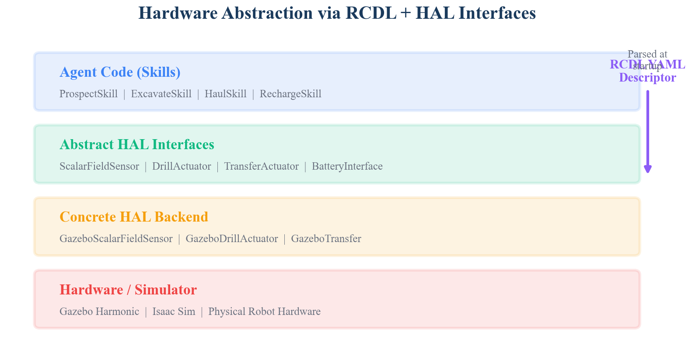

# 1. Introduction

The SELENE system orchestrates a heterogeneous fleet of autonomous lunar surface robots across the full In-Situ Resource Utilization (ISRU) value chain: prospecting, extraction, and transportation. The fleet comprises scouts equipped with neutron spectrometers for ice detection, excavators carrying drills and hoppers for regolith extraction, and haulers with high-capacity transport bins for material delivery. These platforms differ in mass by a factor of three, carry entirely disjoint sensor and actuator suites, and operate under disparate energy budgets. Yet the fleet orchestration engine -- the HTN planner, auction mechanism, energy manager, and skill execution framework -- must treat all robots through uniform interfaces.

This requirement motivates two tightly coupled contributions. First, the **Robot Capability Descriptor Language (RCDL)**: a YAML schema with Pydantic v2 validation that declaratively encodes what a robot *can do* without prescribing *how*. Second, a **Hardware Abstraction Layer (HAL)** whose interface hierarchy is derived directly from RCDL's type system, with pluggable backends that bridge abstract interfaces to concrete middleware. Together, RCDL and the HAL decouple fleet coordination software from hardware specifics, enabling a single agent autonomy stack to run unchanged on any platform whose capabilities are expressed in an RCDL file.

This paper is organized as follows. Section 2 surveys existing robot description languages and identifies the gap RCDL addresses. Section 3 formulates the problem. Section 4 presents the RCDL schema design with annotated YAML examples. Section 5 details the Pydantic validation rules. Section 6 describes the HAL interface hierarchy. Section 7 covers the Gazebo Harmonic backend implementation, including the thread-safe caching model. Section 8 discusses the simulation-to-hardware transfer path. Section 9 compares RCDL against existing description languages. Section 10 concludes.

# 2. Background

## 2.1 URDF and SDF

The Unified Robot Description Format (URDF) and Simulation Description Format (SDF) are the dominant robot description languages in the ROS ecosystem. URDF encodes kinematic chains, visual meshes, collision geometry, and inertial properties. SDF extends this to full simulation worlds with physics, lighting, and sensor plugins. Both are indispensable for simulation and visualization, but they describe *physical structure* -- link-joint trees, mesh URIs, material properties -- rather than *operational capability*. A URDF tells the simulator that a robot has a stereo camera with a 90-degree field of view; it does not tell the fleet planner that this sensor produces depth images usable for obstacle avoidance, draws 8 watts, and publishes on a specific ROS topic. RCDL occupies the complementary space: it describes what a robot can sense, actuate, and accomplish, with enough detail for fleet-level planning and energy-aware task allocation.

## 2.2 CRCL and ROS 2 Capability Maps

The Canonical Robot Command Language (CRCL) provides a middleware-independent command interface for industrial manipulators. While CRCL's goal of hardware agnosticism aligns with RCDL's, its scope is limited to serial-link manipulator commands (MoveTo, SetEndEffector) and does not model mobile robot capabilities such as locomotion energy budgets, kinematic constraints, or heterogeneous sensor suites. ROS 2 capability maps, introduced via the `capabilities` package, allow nodes to advertise functional capabilities at the middleware level. However, these are runtime service advertisements rather than static declarative descriptors, and they lack a validation schema -- a misconfigured capability map fails silently at runtime rather than loudly at startup.

## 2.3 Space ROS

Space ROS provides a safety-hardened fork of ROS 2 targeting flight-qualified robotic systems. It defines coding standards, fault detection patterns, and lifecycle management conventions. Space ROS does not define a capability description schema; RCDL is designed to be forward-compatible with Space ROS by using standard ROS 2 topic naming conventions and lifecycle-compatible sensor activation patterns.

# 3. Problem Formulation

The fleet orchestration layer requires the following information about each robot at planning time:

1. **Capability tags**: Which ISRU tasks can this robot perform? (e.g., prospect, excavate, haul)
2. **Kinematic constraints**: Maximum speed, turning radius, kinematic model -- needed for travel time estimation and path feasibility.
3. **Energy profile**: Battery capacity, idle power draw, speed-dependent locomotion draw -- needed for energy-aware bid scoring and range estimation.
4. **Sensor manifest**: Named sensors with types, ranges, noise characteristics, update rates, and power draws -- needed for skill parameterization and power budgeting.
5. **Actuator manifest**: Named actuators with types, capacities, transfer rates, and power draws -- needed for task duration estimation and power budgeting.

These requirements impose four design constraints on the description language:

- **Static and declarative**: Descriptors must be loadable at startup without a running robot, enabling offline planning and validation.
- **Fail-fast validation**: Misconfigurations (unknown capability tags, duplicate sensor names, negative speeds) must be caught at load time, not at runtime.
- **Backend-agnostic**: The same descriptor must drive both simulation and hardware HAL backends.
- **Extensible**: Adding a new sensor type or capability tag must not require modifying existing descriptors or the core schema.

# 4. RCDL Schema Design

An RCDL file is a YAML document with a flat top-level structure. The following annotated example shows the scout descriptor as deployed in the SELENE Sprint 0 prototype:

```yaml
# RCDL Descriptor -- Scout (Prospecting Robot)
robot_type: scout
kinematic_model: differential_drive
max_speed: 0.5          # m/s
turn_radius: 0.0        # 0.0 = can point-turn
mass: 50                # kg

battery:
  capacity: 50          # Wh
  idle_draw: 10          # W (electronics, compute, comms)
  locomotion_draw: 150   # W per m/s

sensors:
  - name: neutron_spectrometer
    type: scalar_field
    topic: sensors/neutron_spec
    frame: base_link
    range: 10.0          # meters detection range
    noise_stddev: 0.5    # wt% ice concentration
    power_draw: 10       # W
  - name: stereo_camera
    type: depth_image
    topic: sensors/depth
    frame: camera_link
    range: 20.0
    fov: 90              # degrees
    resolution: [320, 240]
    power_draw: 8
  - name: imu
    type: imu
    topic: sensors/imu
    frame: base_link
    update_rate: 100     # Hz
    power_draw: 1
  - name: odometry
    type: odometry
    topic: odom
    frame: base_link
    update_rate: 20
    power_draw: 0

actuators: []            # Scouts have no manipulation actuators

capabilities:
  - prospect
```

## 4.1 Top-Level Fields

The `robot_type` field is a free-form string used for logging and display. The `kinematic_model` field constrains motion planning; currently only `differential_drive` is implemented, but the field accommodates future Ackermann, omnidirectional, or legged models. The `max_speed` and `turn_radius` fields provide the kinematic bounds consumed by the path planner and energy estimator. A `turn_radius` of zero indicates point-turn capability, which the HAL exposes via a convenience method:

```python
class KinematicsInterface(ABC):
    @abstractmethod
    def get_max_speed(self) -> float: ...
    @abstractmethod
    def get_turn_radius(self) -> float: ...
    @abstractmethod
    def get_kinematic_model(self) -> str: ...
    @abstractmethod
    def get_mass(self) -> float: ...

    def can_point_turn(self) -> bool:
        return self.get_turn_radius() == 0.0
```

## 4.2 Battery Descriptor

The `battery` block encodes the three parameters required by the energy manager's range estimation model:

$$R = \frac{E_{\text{remaining}}}{P_{\text{idle}} + P_{\text{loco}} \cdot v} \cdot v \cdot 3600$$

where $R$ is the estimated range in meters at speed $v$, $E_{\text{remaining}}$ is the current energy reserve in watt-hours, $P_{\text{idle}}$ is the constant idle draw, and $P_{\text{loco}}$ is the speed-proportional locomotion draw. The factor of 3600 converts hours to seconds. This model is implemented directly in the `BatteryInterface`:

```python
def estimate_range_m(self, speed: float) -> float:
    state = self.get_state()
    total_draw = self.get_idle_draw_w() + self.get_locomotion_draw_w() * abs(speed)
    if total_draw <= 0:
        return float('inf')
    hours_remaining = state.remaining_wh / total_draw
    return hours_remaining * abs(speed) * 3600.0
```

## 4.3 Sensor and Actuator Manifests

Each sensor entry carries a `name` (used as the HAL lookup key), a `type` drawn from a closed enumeration (`scalar_field`, `depth_image`, `imu`, `fill_level`, `odometry`), a ROS `topic` for the backend to subscribe to, a `frame` for TF lookups, and type-specific optional fields (`range`, `noise_stddev`, `fov`, `resolution`, `update_rate`, `capacity_kg`). Actuator entries follow the same pattern with types `drive`, `drill`, and `transfer`, and optional fields `max_power`, `capacity_kg`, and `transfer_rate`.

The following shows the excavator descriptor, which carries both sensor and actuator entries:

```yaml
robot_type: excavator
kinematic_model: differential_drive
max_speed: 0.3
turn_radius: 0.0
mass: 150

battery:
  capacity: 80
  idle_draw: 15
  locomotion_draw: 250

sensors:
  - name: stereo_camera
    type: depth_image
    topic: sensors/depth
    frame: camera_link
    range: 20.0
    fov: 90
    resolution: [320, 240]
    power_draw: 8
  - name: imu
    type: imu
    topic: sensors/imu
    frame: base_link
    update_rate: 100
    power_draw: 1
  - name: hopper_fill
    type: fill_level
    topic: sensors/hopper_fill
    frame: hopper_link
    capacity_kg: 20
    power_draw: 0.5
  - name: odometry
    type: odometry
    topic: odom
    frame: base_link
    update_rate: 20
    power_draw: 0

actuators:
  - name: drill
    type: drill
    topic: actuators/drill_cmd
    frame: drill_link
    max_power: 200
    power_draw: 200
  - name: hopper
    type: transfer
    topic: actuators/hopper_cmd
    frame: hopper_link
    capacity_kg: 20
    transfer_rate: 5
    power_draw: 15

capabilities:
  - excavate
```

## 4.4 Capability Tags

The `capabilities` list declares which ISRU tasks the robot may be assigned. The orchestrator's auction mechanism uses this list as a hard filter: a robot whose descriptor does not include the `excavate` capability will never receive an excavation task, regardless of its bid score. The valid set is currently `{prospect, excavate, haul, recharge, relay}`. The `recharge` and `relay` capabilities support future charging-station robots and communication relay nodes, respectively.

# 5. Pydantic Validation Rules

RCDL files are parsed and validated by a Pydantic v2 `BaseModel` hierarchy. The root model is `RobotDescriptor`:

```python
class RobotDescriptor(BaseModel):
    robot_type: str = Field(min_length=1)
    kinematic_model: str = Field(default="differential_drive")
    max_speed: float = Field(gt=0)
    turn_radius: float = Field(ge=0)
    mass: float = Field(gt=0)
    battery: BatteryDescriptor
    sensors: list[SensorDescriptor] = Field(default_factory=list)
    actuators: list[ActuatorDescriptor] = Field(default_factory=list)
    capabilities: list[str] = Field(min_length=1)
```

The `Field` constraints enforce basic physical validity: speeds and masses must be positive, turn radii must be non-negative, and every robot must declare at least one capability. Nested models enforce further constraints -- `BatteryDescriptor` requires `capacity > 0` and `idle_draw >= 0`; `SensorDescriptor` constrains `fov` to the range $(0, 360]$ and `noise_stddev >= 0`.

Two custom validators enforce semantic rules beyond what field-level constraints can express:

**Capability validation** (field validator). Each entry in the `capabilities` list is checked against the closed set of valid capability tags. An unknown tag raises a `ValidationError` at load time:

```python
@field_validator("capabilities")
@classmethod
def validate_capabilities(cls, v: list[str]) -> list[str]:
    valid = {"prospect", "excavate", "haul", "recharge", "relay"}
    for cap in v:
        if cap not in valid:
            raise ValueError(
                f"Unknown capability '{cap}'. Valid: {valid}"
            )
    return v
```

**Unique name validation** (model validator). After all fields are parsed, a model-level validator ensures that no two sensors share the same name and no two actuators share the same name. Because the HAL uses names as dictionary keys, duplicate names would silently shadow earlier entries:

```python
@model_validator(mode="after")
def validate_unique_names(self) -> "RobotDescriptor":
    sensor_names = [s.name for s in self.sensors]
    if len(sensor_names) != len(set(sensor_names)):
        raise ValueError("Duplicate sensor names in RCDL")
    actuator_names = [a.name for a in self.actuators]
    if len(actuator_names) != len(set(actuator_names)):
        raise ValueError("Duplicate actuator names in RCDL")
    return self
```

Sensor and actuator types are constrained by `Enum` classes, providing exhaustive type checking at parse time:

```python
class SensorType(str, Enum):
    SCALAR_FIELD = "scalar_field"
    DEPTH_IMAGE  = "depth_image"
    IMU          = "imu"
    FILL_LEVEL   = "fill_level"
    ODOMETRY     = "odometry"

class ActuatorType(str, Enum):
    DRIVE    = "drive"
    DRILL    = "drill"
    TRANSFER = "transfer"
```

The `from_yaml` class method provides the standard entry point, composing YAML parsing with Pydantic validation in a single call:

```python
@classmethod
def from_yaml(cls, path: str | Path) -> "RobotDescriptor":
    path = Path(path)
    with open(path, "r") as f:
        data = yaml.safe_load(f)
    return cls.model_validate(data)
```

This design ensures that if `from_yaml` returns without raising, the caller holds a fully validated descriptor with all invariants guaranteed.

# 6. HAL Interface Hierarchy

The HAL interface hierarchy mirrors RCDL's type system. Each sensor type in the RCDL enum maps to an abstract sensor class; each actuator type maps to an abstract actuator class. The root `HalInterface` provides dictionary-style access to these typed objects:

```python
class HalInterface(ABC):
    @abstractmethod
    def get_sensor(self, name: str) -> SensorInterface: ...
    @abstractmethod
    def get_actuator(self, name: str) -> ActuatorInterface: ...
    @abstractmethod
    def get_kinematics(self) -> KinematicsInterface: ...
    @abstractmethod
    def get_battery(self) -> BatteryInterface: ...
    @abstractmethod
    def get_capabilities(self) -> list: ...
    @abstractmethod
    def list_sensors(self) -> list: ...
    @abstractmethod
    def list_actuators(self) -> list: ...
    @abstractmethod
    def shutdown(self) -> None: ...
```

## 6.1 Sensor Interfaces

All sensors share a common base interface with five methods: `read()`, `get_config()`, `is_active()`, `activate()`, and `deactivate()`. The `read()` method returns the most recent cached value -- it never blocks on I/O. Five concrete abstract subtypes refine the return type:

| Abstract Class | Return Type | RCDL Type |
|---|---|---|
| `ScalarFieldSensor` | `ScalarFieldReading(value, uncertainty)` | `scalar_field` |
| `DepthImageSensor` | `DepthImageReading(image, fov_deg, max_range)` | `depth_image` |
| `IMUSensor` | `IMUReading(orientation, angular_vel, linear_accel)` | `imu` |
| `FillLevelSensor` | `FillLevelReading(level, mass_kg)` | `fill_level` |
| `OdometrySensor` | `OdometryReading(x, y, theta, linear_vel, angular_vel)` | `odometry` |

Table: Sensor interface hierarchy mapping. Each RCDL sensor type corresponds to exactly one abstract class with a typed reading.

All reading types are frozen dataclasses, preventing mutation after construction. Each carries a `timestamp`, `sensor_name`, and `is_valid` flag. The `is_valid` flag is set to `False` before the first callback arrives, enabling the agent layer to detect stale-on-startup conditions -- a pattern that proved critical for handling Gazebo's delayed odometry initialization.

## 6.2 Actuator Interfaces

The actuator hierarchy follows a parallel structure. The base `ActuatorInterface` provides `get_config()`, `get_state()`, `is_active()`, `activate()`, and `deactivate()`. Three concrete abstract subtypes add domain-specific command methods:

- **`DriveActuator`**: `command_velocity(linear_x, angular_z)` and `stop()`.
- **`DrillActuator`**: `set_power_level(level)`, `start_drilling()`, `stop_drilling()`, and `is_drilling()`.
- **`TransferActuator`**: `trigger_load()`, `trigger_unload()`, `is_transfer_complete()`, and `cancel_transfer()`.

The drive actuator is implicit -- every mobile robot has one, even if it is not declared in the RCDL actuator list. The HAL backend constructs the drive actuator from the kinematic model fields. This convention avoids redundant boilerplate in every descriptor while preserving the guarantee that `get_actuator("drive")` always succeeds.

## 6.3 Battery Interface

The `BatteryInterface` returns a `BatteryState` frozen dataclass containing `charge_fraction`, `voltage`, `current_draw`, `capacity_wh`, `remaining_wh`, and `is_charging`. The `estimate_range_m()` method computes remaining traversal distance at a given speed using the descriptor's energy profile, providing the energy manager with a single-call range query.

# 7. Gazebo Backend Implementation

The Gazebo HAL backend (`GazeboHal`) bridges the abstract interfaces to Gazebo Harmonic via ROS 2 DDS. It is constructed from a validated `RobotDescriptor` and a live `rclpy.Node`.

## 7.1 Construction from Descriptor

The `GazeboHal` constructor iterates over the descriptor's sensor and actuator lists, creating one concrete Gazebo implementation per entry. A type-dispatch map routes each RCDL type to its implementation class:

```python
_GAZEBO_SENSOR_MAP = {
    SensorType.SCALAR_FIELD: GazeboScalarFieldSensor,
    SensorType.DEPTH_IMAGE:  GazeboDepthImageSensor,
    SensorType.IMU:          GazeboIMUSensor,
    SensorType.FILL_LEVEL:   GazeboFillLevelSensor,
    SensorType.ODOMETRY:     GazeboOdometrySensor,
}
```

Topic names are constructed by prefixing the descriptor's relative topic with the robot's unique ID namespace (e.g., `scout_0/sensors/neutron_spec`), following ROS 2 namespace conventions.

## 7.2 Thread-Safe Cached-Read Model

Gazebo publishes sensor data on DDS topics at varying rates (100 Hz for IMU, 20 Hz for odometry, event-driven for fill level). The agent's main tick loop runs at 2-10 Hz and must access the latest reading without blocking. The Gazebo HAL resolves this impedance mismatch with a cached-read architecture:

1. Each sensor creates a ROS 2 subscription in the node's callback executor thread.
2. The subscription callback writes the latest reading to a cached field under a `threading.Lock`.
3. The `read()` method acquires the same lock and returns the cached value.

```python
class GazeboOdometrySensor(OdometrySensor):
    def __init__(self, config, node, qos):
        self._lock = threading.Lock()
        self._cached = OdometryReading(
            sensor_name=config.name, is_valid=False
        )
        self._sub = node.create_subscription(
            Odometry, config.topic, self._cb, qos
        )

    def _cb(self, msg):
        reading = OdometryReading(
            timestamp=_stamp_to_ts(msg.header.stamp),
            sensor_name=self._config.name,
            is_valid=self._active,
            x=msg.pose.pose.position.x,
            y=msg.pose.pose.position.y,
            theta=yaw_from_quaternion(msg.pose.pose.orientation),
            linear_velocity=msg.twist.twist.linear.x,
            angular_velocity=msg.twist.twist.angular.z,
        )
        with self._lock:
            self._cached = reading

    def read(self) -> OdometryReading:
        with self._lock:
            return self._cached
```

Because readings are frozen dataclasses, the lock is held only for the duration of a pointer swap (write) or pointer copy (read) -- effectively O(1) time. No deep copies are needed. This design guarantees that the main loop never blocks on sensor I/O, satisfying the real-time responsiveness requirement.

## 7.3 QoS Configuration

All sensor subscriptions use a `BEST_EFFORT` reliability, `VOLATILE` durability, depth-5 QoS profile. This matches the default Gazebo publisher QoS and avoids the latency overhead of reliable (acknowledged) transport. For a cached-read model, a dropped message simply means the cache retains the previous value one cycle longer -- an acceptable tradeoff in exchange for lower latency and reduced DDS overhead.

```python
_SENSOR_QOS = QoSProfile(
    depth=5,
    reliability=ReliabilityPolicy.BEST_EFFORT,
    durability=DurabilityPolicy.VOLATILE,
)
```

## 7.4 Actuator Publishing

Actuator commands are published directly to DDS topics without caching. The `DriveActuator` publishes `geometry_msgs/Twist` to `cmd_vel`. The `DrillActuator` publishes `std_msgs/Bool` (start/stop). The `TransferActuator` publishes `std_msgs/String` with commands `"load"`, `"unload"`, or `"stop"`. Publisher QoS uses the default reliable profile with depth 10, ensuring command delivery.

{width=100%}

## 7.5 HAL Factory

The HAL factory decouples HAL construction from backend selection via a registry pattern. Backends self-register on import:

```python
def create_hal(
    rcdl_path: str | Path,
    robot_id: str,
    backend: str = "stub",
    ros_node=None,
) -> HalInterface:
    descriptor = RobotDescriptor.from_yaml(rcdl_path)
    hal_cls = _HAL_BACKENDS[backend]
    return hal_cls(
        descriptor=descriptor, robot_id=robot_id, ros_node=ros_node
    )
```

The `"stub"` backend returns in-memory implementations with configurable canned data, enabling full agent unit testing without ROS or Gazebo. The `"gazebo"` backend is lazy-loaded only when requested, avoiding import-time dependencies on `rclpy` in test environments.

# 8. Simulation-to-Hardware Transfer Path

RCDL's design anticipates the transition from Gazebo simulation to physical hardware. The transfer path requires three steps, none of which alter the agent autonomy code:

1. **Hardware RCDL file.** A new YAML descriptor is written for the physical platform, capturing its actual sensor topics, power characteristics, and kinematic limits. Field validators immediately flag any out-of-range values.

2. **Hardware HAL backend.** A new HAL backend class is implemented, mapping the abstract interfaces to hardware drivers. For a ROS 2-based robot, this backend will closely resemble the Gazebo backend -- the primary difference being QoS profiles (hardware sensors may require `RELIABLE` transport) and topic namespaces.

3. **Backend selection.** The launch configuration switches from `backend="gazebo"` to `backend="hardware"`. The factory constructs the correct HAL; all downstream code -- the agent FSM, energy manager, skills, and orchestrator -- runs unchanged.

This three-step process confines hardware-specific concerns to two artifacts: the RCDL file and the HAL backend module. The agent's ~1,100-line autonomy stack never imports a hardware-specific symbol.

# 9. Comparison with Existing Robot Description Languages

Table 2 compares RCDL against the most relevant existing robot description languages and capability frameworks across six dimensions.

| Feature | URDF/SDF | CRCL | ROS 2 Capabilities | Space ROS | **RCDL** |
|---|---|---|---|---|---|
| Physical structure | Yes | No | No | No | No |
| Operational capability | No | Partial | Yes | No | **Yes** |
| Energy model | No | No | No | No | **Yes** |
| Sensor/actuator manifest | Plugin-level | Manipulator only | No | No | **Yes** |
| Static validation | XML schema | XSD | None | Coding std. | **Pydantic v2** |
| Fleet planning support | No | No | Runtime only | No | **Yes** |

Table: Comparison of robot description and capability frameworks. RCDL is the only format that combines operational capability declaration, energy modeling, typed sensor/actuator manifests, and static schema validation in a single declarative artifact.

URDF/SDF and RCDL are complementary, not competitive. URDF/SDF tells the simulator how to render and physically simulate the robot; RCDL tells the fleet planner what the robot can do and how much energy it will consume doing it. In a complete SELENE deployment, each robot type has both a SDF model (for Gazebo) and an RCDL descriptor (for the HAL and orchestrator).

CRCL addresses a related problem -- hardware-agnostic robot command interfaces -- but is scoped to industrial serial-link manipulators. It defines commands like `MoveTo`, `SetEndEffector`, and `Dwell` that have no analogue in the mobile robotics domain. RCDL's actuator types (`drive`, `drill`, `transfer`) and sensor types (`scalar_field`, `depth_image`, `odometry`) are domain-appropriate for mobile ISRU robots.

ROS 2 capability maps are the closest conceptual peer, but they are runtime service advertisements discovered via the ROS graph, not static files. This means a planning tool cannot reason about robot capabilities without a live ROS network. RCDL files can be loaded, validated, and queried entirely offline, enabling mission planning before robots are powered on.

# 10. Conclusion

RCDL and its companion HAL provide the hardware-agnostic foundation that enables SELENE's fleet orchestration to operate identically across heterogeneous robot types. The key design decisions are:

1. **YAML with Pydantic v2 validation** provides human-readable descriptors with fail-fast schema enforcement -- misconfigured robots are rejected at startup, not at runtime.
2. **Typed interface hierarchy** maps each RCDL sensor and actuator type to an abstract class with domain-appropriate methods, ensuring type safety at the API boundary.
3. **Thread-safe cached-read model** decouples sensor callback rates from agent tick rates via lock-protected pointer swaps on frozen dataclasses, providing non-blocking sensor access with minimal synchronization overhead.
4. **Factory registry pattern** enables backend swapping (stub, Gazebo, hardware) via a single configuration parameter, confining all hardware-specific code to backend modules.

The SELENE Sprint 0 prototype validates this design with three robot types (scout, excavator, hauler) running identical agent autonomy code against the Gazebo HAL backend. The simulation-to-hardware transfer path requires only a new RCDL file and a new HAL backend module -- the ~1,100-line agent stack and ~1,200-line orchestrator remain untouched.

Future work will extend RCDL to support multi-body articulated platforms (legged rovers), degraded-mode capability declarations (a robot with a failed drill can still haul), and runtime capability negotiation where robots advertise updated descriptors as their state changes (e.g., a half-depleted battery reduces effective range). These extensions will build on the existing Pydantic validation framework and HAL interface hierarchy without requiring architectural changes.

# References

1. J. A. Correct et al., "URDF: Unified Robot Description Format," ROS Wiki, Open Robotics, 2010.
2. N. Koenig and A. Howard, "Design and Use Paradigms for Gazebo, an Open-Source Multi-Robot Simulator," IEEE/RSJ IROS, pp. 2149--2154, 2004.
3. S. Balakirsky et al., "CRCL: A Canonical Robot Command Language," NIST Internal Report, 2016.
4. "Space ROS: An Open-Source Framework for Space Robotics," AIAA SciTech 2023-2709, 2023.
5. S. Macenski et al., "Robot Operating System 2: Design, Architecture, and Uses in the Wild," Science Robotics, vol. 7, no. 66, 2022.
6. S. Pydantic, "Pydantic v2: Data Validation Using Python Type Hints," 2023. [Online]. Available: https://docs.pydantic.dev/latest/
7. D. Nau et al., "SHOP2: An HTN Planning System," JAIR, vol. 20, pp. 379--404, 2003.
8. R. Zlot and A. Stentz, "Market-Based Multirobot Coordination for Complex Tasks," Int. J. Robotics Research, vol. 25, no. 1, pp. 73--101, 2006.
9. G. Sanders et al., "Progress Review: NASA In-Situ Resource Utilization (ISRU) Development & Incorporation -- 2019 to 2025," NASA TM, 2025.
10. "Multi-robot cooperation for lunar In-Situ resource utilization," Frontiers in Robotics and AI, vol. 10, 2023.
11. S. Thrun, W. Burgard, and D. Fox, *Probabilistic Robotics*, MIT Press, 2005.
12. "CADRE: Planning, Scheduling, and Execution for Multi-Robot Lunar Exploration," arXiv:2502.14803, 2025.
