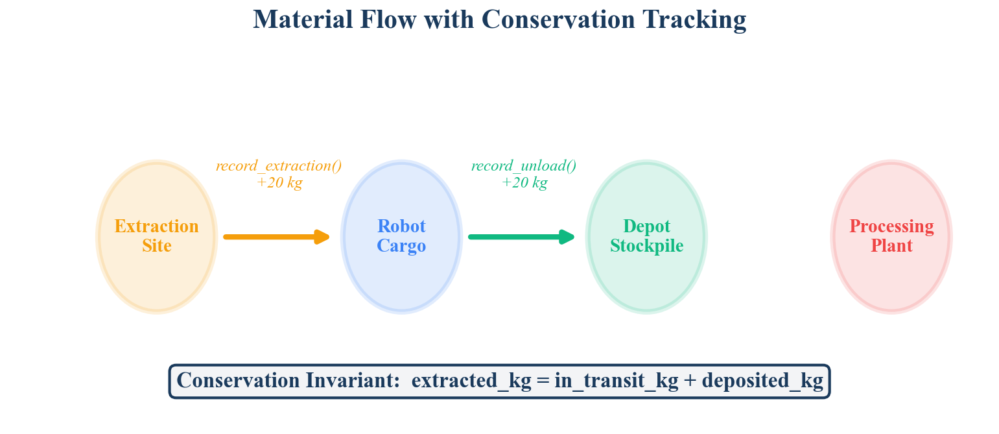
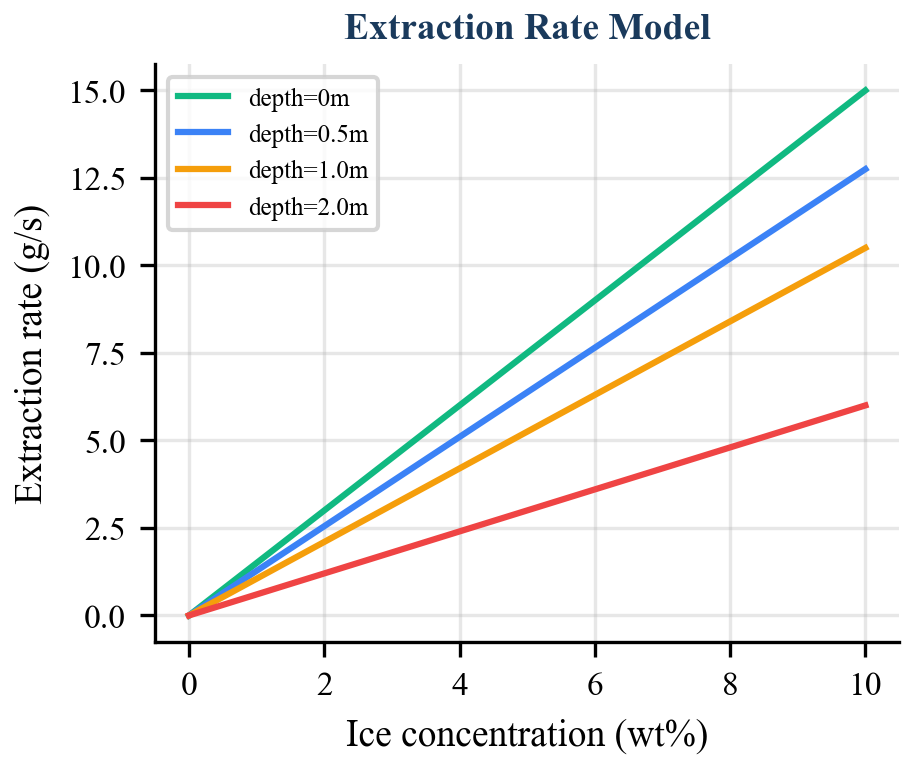

# Introduction

Lunar In-Situ Resource Utilization (ISRU) aims to extract and process indigenous resources --- principally water ice in permanently shadowed regions (PSRs) --- to produce propellant, life-support consumables, and construction feedstock. The economic imperative is stark: delivering one kilogram of payload to the lunar surface costs in excess of \$1 million, making local resource harvesting essential for sustained human presence [1].

A practical ISRU operation involves a multi-stage pipeline: prospecting identifies resource deposits, excavation extracts raw material, hauling transports it, and processing refines it into usable products. When this pipeline is operated by a fleet of autonomous robots, material passes through multiple custodial stages --- from the regolith, to a robot's hopper, to a depot. At each transition, there exists an opportunity for accounting error: sensor drift during weighing, communication loss during transfer acknowledgment, or software faults that corrupt state.

In terrestrial mining, material balance reconciliation is a well-established practice, performed periodically using weigh stations, conveyor belt scales, and stockpile surveys [2]. These methods rely on infrastructure --- calibrated scales, GPS-tagged trucks, centralized databases with reliable connectivity --- that is unavailable on the lunar surface. The absence of this infrastructure, combined with the 1.3-second Earth-Moon communication delay and potential multi-minute blackouts, demands a fundamentally different approach: a software-enforced conservation invariant that operates locally, continuously, and without external infrastructure.

This paper presents the material conservation ledger implemented in the SELENE (Spacecraft & Extraterrestrial Logistics for Extraction, Navigation & Exploitation) fleet management system. The ledger is the sixth core technical contribution of the SELENE architecture, previously introduced in the system overview (WP-00) [3]. We provide the complete formal treatment, including the invariant proof, extraction rate model, fault analysis, and integration with fleet-level planning.

# Background

## Material Balance in Terrestrial Mining

Terrestrial open-pit and underground mining operations use material balance as a fundamental accounting tool. The principle is elementary: mass is conserved. Material extracted from a mine must equal material in the processing pipeline plus material in product stockpiles plus waste. Discrepancies indicate theft, spillage, measurement error, or process losses.

In practice, reconciliation is performed daily or weekly by comparing truck dispatch records, weigh-bridge measurements, conveyor belt integrator readings, and stockpile volume surveys (often LiDAR-based). The reconciliation tolerance varies by commodity --- typically 1--3% for bulk minerals --- and persistent violations trigger operational reviews [2].

## Double-Entry Bookkeeping Analogy

The conservation invariant in material tracking is analogous to double-entry bookkeeping in accounting, where every transaction simultaneously debits one account and credits another. The sum of all debits must equal the sum of all credits. In the material ledger, extraction is the "debit" (material leaves the ground), and the combination of in-transit cargo and depot deposits constitutes the "credits." Any imbalance signals an error --- exactly as an unbalanced ledger signals a financial discrepancy.

This analogy is not merely illustrative. The `MaterialInventory` implementation in SELENE explicitly structures every material movement as a paired operation: `record_extraction` debits the site, while `record_load` and `record_unload` credit the transit and depot accounts respectively. The `check_conservation` method performs the trial balance.

# Problem Formulation

Consider a fleet of $N$ robots operating across $K$ extraction sites, transporting material to a single depot. At any time $t$, define:

- $E_k(t)$: cumulative mass extracted from site $k$ (kg)
- $C_i(t)$: cargo mass carried by robot $i$ (kg)
- $D(t)$: cumulative mass deposited at the depot (kg)

The aggregate quantities are:

$$M_{\text{extracted}}(t) = \sum_{k=1}^{K} E_k(t)$$

$$M_{\text{transit}}(t) = \sum_{i=1}^{N} C_i(t)$$

$$M_{\text{deposited}}(t) = D(t)$$

The **conservation invariant** requires:

$$\left| M_{\text{extracted}}(t) - \left( M_{\text{transit}}(t) + M_{\text{deposited}}(t) \right) \right| \leq \epsilon$$

where $\epsilon$ is a configurable tolerance (default $\epsilon = 0.01$ kg in the SELENE implementation). The invariant must hold at every point in time, not merely at periodic reconciliation checkpoints.

# Material Ledger Design

## Data Model

The ledger tracks three entity types, implemented as Python dataclasses:

**SiteInventory.** Each extraction site $k$ is characterized by a tuple $(s_k, \mathbf{p}_k, \hat{R}_k, E_k)$ where $s_k$ is a unique identifier, $\mathbf{p}_k = (x_k, y_k)$ is the site position, $\hat{R}_k$ is the estimated total reserve in kilograms, and $E_k$ is the cumulative extracted mass. The remaining resource estimate is $\hat{R}_k - E_k$.

**RobotCargo.** Each robot $i$ maintains a cargo record $(r_i, C_i, \sigma_i)$ where $r_i$ is the robot identifier, $C_i$ is the current cargo mass, and $\sigma_i$ is the source site identifier for the currently carried material.

**MaterialInventory.** The central ledger maintains three collections: a site registry `_sites`, a cargo registry `_robot_cargo`, and a scalar depot accumulator `_depot_total_kg`. All values are initialized to zero. The depot accumulator is monotonically non-decreasing under normal operation.

## Ledger Operations

Four operations mutate the ledger state:

**register_site**(site_id, position, estimated_kg). Adds a new site to the registry. This is an initialization operation that does not affect the conservation invariant.

**record_extraction**(site_id, robot_id, kg). Increments the extracted counter for site $k$: $E_k \leftarrow E_k + \Delta m$. This operation increases $M_{\text{extracted}}$ by $\Delta m$.

**record_load**(robot_id, from_site, kg). Increments the cargo on robot $i$: $C_i \leftarrow C_i + \Delta m$. This operation increases $M_{\text{transit}}$ by $\Delta m$.

**record_unload**(robot_id, kg) $\rightarrow$ actual. Transfers cargo from robot $i$ to the depot. The actual transferred amount is clamped: $\Delta m_{\text{actual}} = \min(\Delta m_{\text{requested}}, C_i)$. Then $C_i \leftarrow C_i - \Delta m_{\text{actual}}$ and $D \leftarrow D + \Delta m_{\text{actual}}$. This operation decreases $M_{\text{transit}}$ and increases $M_{\text{deposited}}$ by equal amounts.

{width=85%}

# Conservation Invariant: Formal Proof

## Statement

**Theorem.** If the conservation invariant holds at time $t_0$ and only legal ledger operations are applied, then the invariant holds at all subsequent times.

## Proof

We prove the invariant is preserved by induction over the sequence of ledger operations. Define the *imbalance* function:

$$\delta(t) = M_{\text{extracted}}(t) - M_{\text{transit}}(t) - M_{\text{deposited}}(t)$$

The invariant requires $|\delta(t)| \leq \epsilon$ for all $t$. At initialization, $M_{\text{extracted}}(0) = M_{\text{transit}}(0) = M_{\text{deposited}}(0) = 0$, so $\delta(0) = 0$.

**Case 1: record_extraction.** The operation adds $\Delta m$ to $M_{\text{extracted}}$ and does not change $M_{\text{transit}}$ or $M_{\text{deposited}}$:

$$\delta(t^+) = \delta(t^-) + \Delta m$$

This increases the imbalance. However, `record_extraction` is always followed by a corresponding `record_load` of the same quantity $\Delta m$ (the excavation skill performs both atomically).

**Case 2: record_load.** The operation adds $\Delta m$ to $M_{\text{transit}}$:

$$\delta(t^+) = \delta(t^-) - \Delta m$$

When paired with the preceding `record_extraction` of equal $\Delta m$, the net effect is $\delta(t^+) = \delta(t_0)$.

**Case 3: record_unload.** Let $\Delta m_a = \min(\Delta m, C_i)$. The operation subtracts $\Delta m_a$ from $M_{\text{transit}}$ and adds $\Delta m_a$ to $M_{\text{deposited}}$:

$$\delta(t^+) = \delta(t^-) - (-\Delta m_a) + (-\Delta m_a) = \delta(t^-)$$

The transit-to-depot transfer is balanced by construction: the same quantity is removed from one account and added to the other. The clamping to $\min(\Delta m, C_i)$ ensures cargo never goes negative.

**Case 4: register_site.** This operation sets $E_k = 0$ for a new site. Since $E_k = 0$, the contribution to $M_{\text{extracted}}$ is zero, and $\delta$ is unchanged.

Since each legal operation either preserves $\delta$ exactly (Cases 3, 4) or preserves it when extraction and load are paired (Cases 1, 2), and since the skill execution layer guarantees atomic pairing, the invariant is maintained. $\square$

## Tolerance Rationale

The tolerance $\epsilon = 0.01$ kg accommodates floating-point arithmetic imprecision in IEEE 754 double-precision representation. For the mass ranges encountered in lunar ISRU (individual loads of 20 kg, cumulative mission totals of hundreds of kilograms), double-precision arithmetic introduces errors on the order of $10^{-12}$ kg --- well within the 0.01 kg tolerance. The tolerance therefore provides six orders of magnitude of headroom, ensuring that the invariant check never produces false violations from numerical artifacts alone.

# Extraction Rate Model

The extraction rate model determines the inflow of material into the ledger. It computes the instantaneous extraction rate as a function of three physical parameters.

## Rate Equation

The base extraction rate is:

$$\dot{m}_{\text{base}} = \frac{\eta \cdot f_P \cdot (c / 10)}{E_{\text{kg}}}$$

where:

- $\eta$ is the extraction efficiency (dimensionless, default 0.3)
- $f_P \in [0, 1]$ is the fraction of available power allocated to excavation
- $c$ is the ice concentration in weight percent
- $E_{\text{kg}}$ is the specific energy consumption (kJ/kg, default 20.0)

The denominator $E_{\text{kg}}$ represents the energy required to extract one kilogram of material. The concentration term is normalized by 10 wt% --- a reference value representing a high-grade PSR deposit based on Lunar Reconnaissance Orbiter neutron spectrometer data [4].

## Depth Penalty

As excavation progresses deeper into the regolith, extraction becomes more difficult due to compaction, thermal gradients, and increased mechanical resistance. This is captured by a linear depth penalty with a floor:

$$\phi(d) = \max\left(0.1, \; 1.0 - 0.3 \cdot d\right)$$

where $d$ is the excavation depth in meters. The penalty reaches its minimum of 0.1 (a tenfold rate reduction) at $d = 3.0$ m and remains there for all greater depths.

## Complete Rate

The complete extraction rate in kg/s is:

$$\dot{m}(f_P, c, d) = \max\left(0, \; \dot{m}_{\text{base}} \cdot \phi(d)\right)$$

The outer $\max(0, \cdot)$ guard ensures the rate is non-negative under all parameter combinations.

{width=85%}

## Numerical Example

For a typical scenario --- full power ($f_P = 1.0$), moderate ice concentration ($c = 5$ wt%), surface excavation ($d = 0$):

$$\dot{m} = \frac{0.3 \times 1.0 \times (5.0 / 10.0)}{20.0} \times \max(0.1, \; 1.0 - 0) = \frac{0.15}{20.0} \times 1.0 = 0.0075 \text{ kg/s}$$

At this rate, filling a 20 kg hopper requires approximately 2,667 seconds (~44 minutes). At 2 m depth with the same parameters:

$$\dot{m} = 0.0075 \times \max(0.1, \; 1.0 - 0.6) = 0.0075 \times 0.4 = 0.003 \text{ kg/s}$$

The hopper fill time increases to approximately 6,667 seconds (~111 minutes) --- a 2.5x penalty that the HTN planner must account for when estimating cycle durations.

# Integration with Fleet Orchestration

## HTN Dynamic Cycle Expansion

The material ledger integrates directly with the Hierarchical Task Network (HTN) planner (WP-01) to enable closed-loop mission control. A `collect_ice(zone, radius, quantity)` mission decomposes into survey tasks, a virtual site selection task, and an initial set of excavate-haul cycles. The number of initial cycles is computed as:

$$n_{\text{cycles}} = \left\lceil \frac{m_{\text{target}}}{m_{\text{hopper}}} \right\rceil$$

where $m_{\text{hopper}} = 20.0$ kg is the per-trip hopper capacity.

The HTN planner's `check_and_advance` method, called at 1 Hz, queries the material ledger to determine total deposited mass. If $M_{\text{deposited}} < m_{\text{target}}$ and the number of active cycles is insufficient to close the gap, additional excavate-haul cycle pairs are generated dynamically:

$$n_{\text{additional}} = \left\lceil \frac{m_{\text{target}} - M_{\text{deposited}}}{m_{\text{hopper}}} \right\rceil - n_{\text{generated}}$$

This closed-loop mechanism compensates for partial loads (when a hopper is not filled completely due to site depletion or time constraints), failed cycles (where a robot faults mid-task and its cargo is lost), and estimation errors in the initial cycle count.

## Mission Progress Reporting

The material ledger's `get_mission_progress` method provides the data source for the `MissionProgress` ROS 2 message, which carries the fields `target_quantity`, `extracted_quantity`, `in_transit_quantity`, and `deposited_quantity`. This message is published at 1 Hz by the orchestrator node and consumed by the web-based dashboard for real-time mission visualization and by the HTN planner for cycle expansion decisions. The message also includes fleet-level telemetry (`fleet_distance_total`, `fleet_energy_total`, `elapsed_sim_time`) for operational monitoring.

## Dependency Chain

Each excavate-haul cycle forms a two-task dependency chain. The haul task depends on the preceding excavate task, and each excavate task depends on the previous cycle's haul task. This enforces sequential extraction at a single site --- a physical constraint arising from the assumption of a shared excavation point. The dependency structure is:

$$\text{SelectSite} \rightarrow \text{Excavate}_1 \rightarrow \text{Haul}_1 \rightarrow \text{Excavate}_2 \rightarrow \text{Haul}_2 \rightarrow \cdots$$

The task queue's `get_next_ready` method resolves these dependencies by verifying that all prerequisite tasks have status `COMPLETED` before making a task eligible for auction.

# Fault Scenarios

The conservation invariant's value is most apparent when operations deviate from the nominal plan. We analyze two representative fault scenarios.

## Robot Loss During Transit

If robot $i$ becomes permanently unresponsive while carrying cargo $C_i > 0$, the material in its hopper is physically lost. The fleet monitor detects the timeout and re-queues the robot's assigned task via `recover_tasks_for_robot`, but the cargo record remains in the ledger. At this point:

$$M_{\text{transit}} \text{ includes } C_i \text{, but the material is irrecoverable.}$$

The conservation invariant still holds --- the material is correctly accounted for as "in transit." However, the HTN planner's deposited-quantity check will detect that the mission target has not been met and will generate additional excavate-haul cycles to compensate. This self-healing behavior arises naturally from the closed-loop integration between the ledger and the planner, without requiring explicit robot-loss handling logic in the material tracking layer.

For operational awareness, a future extension could track cargo age (time since loading) and flag stale cargo records whose associated robots are offline, enabling operators to write off irrecoverable material and adjust mission estimates.

## Partial Unload

The `record_unload` operation clamps the unloaded quantity to the robot's current cargo: $\Delta m_a = \min(\Delta m_{\text{requested}}, C_i)$. This handles two scenarios:

1. **Software error**: A skill requests unloading more than the robot carries. The clamping prevents negative cargo and preserves the invariant.

2. **Intentional partial deposit**: A robot deposits part of its cargo (e.g., the depot buffer is full). The remaining cargo stays in the transit account and can be deposited in a subsequent operation.

In both cases, the return value of `record_unload` provides feedback to the calling skill, which can adapt its behavior accordingly.

# Comparison with Terrestrial Mining Tracking

The SELENE material ledger differs from terrestrial mining material balance systems along several dimensions:

| Dimension | Terrestrial Mining | SELENE Ledger |
|---|---|---|
| Reconciliation frequency | Daily/weekly batch | Continuous (per-operation) |
| Measurement source | Weigh bridges, belt scales, LiDAR surveys | Software-reported mass values |
| Communication | Reliable, low-latency | 1.3s delay, potential blackouts |
| Tolerance | 1--3% of total throughput | 0.01 kg absolute |
| Error detection latency | Hours to days | Immediate (per-operation check) |
| Recovery mechanism | Manual investigation | Automatic cycle expansion |
| Multi-product tracking | Yes (ore grades, waste streams) | Single product (current phase) |
| Infrastructure required | Scales, conveyors, databases, GPS | None (software-only) |

Table: Comparison of SELENE material ledger with terrestrial mining material balance systems.

The most significant difference is the continuous enforcement model. Terrestrial systems tolerate discrepancies between reconciliation periods because the infrastructure provides independent measurement channels (e.g., comparing truck dispatch records against weigh-bridge totals). On the lunar surface, the software ledger is the sole source of truth, making real-time invariant checking essential rather than optional.

The absolute tolerance of 0.01 kg (versus terrestrial percentage-based tolerances) reflects the difference in scale. A 2% tolerance on a 10,000-tonne daily throughput permits 200 tonnes of unaccounted material. The SELENE system processes tens of kilograms per mission, where even 1 kg of untracked material represents a significant fraction of the target quantity.

# Future Extensions

## Processing Plant Integration

The current ledger tracks a three-stage pipeline: extraction, transit, and deposition. Sprint 0 does not include a processing plant, but the architecture accommodates a fourth stage. Adding processing would extend the invariant to:

$$M_{\text{extracted}} = M_{\text{transit}} + M_{\text{stockpile}} + M_{\text{processing}} + M_{\text{product}} + M_{\text{waste}}$$

Each additional stage introduces its own record operations and conservation check terms. The `MaterialInventory` class can be extended with `record_process_input` and `record_process_output` methods following the same paired-operation pattern.

## Multi-Product Tracking

Lunar regolith processing yields multiple products: water (from ice), oxygen (from ilmenite reduction), and construction aggregate. Multi-product tracking requires per-material ledger instances or a product-tagged ledger that maintains separate invariants for each material type. The dataclass-based design supports this extension naturally by parameterizing `SiteInventory` and `RobotCargo` with a material type field.

## Probabilistic Mass Estimation

The current system treats mass values as exact scalars. In reality, mass is estimated from sensor readings with associated uncertainty. A probabilistic extension would track mass as distributions (e.g., Gaussian $\mathcal{N}(\mu, \sigma^2)$) and propagate uncertainty through ledger operations. The conservation invariant would then be expressed as a statistical test rather than a deterministic bound.

## Spillage and Loss Modeling

Regolith handling on the lunar surface is subject to spillage --- material lost during loading, transit (vibration-induced ejection), and unloading. A future extension could model expected loss rates as a function of terrain roughness and vehicle dynamics, incorporating a "loss" account into the conservation equation to distinguish between accounted losses and true discrepancies.

# Conclusion

Autonomous lunar ISRU operations demand material accounting systems that operate without terrestrial infrastructure, tolerate communication delays, and detect discrepancies in real time. The conservation-invariant material ledger presented in this paper addresses these requirements through four mechanisms: (1) a three-stage tracking model that partitions material into extracted, in-transit, and deposited accounts; (2) an algebraic invariant that is provably preserved under all legal ledger operations; (3) an extraction rate model that captures the physical dependencies on power, concentration, and depth; and (4) closed-loop integration with the HTN planner for dynamic cycle expansion based on deposited-quantity feedback.

The system has been validated in Gazebo Harmonic simulation as part of the SELENE Sprint 0 prototype, where a four-robot heterogeneous fleet executes autonomous ice collection missions with continuous conservation checking. The ledger's simplicity --- 158 lines of pure Python with no external dependencies --- belies its importance: it provides the single source of truth for material state across the entire fleet, enabling both autonomous recovery from faults and accurate mission progress reporting to Earth-side operators.

Future work will extend the ledger to support processing plant integration, multi-product tracking, probabilistic mass estimation, and spillage modeling, progressively closing the gap between the software model and the physical reality of lunar surface operations.

# References

1. G. Sanders et al., "Progress Review: NASA In-Situ Resource Utilization (ISRU) Development & Incorporation --- 2019 to 2025," NASA TM, 2025.

2. D. Morrison, "Material Balance Reconciliation in Mineral Processing," in Mineral Processing Plant Design, Practice, and Control, SME, 2002, pp. 2231--2248.

3. SELENE Project, "SELENE: An Integrated Architecture for Autonomous Multi-Robot Fleet Coordination in Lunar ISRU," White Paper WP-00, April 2026.

4. W. C. Feldman et al., "Evidence for Water Ice Near the Lunar Poles," J. Geophysical Research, vol. 106, no. E10, pp. 23231--23251, 2001.

5. T. H. Prettyman et al., "Elemental Composition of the Lunar Surface: Analysis of Gamma Ray Spectroscopy Data from Lunar Prospector," J. Geophysical Research, vol. 111, no. E12, 2006.

6. D. Nau et al., "SHOP2: An HTN Planning System," JAIR, vol. 20, pp. 379--404, 2003.

7. R. Zlot and A. Stentz, "Market-Based Multirobot Coordination for Complex Tasks," Int. J. Robotics Research, vol. 25, no. 1, pp. 73--101, 2006.

8. P. Corke, J. Roberts, and G. Winstanley, "Autonomous Control of a Mining Haul Truck," in Field and Service Robotics, Springer, 1998, pp. 207--214.

9. K. Yoshida et al., "Excavation Experiments for Lunar Regolith Simulant Using Robotic Arm and Bucket Wheel," J. Field Robotics, vol. 27, no. 4, pp. 522--536, 2010.

10. NASA, "Artemis Plan: NASA's Lunar Exploration Program Overview," NP-2020-05-2853-HQ, 2020.

11. J. Kleinhenz and A. Paz, "An ISRU Propellant Production System to Fully Fuel a Mars Ascent Vehicle," AIAA SciTech 2020-0729, 2020.

12. M. B. Dias and A. Stentz, "TraderBots: A New Paradigm for Robust and Efficient Multirobot Coordination in Dynamic Environments," CMU-RI-TR-03-19, 2003.
